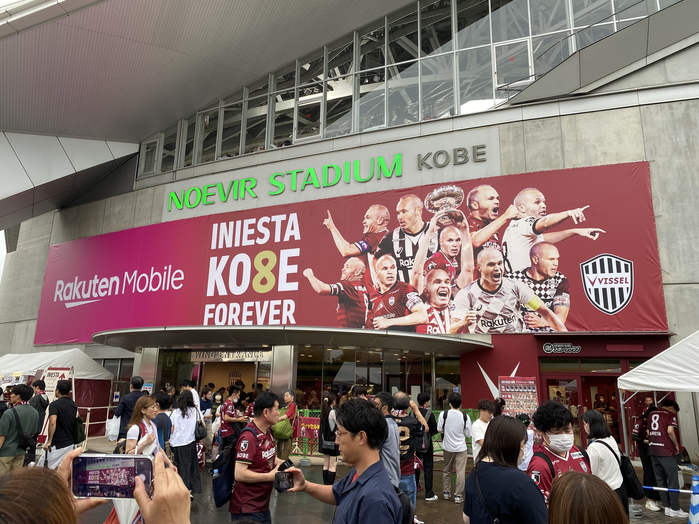
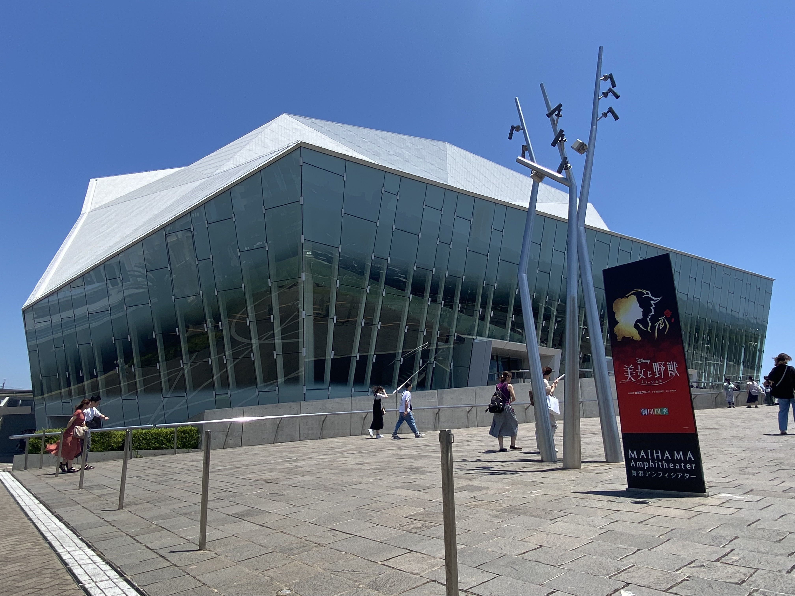
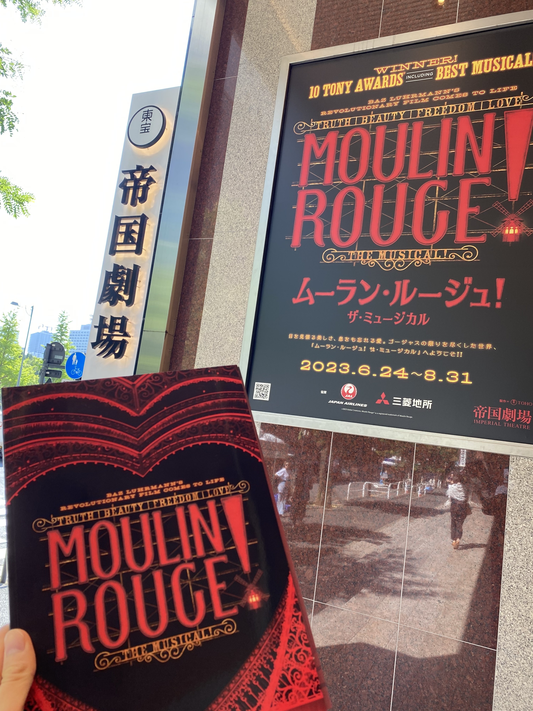





兵庫県内でIT屋さんとして働いてます。大学院では情報検索（主に商品検索）の研究をしていました。就職してからは、FastAPIを使った機械学習ツールの開発を中心に、クラウド環境上でのデータに関わる開発に取り組んでいます。

<h5>活動</h5>
<ul>
    <li><a href="https://corp.rakuten.co.jp/innovation/rnn/2019/1910_008/">楽天と大学生が神戸市へ楽しい技術アイデアを提供 | 楽天グループ株式会社</a></li>
</ul>

<h4>プライベートなところ</h4>

<ul>
    <li>ヴィッセル神戸サポ</li>
    <li>映画、時々観劇（ミュージカル中心）</li>
    <li>バックパック好き</li>
    <li>写真・動画撮影、時々動画編集</li>
</ul>


  
  
  
  
  




<ul>
    <li>技術系の備忘録</li>
    <li>技術系の気になる記事や感想</li>
    <li>個人の振り返り</li>
    <li>商品紹介</li>
    <li>ヴィッセル神戸🐮などの趣味関連</li>
</ul>

基本的には技術系の備忘録として運用していきますが、割りと関係のないものも投稿すると思います。




本サイトでの発言は個人の見解であり、現所属、過去に所属していた組織とは関係がありません。



