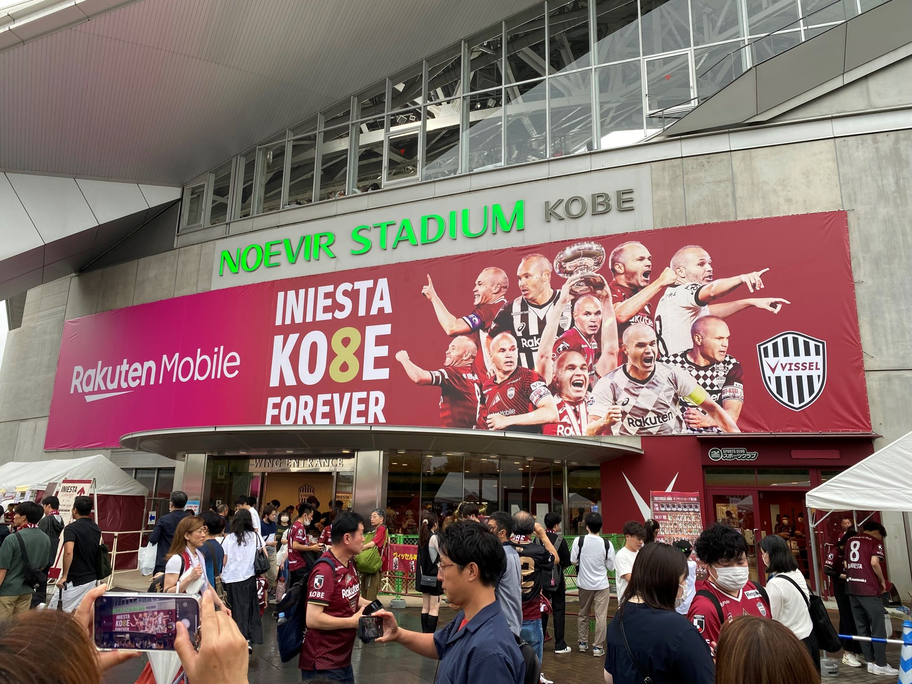
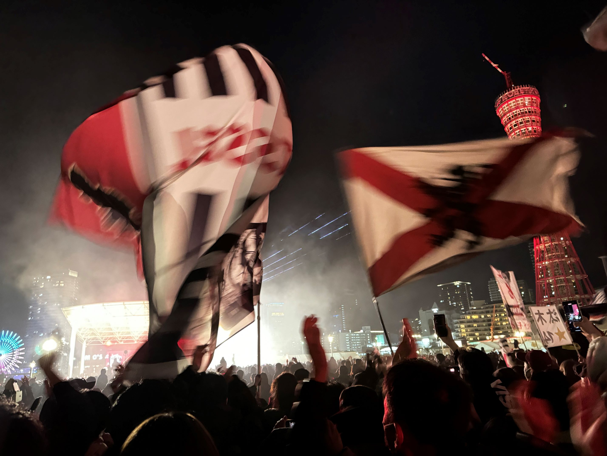
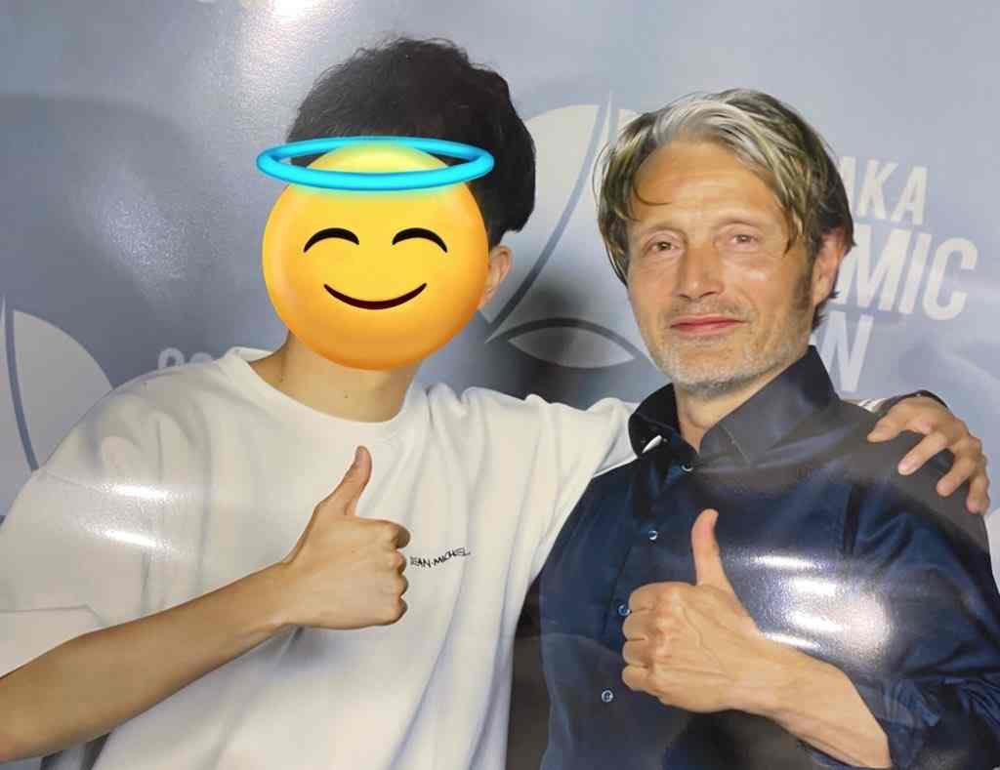
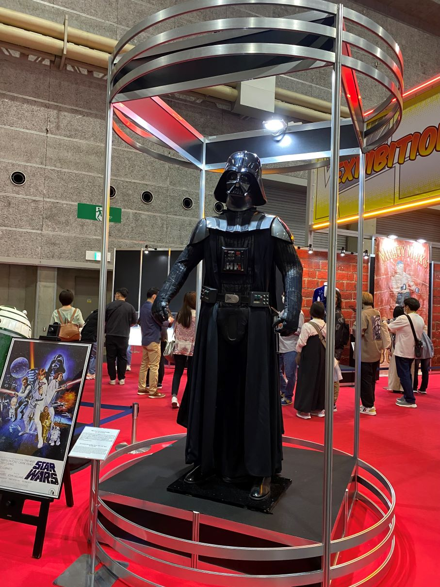
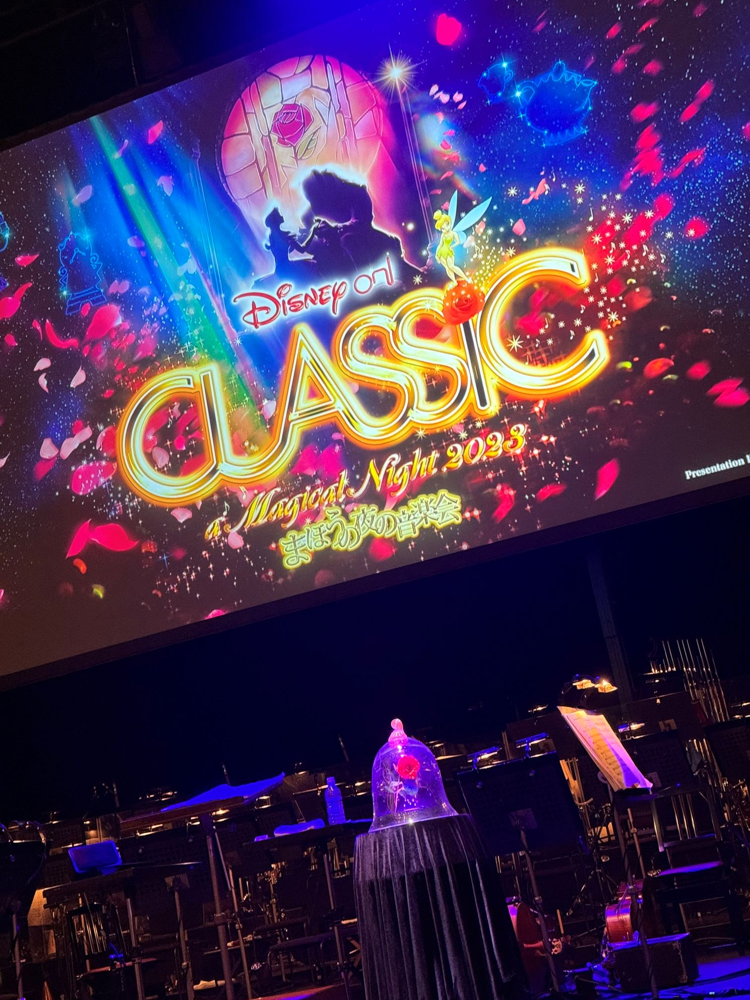
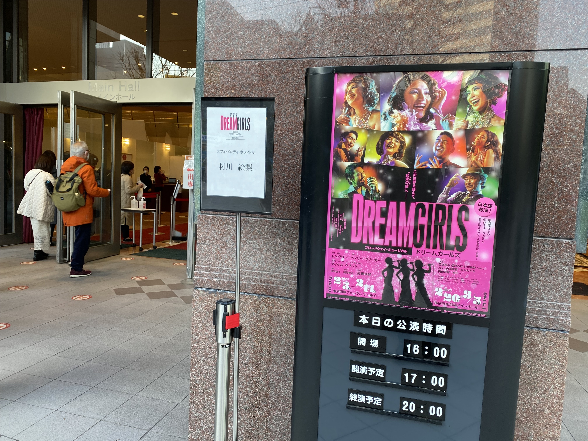
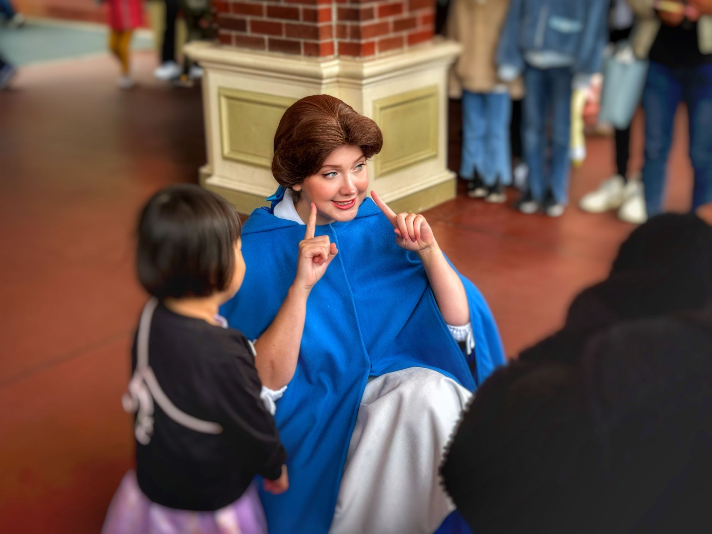
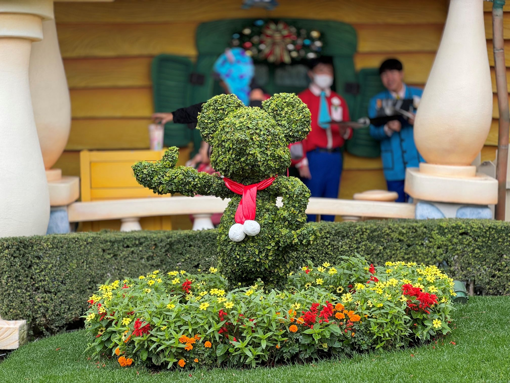

毎年恒例になりつつある1年の振り返りをしていきます。今年は何といっても**ヴィッセル神戸の優勝**が最大で最高の話題かと！！！

仕事とプライベートを分けて書いていきます。まずは仕事から。

## 仕事

今年はAWS上でのアプリ開発やデータ加工のパイプライン作成に取り組むことが多かったです。入った新人さんの育成にも関わりました。

アプリ開発では機械学習を活用したツールの開発に取り組んでいますが、どちらかというとシステムよりの部分を中心的に取り組みました。データ蓄積のためのパイプライン作成では、インフラチームとの調整等を含む簡単なPM業も経験もできました。チーム間連携や技術支援、技術・業務の両方を踏まえた運用フローの構築はなかなか大変でしたが、技術だけで解決できる問題ばかりではないということを再認識できました。

とはいえ、自分自身の技術的なスキルをもっともっと上げたいという気持ちは強くなっています。詳しくは抱負に書きますが、今取り組んでいるバックエンド周りの学習は継続しつつ、来年はフロントエンドよりの技術を身に着けたいと思っています。

外部の勉強会にも参加していきたいと考えています。今年もAWSやSnowflakeのイベントに参加しました。やはりこういうイベントに参加すると刺激がもらえますし、いろいろな技術に触れられるのは単純に楽しかったです。来年は学会等にも参加できればと思っています。DEIMとか面白かったのでまた参加したい...。

## プライベート

### 優勝だ！優勝だ！優勝優勝優勝だ！（ヴィッセル）

2017年から応援し始めたヴィッセルがついに優勝！シーズン途中「優勝できるんじゃないか」という期待は持ちつつもまさかなぁと思っていました。昨年は残留争いをしていたくらいですし、シーズン中もイニエスタやサンペールの移籍、未月の大けがなどいろいろな出来事もありましたから。

改めてですが、イニエスタのプレーを目の前で見ることができたのは幸せでした。チームの戦略が大きく変わったこと、年齢からくるプレー強度の低下で今シーズンはあまり試合で見ることはできませんでしたが、イニエスタが来たからこそ今の神戸があるといっても過言ではないと思います。

そんな世界的なスターが試合に出れないレベルの徹底したハードワーク、高強度のハイラインハイプレスサッカーが1年間展開されとても見ごたえありました。優勝が決まったホーム名古屋戦ももちろん試合に見に行っていたのですが、試合終了時に響いた歓喜の声、スタジアム中の観客が総立ちになった光景は一生忘れられないと思います。

阪神やオリックスみたいなパレードをしてほしかったのが本音ですが、メリケンパークで行われた祝勝会にはしっかり参加しました。神戸の街に神戸賛歌が鳴り響くとは...。


  
  


### 映画・大阪コミコン！

今年見た映画の数は61本でした。昨年は75本だったので割と減ってしまったのが悔やまれます。今年見た中で「これは！」と思った映画と一言コメントを雑に書いておきます。

- **ゴジラ-1.0**：怖いゴジラとヒューマンドラマの絶妙な融合、間違いなく今年1番！
- **マイ・エレメント**：ディズニーやるやん...映画館でぼろ泣きするほど感動して心温まりました
- **ガーディアンズオブギャラクシー volume3**：マーベルやるやん...ワンカット風バトルシーンは最高
- **ザ・スーパーマリオブラザーズ・ムービー**：お前らが見たいマリオはこれだろ！？を90分提供される
- **パルプ・フィクション**：映画好きとしてみておかないといけなかった...

大阪コミコンにも参加し、様々なコスプレイヤーの方と写真を撮ったり海外俳優を見てきました。何より、マッツミケルセンと写真を撮ってきました（高かった...💸）


  
  


### 観劇

昨年に引き続き観劇も楽しみました。まずは一覧を時系列で。

- DREAM GIRLS
- Musical SPY×FAMLIY
- BACK BEAT
- 劇団四季「美女と野獣」
- ファントム
- Moulin Rouge! The Musical
- ディズニー・オン・クラシック 〜まほうの夜の音楽会 2023

特に**ムーランルージュ**が印象的でした。初めての帝国劇場であの豪華絢爛な舞台、素晴らしい楽曲の数々。W主演ではあったのですが、ドリームガールズで推しになっていた**望海風斗**さんの回を見に行きました。自分の少ないボキャブラリーでは表現できないですが、今まで見たミュージカルの中でお気に入りの1つになりました。はまりすぎて観劇後から今まで、ずっとサントラを聴き続けています。

もう1つ今年は「**美女と野獣**」にドハマりました。もともと実写版の映画は好きだったのですが、劇団四季のミュージカルをみたのをきっかけに完全に...。プリンセスにはそこまで興味はなかったのに、ベルにだけははまりました。美女と野獣のグッズを買ったり、サントラを聴くくようになりました。年末にはディズニーオンクラシックにも行ってしまうほど。

楽曲はすべて好きなのですが、劇団四季版の「強いぞガストン」はジョッキを使ったパフォーマンスがあり独自の良さがあったのが印象的でした。「ビーアワゲスト（ひとりぼっちの晩餐会）」は言わずもがなですね。あの空間にまた戻りたい🥹

ムーランルージュは来年大阪で公演予定なので行くつもりです。


  
  
  
  


### iPhone15Proのカメラは良いぞぉ

今年もディズニーへ。こういうところに行くときは必ず一眼レフを持っていきますが、今年はiPhone15 Proのみで挑戦してみました。私レベルの撮影技術で近い距離の写真であれば一眼と遜色ないレベルになってきたなと感じます。iPhoneはソフト側で結構補正をかけているので、平均値の高い写真が撮りやすいのかなと。

うーん、ベルが美しい...


  
  


## 来年の抱負

**インプットは太くアウトプットも太く、財布のひもはきつく**

仕事のところでも少し触れましたが、来年はもっともっと外部との関わりをもって知識を吸収する1年にしたいと思っています。TypeScript、Nextjsは必ず触ります！！！気が向けばGoも...。あとは、CI/CDとIaCの知識をもっとつけて、今取り組んでいる業務をどんどん効率化していきたいです。

同時にアウトプットも太くしたいと思っています。ブログを書くのはわかりやすい練習になると思うので、継続的に書いていきたいですね。できればブログ記事のレビューをしてくれる人がいると良いのですが、なかなか一人では難しいのが悲しい。

他にも、外部向けの発表などを経験して、いろいろな方からコメントをもらったりしたいとも思っています。ただ、これも今の環境だと難しいので手は考えていきたいです。

最後の目標は、「財布のひもをより厳しくしめる」ことです！！！来年もいろいろと変化の多い1年になりそうですが、無駄遣いは抑えるようにしなければ！

この辺りで、今年の振り返りと抱負は以上にしたいと思います。今年1年ありがとうございました！来年もどうぞよろしくお願いいたします！
