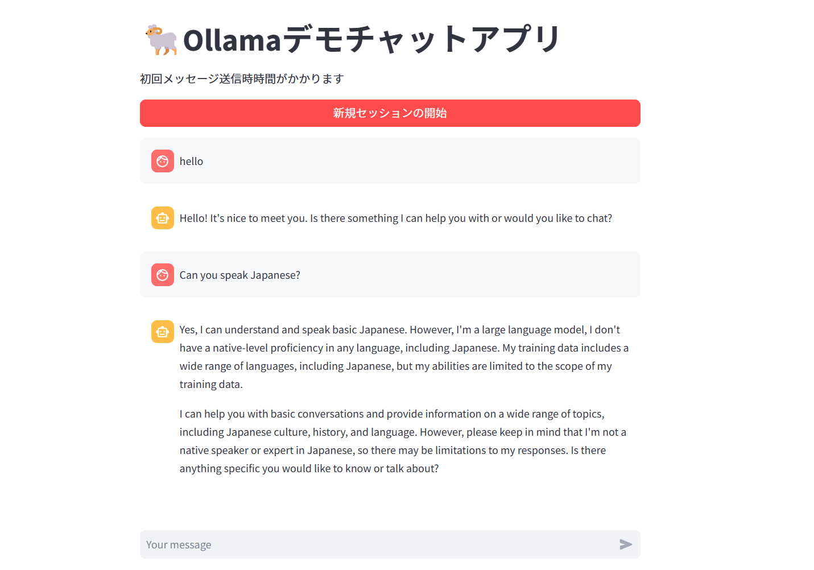

ローカル環境でLLMを動かせる[Ollama](https://ollama.ai/)の公式Dockerイメージと[Streamlit](https://streamlit.io/)を利用して、簡単なアプリを作ってみました。[LangChain](https://www.langchain.com/)等も利用せず簡単なチャットアプリを作っただけですが紹介します。



## 本記事の要点

取り組んだ内容について以下の示します。

- ローカル環境（CPU Only）で実行可能なLLMアプリ実装
- Docker （docker-compose） を利用して、Ollama（APIサーバ）とStreamlit（アプリ）を用意
- llama2モデルを利用
- LangChain等は利用していない

シンプルな構成にしているつもりです。作成したコードは以下リポジトリにて管理しています。



## クイックスタート

とりあえず動かす場合はこちら。

```shell
git clone git@github.com:rakuichi4817/ollama-app.git
docker compose up --build
```

<http://localhost:8501>へのアクセス。

## Ollama周り

Ollamaの公式ドキュメントを参考にして公式Dockerイメージを利用していきます。こちらの**公式イメージを利用する際に抑えるべきステップは以下の3つ**です。

1. **ollamaコンテナの立ち上げ（サーバ起動：`ollama serve`）**
2. **利用するモデルの取得**（`ollama run llama2` や `ollama pull llama2` で実行可能）
3. **REST APIで操作可能**

↓公式GitHubリポジトリ


### 公式Dockerイメージを見てみる

dockerhubの[イメージページ](https://hub.docker.com/r/ollama/ollama)を見ると、以下コマンドでOllamaを実行できるようです。\
※今回はCPU Onlyになります

```shell
docker run -d -v ollama:/root/.ollama -p 11434:11434 --name ollama ollama/ollama
```

ここで、`ollama/ollama` イメージのレイヤーを見てみると末尾のレイヤーが以下のようになっています。

```dockerfile
ENTRYPOINT ["/bin/ollama"]
CMD ["serve"]
```

ollamaコンテナを起動するとサーバが立ち上がり、APIリクエストを送信するポートが「11434」となります。

### 利用するモデルの取得

**コンテナ起動後にモデルデータを取得することが推奨されているようです**。後述でDocker Composeについて紹介しますが、ボリュームを活用してモデルデータを管理しています。コンテナイメージサイズを小さくする観点やGPUの有無によるモデルの違いなどから、コンテナイメージに含めるべきではないと以下のissueで触れられていました。

議論されているissue：<https://github.com/jmorganca/ollama/issues/258>

モデルの取得や実行は以下コマンドで行います。

```shell
# 取得から実行まで
ollama run llama2
# 取得のみ
ollama pull llama2
```

### REST APIの利用

Ollamaは `ollama serve`コマンドでサーバが立ち上がり、APIでのモデル操作が可能になります。このAPIの使い方については[こちら](https://github.com/jmorganca/ollama/blob/main/docs/api.md)を参照ください。

今回利用するのはモデルを取得するAPIとチャットのためのAPIになります。公式ドキュメントに書かれているコマンド例を以下に示します。今回作成したアプリではPythonの`requests`ライブラリを利用してリクエストを送信しています。

```shell
# モデル取得リクエスト
curl http://localhost:11434/api/pull -d '{
  "name": "llama2"
}'

# チャットリクエスト
curl http://localhost:11434/api/chat -d '{
  "model": "llama2",
  "messages": [
    {
      "role": "user",
      "content": "why is the sky blue?"
    }
  ], 
  "stream": false
}'

```

`"stream": false` をつけることで、レスポンスを一回にまとめることができます。本来はストリームをうまく使うべきなのでしょうが、今回は簡略化のために設定しています。

## アプリプログラム（Streamlit）

Streamlitは過去記事でも触れてきましたが、Pythonで簡単にアプリを作ることができるフレームワークです。日々機能拡張が進んでおり、チャット形式のコンポーネントも実装されていたので活用しました。

今回はLangChain等は利用しておりません。

ということでいきなりコードをベタ貼りします。少し長いのでポイントだけ以下にまとめます。

- **OllamaサーバへのAPIリクエストURLはDocker Compose側の設定に依存（サービス間通信）**
- **初回アプリ起動時にllama2モデルの取得リクエストを送信**
- **チャット形式でセッション内の履歴はすべて送信**

```python
"""一旦langhainを使わずに実装"""
from collections import namedtuple

import requests
import streamlit as st

# チャットの保存形式
Chat = namedtuple("Chat", ["role", "content"])

# ページ設定
page_title = "Ollamaデモチャットアプリ"
page_icon = "🐏"
st.set_page_config(page_title=page_title, page_icon=page_icon)

# 表示
st.write(f"# {page_icon}{page_title}")
st.write("初回メッセージ送信時、時間がかかります")

# モデルダウンロード
if "model_download" not in st.session_state:
    with st.spinner("モデル準備中"):
        requests.post(
            "http://ollama:11434/api/pull", json={"name": "llama2", "stream": False}
        )
        # 2回目以降ダウンロードしないように
        st.session_state.model_download = True

# セッション初期化
if "chat_logs" not in st.session_state:
    st.session_state.chat_logs = []


def write_chat_log(chat: Chat | None = None):
    """単一のチャットを出力するか、セッションすべてを表示する

    Notes
    -----
    引数がなければチャットログを表示

    Parameters
    ----------
    chat : Chat | None, optional
        表示するチャット, by default None
    """
    if chat:
        with st.chat_message(chat.role):
            st.write(chat.content)
    else:
        for chat_log in st.session_state.chat_logs:
            with st.chat_message(chat_log.role):
                st.write(chat_log.content)


# ユーザインプット
prompt = st.chat_input()
# セッションリセットボタン
if st.button("新規セッションの開始", type="primary", use_container_width=True):
    st.session_state.chat_logs = []

if prompt:
    # ユーザメッセージの形式変換とセッションステートへの追加
    user_chat = Chat("user", prompt)
    st.session_state.chat_logs.append(user_chat)
    # 新規ユーザチャット含むセッション内のすべてを表示
    write_chat_log()

    # ollama側に投げる
    messages = [chat_log._asdict() for chat_log in st.session_state.chat_logs]
    with st.spinner("🤖考え中"):
        response = requests.post(
            "http://ollama:11434/api/chat",
            json={"model": "llama2", "messages": messages, "stream": False},
        )
        # レスポンスの取得
        if response.status_code != 200:
            system_chat = Chat("system", "error")
        else:
            response_json = response.json()
            system_chat = Chat(
                response_json["message"]["role"], response_json["message"]["content"]
            )
    # ステートへの追加
    st.session_state.chat_logs.append(system_chat)
    # システムチャットを表示
    write_chat_log(system_chat)
```

Streamlitのチャットメッセージ表示機能にはロールを設定するところがあり、`user` などを設定することで色付けしてくれます。このあたりも[公式ドキュメント](https://docs.streamlit.io/library/api-reference/chat)が充実しているので興味がある方は御覧ください。

本当に便利なフレームワークです...。

## プロジェクト構成とDocker周り

Docker周りの定義ファイルを紹介していきます。プロジェクト構成は以下のようになっています。

Ollamaは公式イメージを使うだけなのでDockerfileはありません。

```text
root 
├── .devcontainer      # 開発用コンテナ設定
├── .vscode            # エディタ設定
├── app
│   └── main.py        # Streamlitアプリ用モジュール（上記のコード）
├── ollama             # ダウンロードしたモデルのマウント先
├── Dockerfile         # Streamlitアプリ用Dockerfile
├── Pipfile            # Streamlitアプリ用Pythonライブラリ管理
├── Pipfile.lock
├── README.md
└── docker-compose.yml 
```

### docker-compose.yml

最適でない書き方をしているところもあると思いますが、そのときはぜひ右下のチャットよりコメントをお願いします。

ポイントはサービス間通信の設定をするところと、モデルデータのバインドマウントの設定をしているところくらいでしょうか。

```docker
services:
  ollama:
    image: ollama/ollama:latest
    container_name: 'ollama-serve'
    ports:
      - "11434:11434"
    volumes:
      - ./ollama:/root/.ollama
    networks:
      - net

  app:
    build:
      context: .
      target: app
    container_name: 'ollama-app'
    ports:
      - "8501:8501"
    networks:
      - net

networks:
  net:
    driver: bridge
```

アプリ側のDockerfileに関しては長くなってしまうので本記事では割愛します。リポジトリを参照してもらえれば。

## まとめと課題

これらの構築により、チャットアプリを無事実装することができました。ページ上部にもサンプル画像を貼っていますがこちらにも載せておきます。


セッションのクリアもできるので、簡易チャットアプリとしては十分かなと思います。

課題としては以下の点があります。

- レスポンスの日本語化
- モデルの調整
- 応答時間の短縮

レスポンスの日本語化とモデルの調整に関しては、色々触っていきながら最適化していくことになるのかなと思います。また、LangChainの利用も検討しています。応答時間に関しては、裏側の仕組みを改善することとGPUの利用で対応できそうではあります。

色々と調整することはありますが基本的な動作をできるようになったので、機能拡張しやすい状態ではあるかなと思います。

それにしても生成AI周りの進歩が早すぎて...。しっかりキャッチアップしていかないといけないと改めて感じました。
