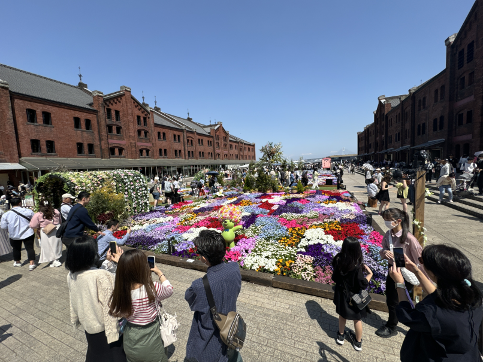
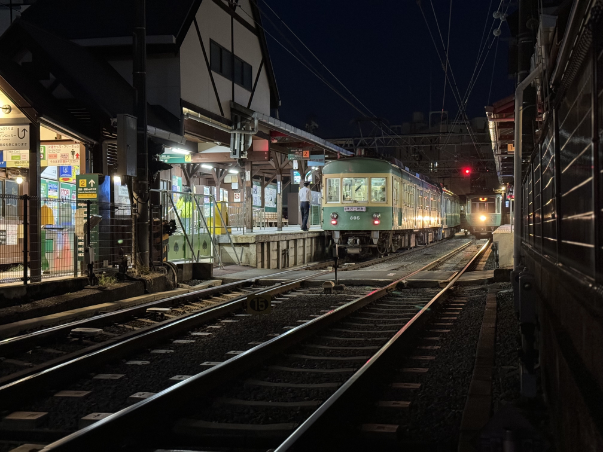
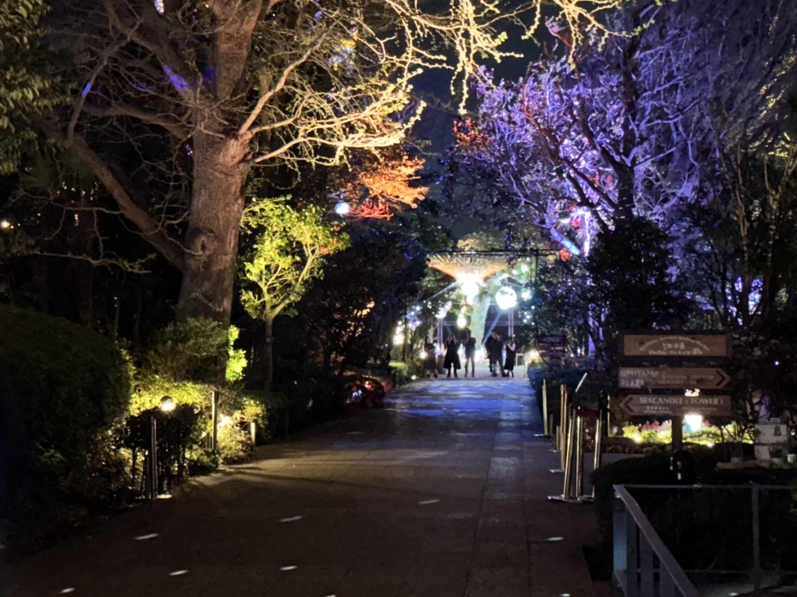
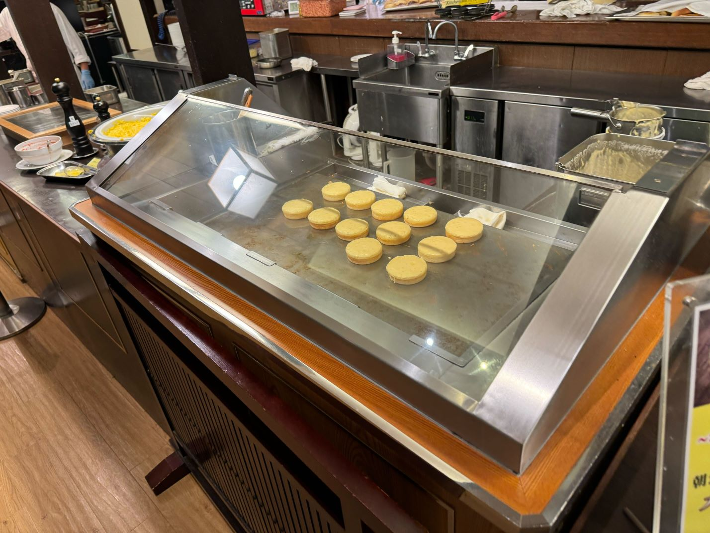
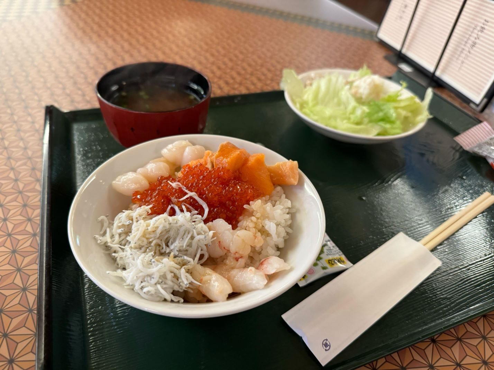
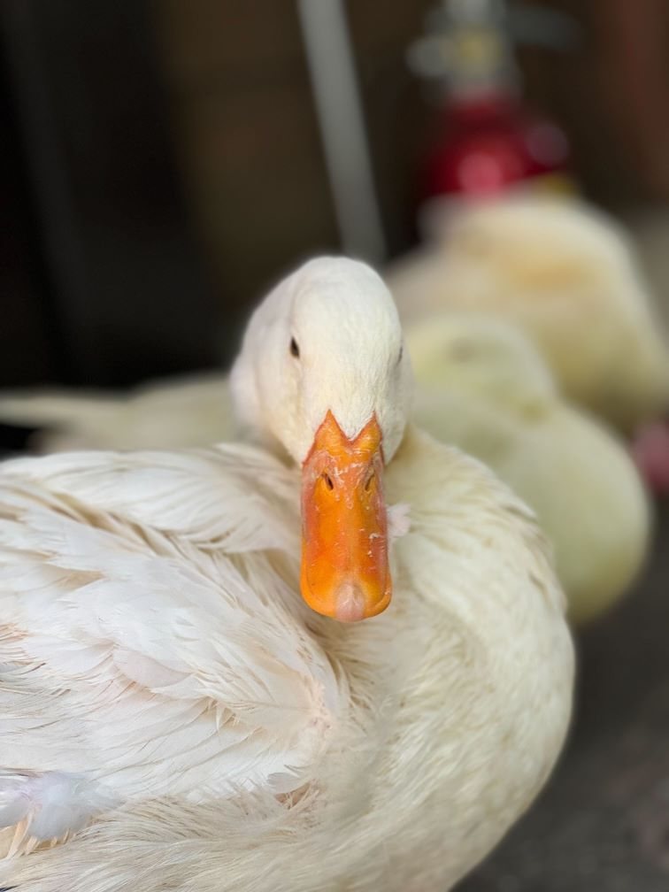
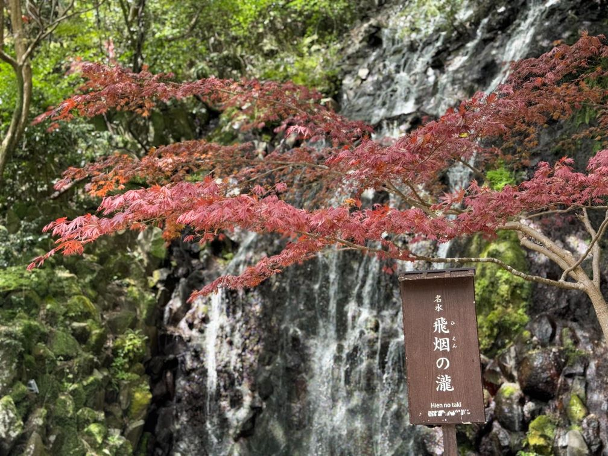
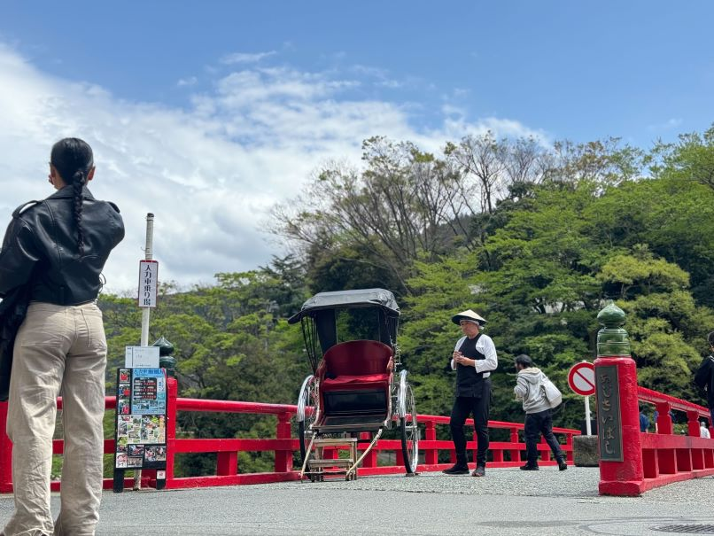

放浪記第3弾は神奈川観光について。みなとみらいと江の島を1日で観光、その後は箱根の温泉宿で2泊しました。分けて書こうかと思いましたが、あまり大量に書いてもなぁということで1つにまとめます。

旅の始まりが東京だったので、そのまま新幹線で神戸に向かうような形で観光していました。東京→横浜→江の島→箱根→浜松という流れです。

## 横浜、江の島1日弾丸

### 横浜家系総本家 吉村家🍜

横浜に行くことを知った会社の後輩から「横浜初めてなら吉村家がオススメですよ！」と言ってもらい、せっかくなので行くことに。

「並ぶらしいけど30分前くらいに行けばいいか～」と思っていたものの、念のために1時間前に行きました。ついた段階ですでに15名ほど並んでいて、店から少し離れたところに並びます。開店30分前には最後尾が見えないくらい並んでいたので、1時間前に行っておいて良かったです。

開店後20分くらい待ってようやく入店。二郎系みたいに難しい注文をしなくていいので助かります。念願のラーメンは、ふつうに美味しい！という感じでした。90分並んだらそりゃうまいよなという気持ちのほうが強かったです...。隣りに座った方があまり清潔な方ではなく、それが気になったのもありますが。

たけのこが無料で持ち帰れたのですが、流石に旅行中なのでスルーしました。

### みなとみらいと赤レンガ倉庫🧱

吉村家をあとにして、そのままみなとみらいへ向かいます。日曜ということもあり人は結構いました。

このあたりの雰囲気は神戸に似ていると聞いていたのですが、たしかにそのとおりだなぁという印象。神戸の町並みが好きなのもあり、みなとみらいも居心地が良かったです。

赤レンガ倉庫ではイベントが開催中で賑わっていました。旅行でテンションがあがっていた私はサングラスを買ったり、しっかり浮かれました。


  
  


横浜に来たらぜひ乗りたいと思っていたロープウェイ「[YOKOHAMA AIR CABIN](https://yokohama-air-cabin.jp/)」にも、バッチリ1人で乗りました。周りの目線は気にせず景色を楽しみます。

### 暗すぎた江の島🏝️

14時くらいまで横浜でぶらぶらしていたこともあり、少しつかれたので、とっていた藤沢のビジホで仮眠した後に江の島に向かいました。夕方くらいに江の島に行こうと思っていたのですが、仮眠を取りすぎて、江の島駅に着いた頃には真っ暗に...。

江ノ島駅から向かう途中、ほとんどの人が江の島から帰ってこようとしていて、江の島方面に歩いている人は少なかったです。これはやばいかもなと思いつつ向かいます。

江の島では食べ歩きをしようと思ったのですが、18時頃についたらほとんどお店やってませんでした...。悪い予感が的中...。なんとかあいてるレストランに入って、楽しみにしていた生しらす丼を食べます。うーむ、やはり美味しい。

そのまま適当に歩きつつ、[江の島サムエル・コッキング苑](https://enokama.jp/spot/1088/)でイルミネーションを鑑賞。[江の島シーキャンドル](https://enokama.jp/spot/1087/)の展望フロアにも行きましたが、1人で来ていたのは私だけでした。


  
  
  
  



次行くときはお昼すぎから夕暮れくらいまでに行きます...。

## 箱根のんびり

箱根は1日目に観光し、2日目は宿でのんびりしました。

### 日本人の方が少ない箱根ゴールデンコース🚌

箱根観光は箱根ゴールデンコースにのっかりました。[箱根フリーパス](https://www.hakonenavi.jp/transportation/ticket/freepass/)を購入して、以下のサイトを見ながらぶらり。

美術館等には寄りませんでしたが、ケーブルカーやロープウェイ、海賊船をしっかり満喫。

お昼はとんかつにしようかと思ったのですが、強羅公園の近くにある[箱根の森のパンケーキ](https://hakone-no-mori-no-pancake.com/)に吸い寄せられパンケーキ。お皿も可愛いですし、味も美味しい。パンケーキ好きは是非。


  
  
  


大涌谷では硫黄の匂いを感じつつ、富士山も見ることができました。桃源台ではエヴァ関連の展示があり、エヴァ好きの私は写真をパシャリ。箱根町港では箱根駅伝ミュージアムの前を通りました。自分は丹後駅伝に出てたので箱根には興味ないですがね！！

箱根関所では外国の方に頼んで写真を撮ってもらいました。今回の箱根観光で感じたことですが、本当に外国の方が多い！乗り物に乗るたび、日本人の方が少数派という環境でした。時々英語で話すことがあったのですが、英語力のなさを痛感しました...。つたない英語で写真撮影をお願いできたのは良かった...。


  
  
  
  
  


### 天成園を満喫♨️

箱根では2泊したのですが、宿は[天成園](https://www.tenseien.co.jp/)さんを選びました。天空大露天風呂に惹かれ、朝晩がバイキング形式なのも理由でした。バイキングスタイルであれば好きなものだけ食べられますしね😏。

バイキングではライブキッチンがあり、天ぷらやお肉、お寿司、朝はパンケーキなんかを目の前で作ってくれます。また、朝には海鮮丼を自分で作れるコーナがあるので、いつもあまり朝は食べない私も食べすぎました...。

なぜか2日目の晩は個室に通してもらい、たった1人なのに個室の静かな空間を満喫。そのことをきっかけにスタッフの方と仲良くなって一緒に写真を撮ったりしました。


  
  
  


天成園さんは宿のすぐ裏に庭園があって、滝や神社があります。散策できるのでブラブラしていました。昼であればアヒルとも近づけます。お風呂は露天風呂が最高で、開放感溢れる空間に程よい温度の温泉がたまりません。2泊する間に4,5回お風呂に入りました。


  
  
  
  


部屋は洋室しか空いていなかったので洋室に泊まりました。可能であれば和室のほうが旅館感があっていいかもです。洋室のベッドはフカフカで良かったですが。

2日目は、少しだけ箱根湯本を散策し基本のんびりしてました。


  
  


## まとめ

3日分を1つにまとめたので、だいぶ簡潔にまとめましたが、たまにはこういうのも良いですね。普段は自分しか見られない日記を書いているので、公開する形でまとめると文章の練習になりました。

みなとみらいや江の島はだいぶ駆け足で観光したので、また行ってみたいです。家系ラーメンもいくつか食べてみたい。中華街なんかも行ってみたいですね。

放浪記はあと1つか2つ書くことになると思います！

では、また～