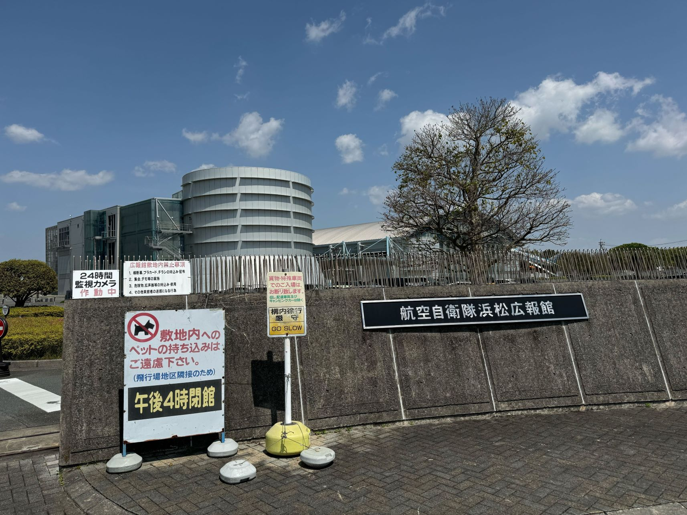
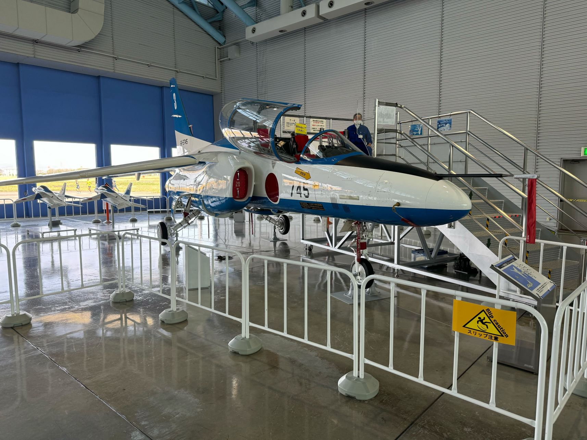
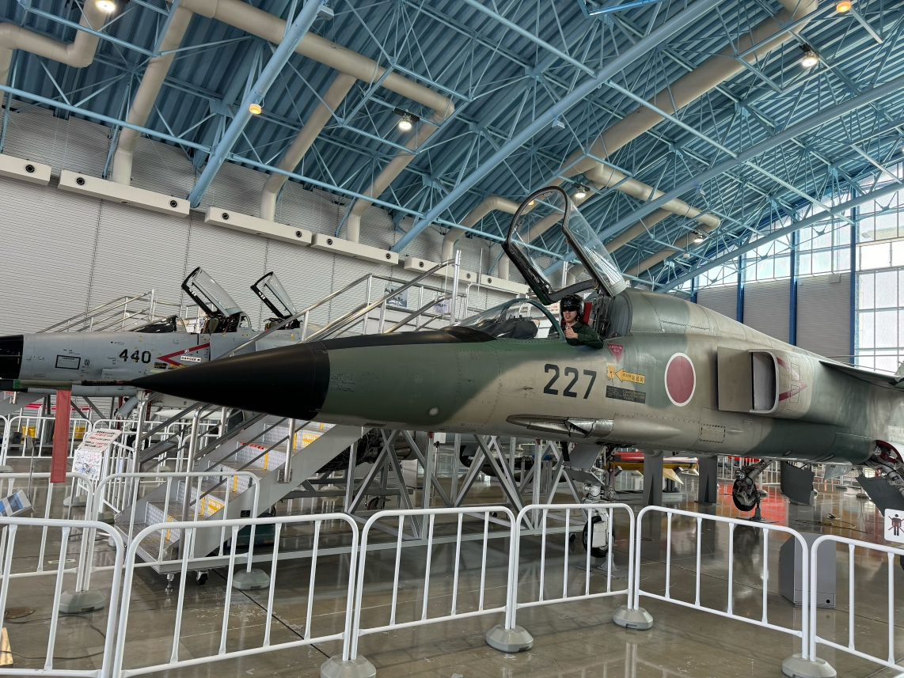
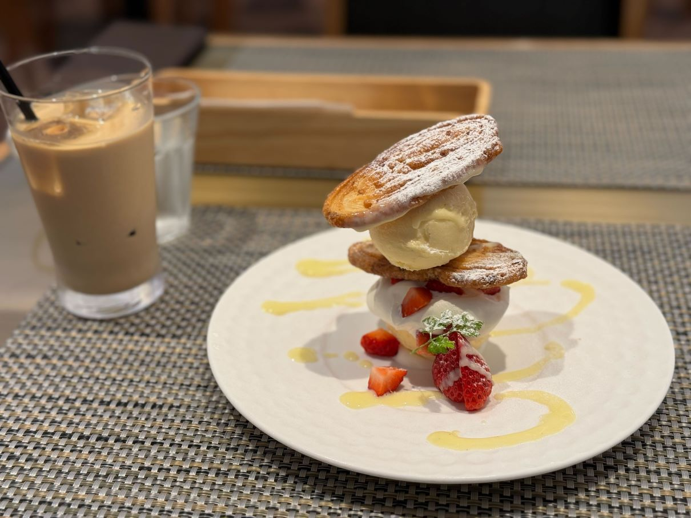
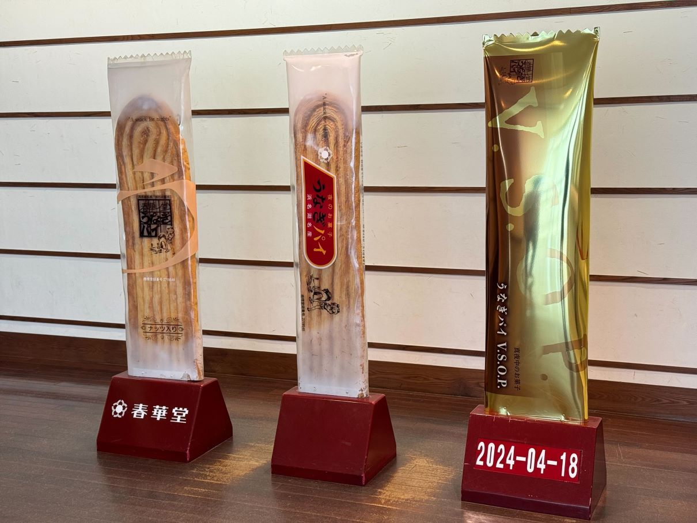

放浪記第4弾は浜松観光。

浜松の目的は3つ。「航空自衛隊浜松広報館 エアーパーク」と「うなぎパイファクトリー」に行くこと、そして「さわやか」でハンバーグを食べること。

## 浜松来たらエアパーク！🛫

浜松駅からバスで30分。最寄りのバス停から大体10分くらい歩くと見える[航空自衛隊浜松広報館 エアーパーク](https://www.mod.go.jp/asdf/airpark/)。

見学無料で航空自衛隊の展示を見ることができます。実際の機体が置かれていたり、各部隊の紹介動画や、昔使われていた装備品の展示なども見ることができます。

VRでのブルーインパルス飛行体験や、シミュレーターでの操縦体験などもあります。訪れたのが平日の昼間だったこともあり、そこまで人が多くなかったのでスムーズに体験できました。シミュレーターではしっかり着陸に失敗。


  
  


一番楽しかったのは、ジャンプスーツの試着と実際の機体に乗り込める体験でした。ジャンプスーツは受付で申し込むだけで、試着したまま10分間限られたエリア内を見学できます。さらにヘルメットやブーツも借りることができます。もちろんこちらも無料で体験できるので、非常におすすめです。

試着した状態で戦闘機に搭乗できるのはテンションが上りました。実は試着前に一度登場させていただいていたのですが、試着してからもしっかり搭乗しました。

改めて写真撮影をお願いしたところ、スタッフの方の計らいで、帽子を被らせていただき、ポーズの指導もしていただきました。格好良いお気に入りの1枚です。


  
  


タイミングよく、早期警戒機の離陸を見ることもできました。間近で聞くとやはりエンジン音がすごい。

全天周シアターではいくつか内容の上映を定期上映しており、整理券を貰えば楽しむことができます。私が参加した回はブルーインパルスの紹介でしたが、実際のフライトの映像が入っていて迫力満点でした。

少し浜松駅から距離はありますが、すべて無料で見学できますし、個人的にはとてもおすすめの場所です。浜松周辺に来たらまた行きたいです。

## ハンバーグと店員さんが魅力のさわやか

大学院時代に一度浜松に来たことがあったのですが、行くタイミングがなくて「さわやか」は未経験でした。今回こそ！と思い浜松駅から一番近いさわやかにチャレンジ。19時頃に受付しましたが80分待ち。吉村家（[吉村家に訪れたときの記事](/posts/2024/trip-03-kanagawa/#横浜家系総本家-吉村家)）とは違い、時間に戻ってこれば良いシステムだったので非常に楽でした。

時間になって戻ってきたあと、少し待ってついに座席に案内。副店長（店長だったかも）と書いた名札をつけた女性に接客していただいたのですが、常に笑顔で非常に親切な方でした。ハンバーグを食べる前から幸せになります。

セットが単品と変わらない価格で頂けるイベントをやっていたので、ハンバーグ250gとご飯、スープとドリンクがセットなっている「なんとか倶楽部」を注文。

ドリンクが届いた際に、「一緒に乾杯させていただきたいんですけど、めでたいこととかありますか？」と聞いていただいたので「1人旅行に！」と答え乾杯。お店の方に声をかけていただけるのは、1人旅行だと余計に嬉しい...。

肝心のハンバーグですが...

肉々しい！美味しい！！ソースもうまい！！！

朝まで居た箱根の旅館がバイキングで、いつも異常に食べていたこともあり、正直お腹は張っていました。しかし、ぺろりと食べてしまいました。うまいうまい！と食べていたところ、副店長さんがお肉の焼き加減を聞きに来ていただけました。ここまでしていただけるとは、さわやか恐るべし...

お会計のときも、わざわざレジ横まで来て「いかかでしたか？」と聞いてくださります。ハンバーグの美味しさはさることながら、その副店長さんにも心打たれた、さわやか体験でした。

## うなぎパイファクトリーでうなぎパイ満喫

私の家族はうなぎパイが大好きで、静岡周辺に出かけたときは必ずうなぎパイを買います。私もその英才教育（？）を受けているので、うなぎパイが大好きです。だから、当然[うなぎパイファクトリー](https://www.unagipai-factory.jp/)に行きます。

うなぎパイファクトリーも公共交通機関ではなかなか行きにくかったです。浜松駅からバスで40分くらい移動した後に、歩きで20分くらいでした。

出来立てのうなぎパイが食べられるとのことで楽しみにしていたのですが、事前予約が必要だったようで気づいたら埋まっていました。残念ではありますが、工場見学するだけで記念のうなぎパイがもらえるので良しとします。

工場見学では、うなぎパイの製造工程を見ることができます。個人的に気になったのは、とてつもない速度で検品するシステムでした。食品製造系のシステムにも一度関わってみたい...。

カフェでスイーツを楽しんだあとは、お土産売り場で徳用うなぎパイを大量購入。帰ってから割と速攻で消費してしまいましたが...。


  
  
  


## まとめ

浜松観光は自分の趣味を堪能しました。浜松は車がないと少し観光しづらい印象。遠鉄系の電車やバスではICOCAやSuicaが使えず、「ナイスパス」とやらしか使えませんでした。（クレカのタッチ決済はいけるのかな？）

公共交通機関では少し不便さを感じましたが、東京や箱根に比べると人が少ないこともありのんびり観光できました。

転職前の放浪記シリーズを書いてきましたが、あと1本書くつもりです。おそらく転職先の初勤務を終えてから投稿することになりますが。最後までお付き合いいただければと思います。
