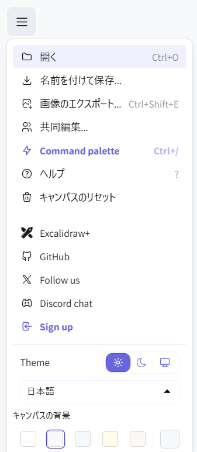

優秀な後輩に紹介された「Excalidraw」を試しに触ってみたので、記録を軽く書いておきます。

## Excalidrawとは

OSSの手書き風ホワイトボードです。Webアプリとしても公開されていますが、OSSなので自分でカスタマイズしたり、サーバを用意することで閉じた環境で展開することもできます。

<div class="iframely-embed"><div class="iframely-responsive" style="height: 140px; padding-bottom: 0;"><a href="https://github.com/excalidraw/excalidraw" data-iframely-url="//iframely.net/HbH7eYZ?card=small"></a></div></div><script async src="//iframely.net/embed.js"></script>

会社ではすでに[miro](https://miro.com/ja/)を使っているので採用することはなさそうですが、自前の環境で展開できるのは便利そうです。

## 環境の用意

ローカル環境での起動は非常に簡単です。[公式ドキュメント](https://docs.excalidraw.com/docs/introduction/development)の通り実行します。

```shell
# リポジトリのクローン
git clone https://github.com/excalidraw/excalidraw.git
# 関連ライブラリのインストール
yarn
# サーバのスタート
yarn start
```

ちなみに 「yarn」 は 「mise」 を使って入れています。miseの入れ方は以前の記事（[miseのインストールとPython環境の用意](../mise-install)）をどうぞ。

## 使ってみた感想

立ち上げたアプリを実際に触ってみた感想をざっと書いてみます。miroを使いこなしていたら比較できるのですが、現状比較するほど使いこなしていませんので、単体の感想になります。

- 手書き風が可愛い！（当然日本語は手書き風フォントに対応していない）
- Mermaidをそのまま図形に変換してくれるのがgood！
- Notionやら他の製品と連動している

### 手書き風が可愛い

下の画像のように、各図形も手書きで書いたようなタッチになります。角を四角することもできますし、画像を埋め込むこともできます。日本語の手書き風フォントはネイティブで対応していませんが、OSSなので自分でフォントを入れたら対応できそうな気がします。


### Mermaid使える！

個人的に「おぉ！」と思ったのは、mermaidが利用できる点です。下の画像はサンプルに入っていたフローチャートをそのまま利用しています。


Excalidrawでは下の画像のように、一度生成した図形を自分で動かすことができる点がgoodです。他のツールでも同様の機能はあるのかもしれませんが、お手軽にできるのがいいですね。ただ、一度図形として挿入したあとはテキストレベルでの調整ができなくなる点に注意です（直前に作ったものは新規作成時のエディタ画面に残っていますが）。


### その多機能

ホワイトボードとして最低限の機能は揃っている印象です。ボードの保存や画像のエクスポート、共同作業等も可能なようです。システム言語としては日本語にも対応しています。



## まとめ

非常に簡単ではありますが「Excalidraw」について書いてみました。

業務ではmiroを使うことになるので、今後自分が使っていくかは不明です。とはいえ、こういうツールがあるとしれたのは良かったなと思います。プライベートで利用するにはちょうどよいかも。
