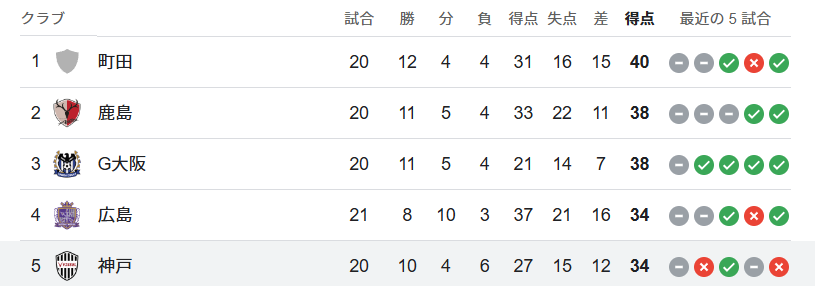
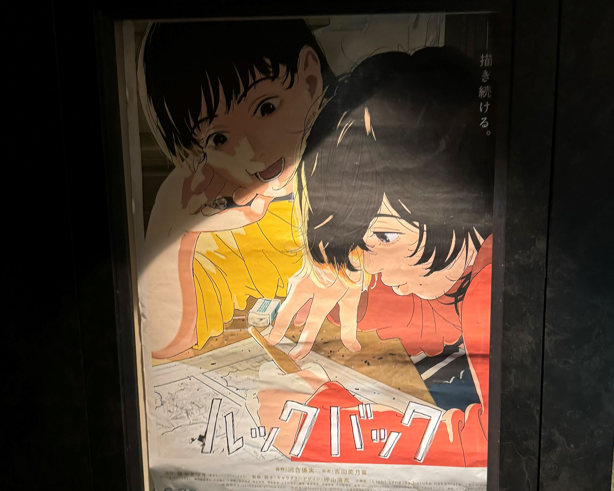
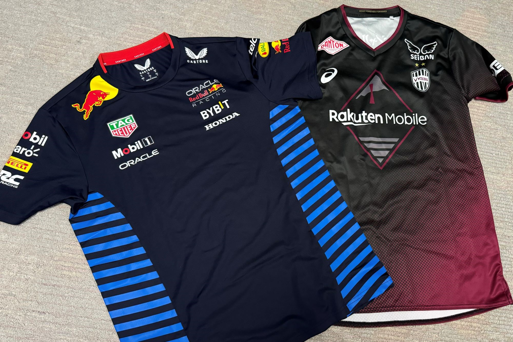

あっという間に6月も終わりでびっくりしました。今年の上半期は本当にいろいろあり大変な期間でした。

毎回振り返りでは仕事面とプライベート面に分けて書いているので、今回も同じように簡単に書いていきます。

## 社会人5年目で転職

なんといっても転職したことがビッグイベントでした。転職した経緯などは「[社会人5年目で転職したお話](/posts/2024/job-change/)」に書いています。また、転職前の有休消化期間に1人旅行していたのですが、いくつかの記事を「[転職前の放浪記](/series/転職前の放浪記)」シリーズとして書いています。

転職して2か月を終え、新チームになれるために必死な日々が続いていると思います。決してネガティブ意味ではなくて、学べることが多いので必死に吸収している段階ということです。

チームが運営するコラムに記事を投稿することを1つの目標にしていたのですが、無事達成することができました。スモールな目標ではありますが、まずは達成感を感じることが大事なので。内容としてはハッカソンの参加レポートをかきました。

アウトプットを増やしていくのは今年の目標でもあるのですが、会社の仕事として取り組めるのが良いですね。チームとして積極的にアウトプットしていく文化があるので刺激をもらうこともできます。

現在は、ソフトウェアエンジニアとしての力を伸ばすことを意識しています。生成AI周りの知識ももちろんキャッチアップしていますが、まずはプロダクトを作るための力をつけるつもりです。チームメンバーと開発談義するのが楽しい。

仕事に関しては、過去記事でも書いてしまったのでこの辺で。

## プライベート面

趣味にフォーカスして書いていきます。

### ヴィッセルは可もなく不可もなく

正直今年のヴィッセルはパッとしないです。この記事を書いている時点（6/30試合前）で首位と勝ち点6差の5位。しかも首位町田との試合はすでに消化してしまっているのも痛いです。ちなみにこの記事を書いている最中に鹿島と試合中。

ヴィッセルを応援し始めたころに比べると、安定して優勝争いに食い込めてるのですごいのですが。連覇がミッションって言ってましたからね。試合の内容もうーんと思うのが多くて少し面白さに欠ける気がしています。

何より得点が取れない。大迫、武藤に点を取ってもらわないとチームとしてのっていけないと思うのですが、ことごとく決定機を逃してるんですよね～。最近は「また外した！」と思ってしまうように。

いろいろ事情があって現地からは遠ざかっているのも合わさって、少し熱が落ち着いてしまっているのも正直なところです。ここから連勝街道を突っ走って、私をスタジアムに連れてって。

### ルックバックが上半期のダントツ1位、舞台はアラジンのみ

上半期で見た映画は35本で、思ったより見ることができませんでした。6月は15本見ることができたのですが、逆に1~5月で20本しか見ることができず...

比較的アクション映画多めでした。理由は単純でワイスピを一気見したからです。今まで全く見たことがなかったのですが、作品を追うごとに大味になってくるので変な方向に面白い。頭を空っぽにして見られる映画シリーズなので見るのは楽でした。

上半期見た中では、ルックバックがダントツで素晴らしかった。感想を書こうかと思いましたが、個人的に書いてブログには載せないで置きます（作品が良すぎて...）

ほかの映画もあわせて上半期に見たおすすめを。順番はおすすめ順です。

- ルックバック：50分の映画だとは思えない密度。心理描写とメッセージ性が素晴らしい（絶対見て）
- グランツーリスモ：べたなストーリー展開だがそれでいい！熱いし見入ってしまう。モータースポーツに興味を持つきっかけ
- オペラ座の怪人：狂った愛と音楽に支配されたファントムは必見。劇団四季も見に行きたくなりました
- Ghosted：アナデアルマスとクリスエヴァンスがおくるドタバタアクション。私は好きです（好きな役者が出てきてるので）

舞台に関しては「アラジン」のみでした（[アラジンのことについて書いた記事](/posts/2024/trip-01-aladdin/)）。下半期には、「モダンミリー」、「ムーランルージュ」、「アナ雪」、「レ・ミゼラブル」あたりを見に行こうかと思っています。当日券があれば「ウィキッド」も見に行きたいなーと思ったり。

ムーランルージュがダントツで楽しみです。昨年行った時の内容を含む記事は[こちら](/posts/2023/2023-summary/)。今年は平原綾香で見に行くか、推しの望海風斗でもう一度見るか...。

### F1も少し見始め

今年からF1も見始めました。レギュレーションはぼちぼち覚えているのですが、DAZNでの解説を頼りに楽しんでいます。マックスフェルスタッペンがやっぱりかっこええ。日本人の角田がいるのも応援しがいがあって楽しい。来年はぜひ鈴鹿に行ってみるつもりです。

レッドブルのTシャツを買ったのですがかなり気に入っています。毎年買ってしまいそう...。ヴィッセルのユニが2万するのに対し、1万ちょっとで買えるのが良心的すぎる...。

## 下半期に向けて

下半期は、より仕事を充実させたいです。ひたすら勉強してソフトウェアエンジニア力を高めたい。良い環境に入れたので、その環境を最大限使っていきたいです。

プライベート面でいえば以下3点

- 映画を1年間で100本見ることを目標に、残り65本見るぞ！！
- 痩せる！（ずっと言ってるが...）
- 無駄遣いを抑える！（シャツはうん...）

仕事面もあわせてですが、しっかり自分を磨いていきたいと思います。冒頭にも書いた通り、本当にいろいろなことがあって、精神的にも経済的にもすり減ってしまいました。下半期はその両方を回復させるつもりです。

余裕を持った生活を送れるように。

下半期... Lights out！！
