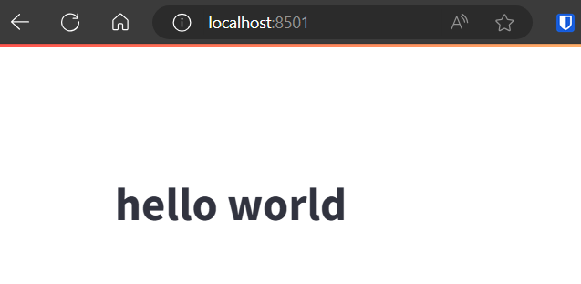

前回のmiseの記事「[miseのインストールとPython環境の用意](../mise-install)」の続きの内容となります。

今回はより実践に近い形で環境構築をしていきたいと思います。[Streamlit](https://streamlit.io/)を使ってアプリを立ち上げるところまでを目標にして、次の2点に取り組んでいきます。

- poetryを使ってPythonライブラリを管理する
- miseのタスクランナー機能を利用する

この記事で利用しているコードは、こちらにおいています。

<div class="iframely-embed"><div class="iframely-responsive" style="height: 140px; padding-bottom: 0;"><a href="https://github.com/rakuichi4817/mise-sample" data-iframely-url="//iframely.net/zALDnXu?card=small"></a></div></div><script async src="//iframely.net/embed.js"></script>

## 前提

- wsl2
- Ubuntu24.04

## Poetryとは

PoetryはPythonライブラリを管理するツールの1つです。私は今までpipenvを使ってきましたが、練習も兼ねてPoetryを使っていきます。色々紹介記事がありますので参考に貼っておきます。（今回はpoetryを詳しく紹介するわけではないです。）

<iframe src="https://hatenablog-parts.com/embed?url=https%3A%2F%2Fvaaaaaanquish.hatenablog.com%2Fentry%2F2021%2F03%2F29%2F221715" title="pipとpipenvとpoetryの技術的・歴史的背景とその展望 - Stimulator" class="embed-card embed-blogcard" scrolling="no" frameborder="0" style="display: block; width: 100%; height: 190px; max-width: 500px; margin: 10px 0px;"></iframe>

<iframe src="https://hatenablog-parts.com/embed?url=https%3A%2F%2Ftech.dentsusoken.com%2Fentry%2F2022%2F08%2F22%2FPoetry_%25E3%2581%25AF%25E3%2581%2598%25E3%2582%2581%25E3%2581%25BE%25E3%2581%2597%25E3%2581%259F_-_%25E3%2583%2581%25E3%2583%25BC%25E3%2583%25A0%25E9%2596%258B%25E7%2599%25BA%25E3%2581%25AB%25E3%2581%258A%25E3%2581%2591%25E3%2582%258B_Python_%25E3%2581%25AE%25E9%2596%258B%25E7%2599%25BA%25E7%2592%25B0%25E5%25A2%2583" title="Poetry はじめました - チーム開発における Python の開発環境 - 電通総研 テックブログ" class="embed-card embed-blogcard" scrolling="no" frameborder="0" style="display: block; width: 100%; height: 190px; max-width: 500px; margin: 10px 0px;"></iframe>

サクッと使ってみた感想としては、Pipenvより良さそうだなと思います。軽量ですし、「pyproject.toml」でライブラリを管理できるのが便利です。Pipenvのメリットであったスクリプトの定義も、今回紹介するmiseのタスク機能を使えば補えるので問題になりません。

## miseでPoetryをインストール

前回の記事「[miseのインストールとPython環境の用意](../mise-install)」の続きとして始めていくので、「.mise.toml」が以下のような状態であるという前提で進めていきます。

```toml
[tools]
python = {version="3.12", virtualenv=".venv"}

[env]
_.python.venv = { path = ".venv", create = true }
```

シンプルにプロジェクトで利用するPythonのバージョンを指定しているだけです。この状態で以下コマンドを実行します。

```shell
mise use poetry
```

このコマンドを実行するだけで、「.mise.toml」が次のように変更されます。

```toml
[tools]
python = {version="3.12", virtualenv=".venv"}
poetry = "latest"

[env]
_.python.venv = { path = ".venv", create = true }
```

すでにこのプロジェクト上でpoetryが利用可能になりました。念の為以下コマンドで確認しておきます。バージョン情報が表示されたらOKです。

```shell
$ poetry --version
Poetry (version 1.8.3)
```

## Poetryでライブラリの追加

今回はStreamlitという簡単にアプリが作成可能なライブラリを追加していきます。Poetryの扱い方には詳しく触れませんが、今回利用したコマンドは紹介しておきます。

### プロジェクトの初期化

```shell
# プロジェクトの初期化（すでにpyproject.tomlやpoetry.lockがあるなら不要）
poetry init
```

「pyproject.toml」や「poetry.lock」が存在しておらず、初めてプロジェクトを作成する場合は、`poetry init` を実行します。実行するとプロジェクト名やバージョン情報を求められるので、必要に応じて入力していきます。

こちらで入力した内容は「pyproject.toml」の先頭に次のように記載されます。

```toml
[tool.poetry]
name = "mise-sample"
version = "0.1.0"
description = ""
authors = ["rakuichi"]
readme = "README.md"
```

「pyproject.toml」や「poetry.lock」がすでに存在していた場合は、 `poetry install` で環境が再現できます。

### ライブラリの追加

ライブラリの追加は非常に簡単です。今回であれば Streamlit を利用するので以下コマンドになります。

```shell
poetry add streamlit
```

実行すると「pyproject.toml」は以下のようになります（一部抜粋）。

```toml
[tool.poetry.dependencies]
python = "^3.12"
streamlit = "^1.35.0"
```

また、完全なライブラリ情報を載せている「poetry.lock」も自動で更新されます。ここまで来たら準備はほぼ完了です。

## miseのタスクとしてStreamlitアプリを起動

### Streamlit用のファイルを用意

まずはStreamlit用に最低限のプログラムを用意します。「src/main.py」に以下コードを用意します。

```python
import streamlit as st

st.title("hello world")
```

ただただ、「hello world」と表示するだけのStreamlitアプリです。あとはこちらのファイルを指定して、 `streamlit run src/main.py` とすればアプリの起動は完了です。試しに実行し、<localhost:8501>にアクセスすると以下のような画面が表示されます。



これらのコマンドを省略するために、miseにタスクとして設定していきます。

### miseのタスクとして定義する

miseでは「.mise.toml」にタスクを指定することができます。今回は以下のように`init` と `up` というタスクを用意しました。

```toml
[tools]
python = {version="3.12", virtualenv=".venv"}
poetry = "latest"

[env]
_.python.venv = { path = ".venv", create = true }

[tasks.init]
run = "poetry install"

[tasks.up]
depends = ["init"]
run = "streamlit run src/main.py"
```

`init`はPoetryを利用して、Pythonのライブラリをインストールするためのタスク。`up`はStreamlitアプリを起動するためのタスクとなります。

`up` に関しては `depends = ["init"]` とすることで、`up` タスクを実行する際に 「`init` タスクを実行してから実行する」という指定をしています。

いきなり`up`タスクを実行したとしても、必ずライブラリがある状態にしてくれるということです。この状態で以下コマンドを実行すると、タスクが実行可能です。

```shell
mise run up
```

先程と同様に<localhost:8501>でアプリにアクセス可能になっているはずです。

このタスク周りのtoml定義については、[公式ドキュメント](https://mise.jdx.dev/tasks/toml-tasks.html)を参考にしてください。他にも色々と設定ができます。

## まとめ

今回は、miseとPoetryを使った環境構築と、miseのタスク機能を使った備忘録を書いてみました。miseの部分はDockerに置き換わったりするかもしれませんが、ぱぱっと環境を作るには非常に良さそうな気がします。

ただ、mise自体が割と最近出てきたツールなので、あまり情報がないのは難点な気がします。公式ドキュメントももう少し丁寧に書いてほしいなーと思ったり。