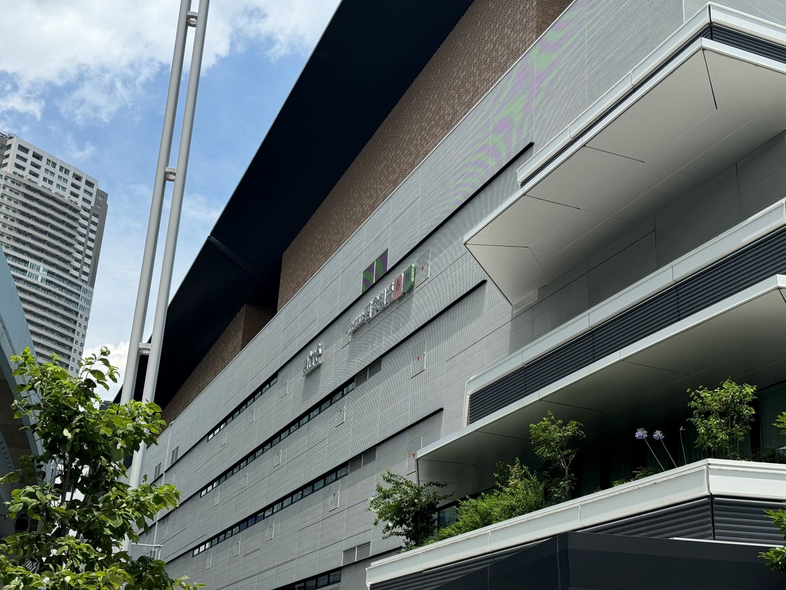
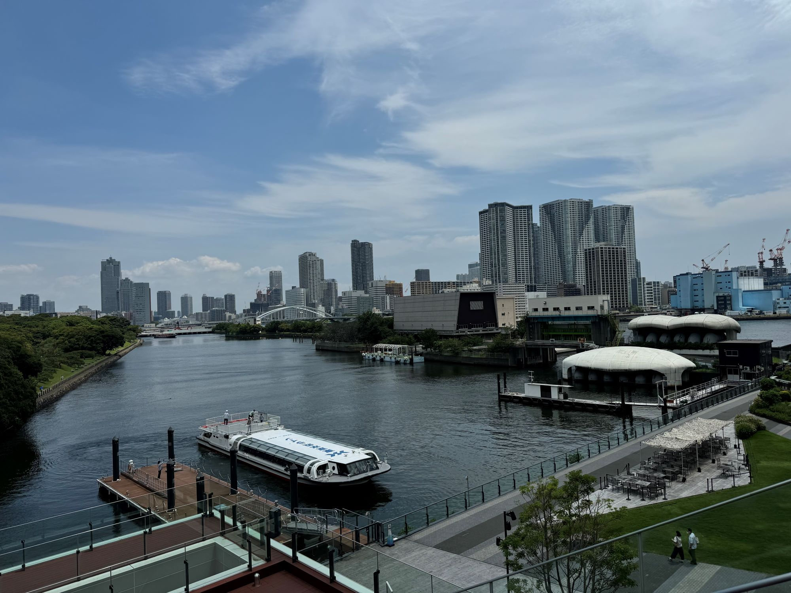
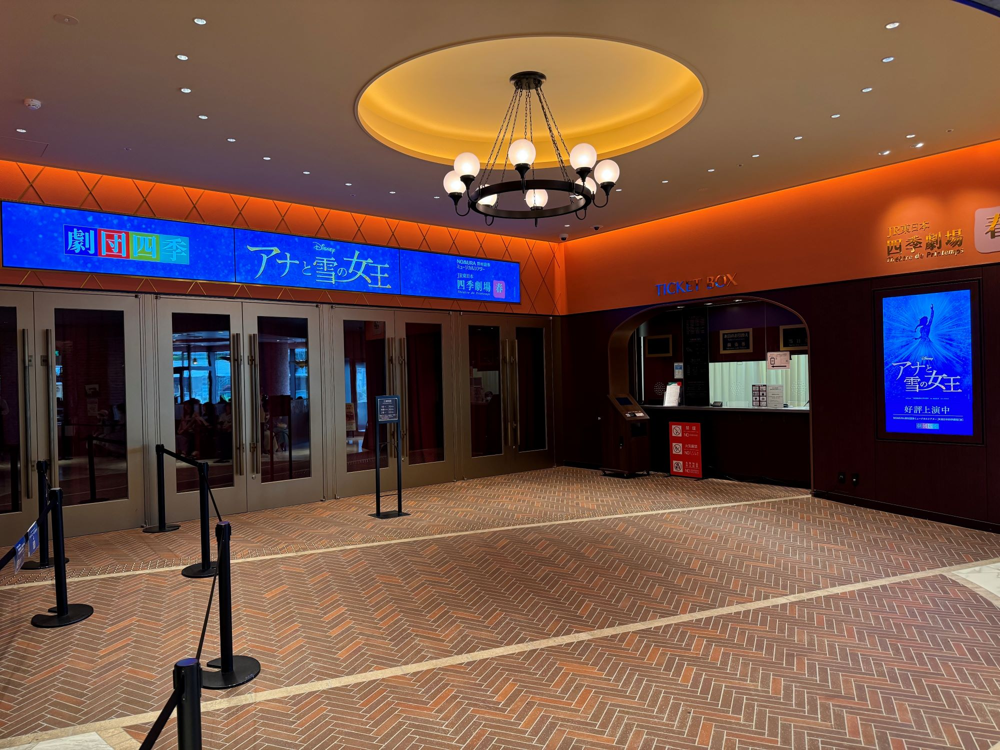
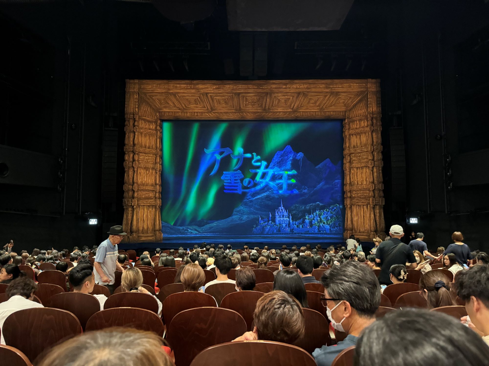
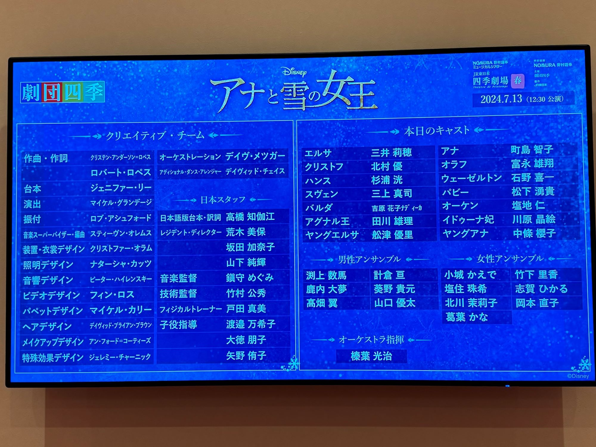

前回の[劇団四季「アラジン」のレポート](/posts/2024/trip-01-aladdin/)に続き、慣れない観劇レポートを書いてみようと思います。といっても、舞台の内容はそこまで語れないので、劇場の話や座席についても触れていきたいと思います。

## JR東日本四季劇場\[春\]

### 外観・周辺

「アナと雪の女王」は[JR東日本四季劇場\[春\]](https://www.shiki.jp/theatres/4023/)で公演されており、JR浜松町駅の近くにある「WATERS takeshiba（ウォーターズ竹芝）」内にあります。JR浜松町駅からは徒歩5分程度でアクセスは非常に良いです。

JR浜松町駅からこちらの劇場まで、迷うことなくたどり着くことができました。途中いくつか大きなビルがあり、その中に飲食店もありました。また、劇場近くに（もはや同じフロアの目の前にも）あるので、私は劇場近くで食事をすませました。とはいえ公演開始前は混雑するので、余裕を持って食事をすませるか駅の近くで食べるのもよいかもしれません。

WATERS takeshibaというだけあって、涼し気な雰囲気で景色もよかったです。といつつ、かなり暑かったので基本的に室内にいましたが...

### ロビー・物販

劇場の入り口は建物3階にあります。着いたときは開場前だったこともあり、以下の写真の通り全く人がいませんでした。**右側に写っているアナ雪のデジタルサイネージですが、開場後はスタッフの方が立っていて混雑緩和のために入り口付近での写真撮影を遠慮するよう呼び掛けていました。写真を撮りたい方は開場前に来ることをお勧めします**。終わった後に誰かに写真を撮ってもらおうかと思ったのですが、人が多すぎて諦めました🥲

写真の左側に写っている待機列のようなところは物販スペースです。開場と同時にオープンするのですが、レジが2つしかないので開場後はそれなりに混雑していました。確認はしていないのですが、ロビーにも物販エリアがあるとのことでした。おそらく入り口側のほうが混雑するので、ロビー内の物販エリアを利用するのもよいかもしれません。（なかったらごめんなさい）

### 座席

今回私が確保した座席は「S1席 1階 19列 20番」、ど真ん中の席でした。劇場の座席表は[こちら](https://www.shiki.jp/theatres/pdf_seat/40230084.pdf)で確認できます。公演開始前であれば写真撮影が可能であったため、座席からの景色を撮っておきました。

舞台の横幅は比較的小さめなのかな～？というのが正直な感想です。木の枠のようなところは演出でどうしても必要になるので仕方がないのかなと思ったり。といっても全然迫力がないとかいうことではないです。

座席の前後間隔狭いと結構つらいのですがこの劇場は気になりませんでした。個人的にはかなりうれしいポイントです。私は身長が180cmあるので、観劇の際は浅く座って背もたれに持たれることで、後ろの人の視界に影響が出ないようにしています。観劇はどうしても女性客が多く男性よりは小柄ですので、自分みたいのが前にいると迷惑だろうなと思ってしまい...。浅く座るので席の前後間隔が狭いと足が当たって苦しい。気にせず普通に座りたいんですけどね。

## 舞台「アナ雪」⛄

あまり観劇レポートは得意でないので、素人の意見だと思ってください。シンプルによかったところとうーんなところを書いていきます。

### 良かったところ

- 舞台に最適化された演出と楽曲
- 子供のころの家族の様子や心理描写が丁寧
- オラフのパペット良き

#### 「すこーしもさむくないわっ」ではなく「すこーしもさむくぅーないわぁーーっ！」

アナ雪といえば「Let It Go」といっても過言ではないでしょう。劇団四季版では「ありのままで」という曲名になっています。舞台としても1幕最後の曲なので一番盛り上がるところです。

歌に合わせてエルサの魔法で一面雪と氷で覆われる演出は圧巻です。エルサの衣装が変わりながら自信に満ち溢れた顔になるシーンは映画でもお気に入りのシーンですが、舞台ならではの演出もすごく良かったです。言葉で表現するとちゃっちくなってしまいそうなのでぜひ劇場に見に行ってほしいです。

そして何よりすごい！と思ったのは、歌い方が舞台版オリジナルになっていてぴったりはまっていたことです。そもそも映画原作の舞台の楽曲は翻訳しなおしや舞台版オリジナルの曲になっているものですが、どれも自然に舞台にあっていてよかったです。パンフレットに書いていたのですが、映画等ではキャラクターの口の動きに合わせて翻訳する必要があるそうなので、舞台版のほうが丁寧な翻訳ができることもあるみたいです。

「ありのままで」の歌い方は、映画版の歌い方とは違い、舞台版オリジナルの歌い方になっていました。曲のラスト、映画版の歌い方は「すこーしもさむくないわっ（扉バタンッ！）」という感じでしたが、舞台版では「すこーしもさむくぅーーないわぁーーーーーーーーっ！（暗転）」と力強い歌い方に変わっています。これがとても良かったです。映画版の歌い方も印象的で好きですが、舞台版の歌い方だとエルサが自分を解放している感じがありますし、舞台ならではの生の迫力を全身で浴びることができます。「すこーしもさむくないわっ（扉バタンッ！）」も結構好きなので、伸ばし始めた時は一瞬「えっ！？」と思ったのですが、すぐに「こっちのほうがいいかも！！」と思いました。暗転して休憩に入ったときは、まわりも度肝抜かれている様子でした。

何言ってるのかさっぱりわからん！みたいな人はぜひ見に行ってほしいです。（レポートの意味）

↓ブロードウェイ版なら動画があった！とはいえ、やはり生のほうがイイ！！そして微妙に日本版と舞台装置が違う！！

<iframe src="https://www.youtube.com/embed/jrrQ8TX57aY?rel=0" style="top: 0; left: 0; width: 100%; height: 100%; position: absolute; border: 0;" allowfullscreen scrolling="no" allow="accelerometer; clipboard-write; encrypted-media; gyroscope; picture-in-picture; web-share;"></iframe>

#### 全体的に心理描写が丁寧だったり、演出が楽しい

映像作品がある舞台の楽しみの1つだと思うのですが、映画での表現をどうやって落とし込んでいるのか、逆に映画では表現しきれないような心理描写が見られるのが良かったです。例えば「生まれて初めて」のシーンでは、アナが寝起きで髪の毛がぼさぼさになっているところもしっかり再現されていました。そこから、楽しみな気持ちを抑えられないアナの気持ちを、舞台めいっぱい使って表現していて見ていて楽しいです。アナとエルサが掛け合いながら歌うところも見事に表現されています。

そもそも、映画では描かれていなかったシーンが舞台にはあったりもします。舞台アナ雪でいえば、アナやエルサが小さい頃の家族の様子・両親の思い、エルサの葛藤やクリストフとアナの関係あたりがしっかり描かれている印象でした。

舞台オリジナルの「愛の何がわかる」では、クリストフとアナが意地を張り合いながらも協力していく様子が見られます。映画版よりクリストフに愛着がわきましたね。

ブロードウェイ版なら動画があった！Part2↓

<iframe src="https://www.youtube.com/embed/MWZdLcKNMX4?rel=0" style="top: 0; left: 0; width: 100%; height: 100%; position: absolute; border: 0;" allowfullscreen scrolling="no" allow="accelerometer; clipboard-write; encrypted-media; gyroscope; picture-in-picture; web-share;"></iframe>

#### オラフのパペットええやん

前情報をあまり入れずに見に行ったこともあり、実はオラフがどのように表現されるか知りませんでした。登場したときは「パペットか！」と思ったものの、全く違和感がありませんでした。まずオラフの表情というか表現力がすさまじく、そこにオラフが本当にいるかのようでした。踊りながら歌いながらパペットを操作する役者さんはすごい！

私が見に行った公演は富永さんという方がオラフを演じていたのですが、心なしか映画版のオラフと声の雰囲気が似ていた気もします。「夏がきたら」は映画と同じくワンマンショーみたいな感じで、オラフのキャラクターがよく出ていて引き込まれました。オラフが出てくるだけで明るい気分になれるのは不思議な魅力ですね。

### うーんなところ

- 1幕が良すぎて2幕がちょっと
- 「ヒュッゲ」良いんだけど、良いんだけどね...
- オチがちょっとあっさり

#### 1幕が良すぎた感

鑑賞後にいくつかレビュー記事や感想を読んだのですが、「1幕が良すぎて2幕がちょっと...」という意見が非常に多かったです。そして私も同じことを思いました。

そもそも有名曲が映画でも前半に出てくるのでそこの影響はあると思います。決して2幕が面白くないわけではないです。映画ではあまり表現されていなかったエルサの自分の力に対する葛藤が、舞台オリジナル楽曲「モンスター」で表現されていまし、舞台ならではのノリの良さがある「誰でも完璧じゃない」も見て楽しい、聞いて楽しいでとても好きでした。ただ、それでも1幕の終わり方が完璧すぎなんですよね...。

#### 「ヒュッゲ」良いんだけど、葉っぱ隊が頭に...

2幕開演直後に披露される「ヒュッゲ」、面白かったです。「冬の寒い状態になっちゃったけど、サウナとか楽しい幸せなこともあるよね！」という気持ちを「ヒュッゲ」という言葉で表し、コミカルな楽曲と踊りで楽しませてくれます。観客との掛け合いも舞台ならでは好きです。

休憩時間を挟んで現実世界に戻った観客を一気にアレンデールへ引き戻してくれると思います。ただ、サウナから出てきた男女が桶ダンス的なことをするんですよね（笑）。「これは葉っぱ隊じゃないか！」と、一定年齢以上の人は思ってしまうと思います。せっかくアレンデールの世界に戻ったのに、葉っぱ隊が頭から離れませんでした（笑）。だから、良いんだけど、良いんだけどね...。という感想に。

#### ウェーゼルトン！直前まで殺そうとしてたくせに都合よすぎやろ！

映画でもそうなんですが、[ウェーゼルトン公爵](https://disney.fandom.com/ja/wiki/%E3%82%A6%E3%82%A7%E3%83%BC%E3%82%BC%E3%83%AB%E3%83%88%E3%83%B3%E5%85%AC%E7%88%B5)は自国の利益のためにエルサたちを利用しようと考えています。そしてエルサを殺そうと画策します。もちろんうまくいかないのですが、映画ではしっかりお灸をすえられています。しかし、劇団四季版では自ら殺しに向かう程殺意にあふれていた（？）くせに、最後の大団円の際ちゃっかり跪いてエルサたちの集団の中にいるのです。

エルサ心広すぎじゃね！？ウェーゼルトン都合よすぎじゃね！？と素直に思ってしまいました（笑）もちろん許しの心は大切ですが、「ハンス王子はしっかり殴られたのにてめーは何ちゃっかり混ざってるねん！！」と心の中でつっこんでしまいました。

## まとめ

うーんなところも書きましたが、総じて満足度高めで良い舞台でした！！！映画版よりも好きかもしれない。劇団四季は「美女と野獣」、「アラジン」、「アナと雪の女王」とみてきました。良かった順もそのままです。3番目とはいえ普通に人にお勧めできるレベルでしたので、劇団四季はすごい。オペラ座の怪人も見に行きたいなぁ。

そして自分がどれだけ良いと思っても語彙力が少なくてそれを表現できないもどかしさを感じました。普段硬い文章しか仕事で書かないので、感情をうまく表現できるような文章が書きたい...。
