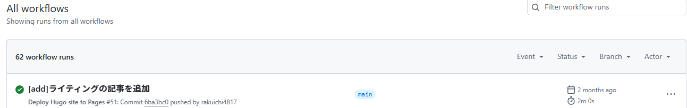
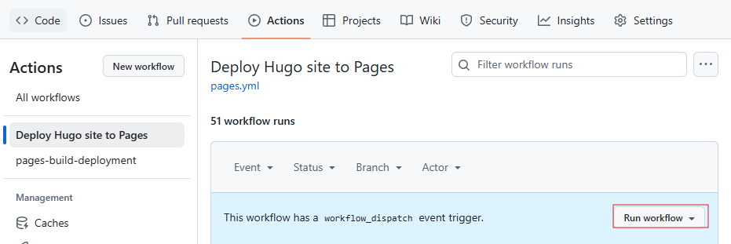

このブログは[Hugo](https://gohugo.io/)で作成しており、GitHub Pagesを利用して公開しています。今回はGitHub Actionsを用いて、Hugoで作成しているサイトのビルドとデプロイを行う方法について紹介します。

といっても簡潔な記事になると思います。実際にこのブログのソースを管理しているリポジトリは以下にありますので、そちらを参考にしてください。

<div class="iframely-embed"><div class="iframely-responsive" style="height: 140px; padding-bottom: 0;"><a href="https://github.com/rakuichi4817/rakuichi4817.github.io" data-iframely-url="//iframely.net/JORxTFL?card=small"></a></div></div><script async src="//iframely.net/embed.js"></script>

## Hugoの基本

Hugoは静的サイトジェネレーターの1つで、MarkdownファイルをHTMLに変換してくれるツールです。Hugoを使うことで、簡単に静的サイトを作成することができます。Hugoのインストール方法は[公式のドキュメント](https://gohugo.io/installation/)を参照してください。

執筆中にローカルでプレビューを確認する場合は`hugo server`でサーバーを立ち上げることができます。特にオプションなどを指定していなければ「<localhost:1313>」でプレビューを確認可能です。ページをビルドする際は `hugo` コマンドを実行します。

そのため、Hugoでサイトを作成する際は、基本的に以下のステップを踏みます（デザインや基本設定は完了しているものとします）。

1. Markdownファイルを作成、編集
2. `hugo` コマンドを実行してビルド（HTMLファイルを生成）
3. ホスティングサービスにアップロード（今回であればGitHubリポジトリ）

今回はこのステップ2, 3をGitHub Actionsを用いて自動化する方法について書いていきます。

## GitHub Actionsを用いたビルド・デプロイ

GitHub Actionsについては過去の記事「[GitHub Actions・pipenv・pytestで自動テストの練習](/posts/2022/github-actions-pytest/)」でも触れています。

細かい説明は抜きにして、今回の目的であるHugoで作成しているサイトのビルドとデプロイを行うための設定ファイルを以下に示します。こちらはHugoの公式サイトにある[サンプル](https://gohugo.io/hosting-and-deployment/hosting-on-github/)を利用しています。

このファイルを対象リポジトリの「.github/workflows」ディレクトリに配置することで、GitHub Actionsが自動的にビルドとデプロイを行ってくれるようになります。

```yaml
# Sample workflow for building and deploying a Hugo site to GitHub Pages
name: Deploy Hugo site to Pages

on:
  # Runs on pushes targeting the default branch
  push:
    branches:
      - main

  # Allows you to run this workflow manually from the Actions tab
  workflow_dispatch:

# Sets permissions of the GITHUB_TOKEN to allow deployment to GitHub Pages
permissions:
  contents: read
  pages: write
  id-token: write

# Allow only one concurrent deployment, skipping runs queued between the run in-progress and latest queued.
# However, do NOT cancel in-progress runs as we want to allow these production deployments to complete.
concurrency:
  group: "pages"
  cancel-in-progress: false

# Default to bash
defaults:
  run:
    shell: bash

jobs:
  # Build job
  build:
    runs-on: ubuntu-latest
    env:
      HUGO_VERSION: 0.120.2
    steps:
      - name: Install Hugo CLI
        run: |
          wget -O ${{ runner.temp }}/hugo.deb https://github.com/gohugoio/hugo/releases/download/v${HUGO_VERSION}/hugo_extended_${HUGO_VERSION}_linux-amd64.deb \
          && sudo dpkg -i ${{ runner.temp }}/hugo.deb          
      - name: Install Dart Sass
        run: sudo snap install dart-sass
      - name: Checkout
        uses: actions/checkout@v4
        with:
          submodules: recursive
          fetch-depth: 0
      - name: Setup Pages
        id: pages
        uses: actions/configure-pages@v3
      - name: Install Node.js dependencies
        run: "[[ -f package-lock.json || -f npm-shrinkwrap.json ]] && npm ci || true"
      - name: Build with Hugo
        env:
          # For maximum backward compatibility with Hugo modules
          HUGO_ENVIRONMENT: production
          HUGO_ENV: production
        run: |
          hugo \
            --gc \
            --minify \
            --baseURL "${{ steps.pages.outputs.base_url }}/"          
      - name: Upload artifact
        uses: actions/upload-pages-artifact@v2
        with:
          path: ./public

  # Deployment job
  deploy:
    environment:
      name: github-pages
      url: ${{ steps.deployment.outputs.page_url }}
    runs-on: ubuntu-latest
    needs: build
    steps:
      - name: Deploy to GitHub Pages
        id: deployment
        uses: actions/deploy-pages@v2
```

このワークフローを利用することで、mainブランチにプッシュされたときに自動的にページが更新されるようになります。（以下、ワークフローが実行されている様子）



## ワークフローの説明

ワークフローの簡単な説明をします。

### トリガー（on:）

- **push**: mainブランチへのプッシュ時に実行
- **workflow_dispatch**: GitHubのActionsタブから手動でワークフローを実行できるような設定（設定をしておくと、下図のようにワークフローを手動で実行することができます。）



### パーミッション設定（permissions:）

- **contents**: read: リポジトリの内容を読み取るためのパーミッション。
- **pages**: write: GitHub Pagesに書き込むためのパーミッション。
- **id-token**: write: デプロイに必要なIDトークンを書き込むパーミッション。

### 同時実行設定（concurrency:）

- **concurrency**: 同時実行されるデプロイを1つに制限します。ただし、進行中のデプロイはキャンセルされず、完了するまで実行されます。

### デフォルト設定（defaults:）

- **shell**: bash: Bashをデフォルトのシェルとして使用します。

### ジョブ1: build (ビルド)

- 実行環境: ubuntu-latest
- 環境変数: HUGO_VERSION: 0.120.2（Hugoのバージョンを指定）

ステップ詳細

1. **Install Hugo CLI**: HugoのCLIをインストール
2. **Install Dart Sass**: Dart Sassをインストール
3. **Checkout**: リポジトリをクローンし、サブモジュールも含めて取得
4. **Setup Pages**: GitHub Pagesの設定
5. **Install Node.js dependencies**: package-lock.jsonやnpm-shrinkwrap.jsonが存在する場合、Node.jsの依存関係をインストール
6. **Build with Hugo**: Hugoを使ってサイトをビルド（オプションについては以下参照）
    1. --gc: 未使用のリソースをガベージコレクション
    2. --minify: 出力を最小化
    3. --baseURL: ビルド時のベースURLを指定
7. **Upload artifact**: ./publicフォルダをGitHub Pages用の出力先に指定

### ジョブ2: deploy (デプロイ)

依存関係（needs:）の設定でbuildジョブが完了するまで待機するようにします。GitHub Pagesへのデプロイは[deploy-pages](https://github.com/actions/deploy-pages)を利用します。（最新バージョンはv4のようです。）

### まとめ

Hugoで作成しているサイトのビルドとデプロイをGitHub Actionsを用いて自動化する方法について簡単に紹介しました。GitHub Actionsを使うことで、手動でビルドとデプロイを行う手間を省くことができます。
