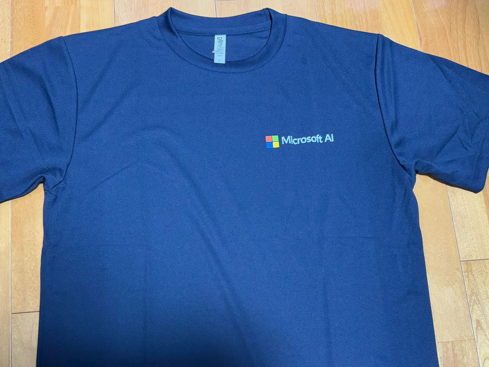
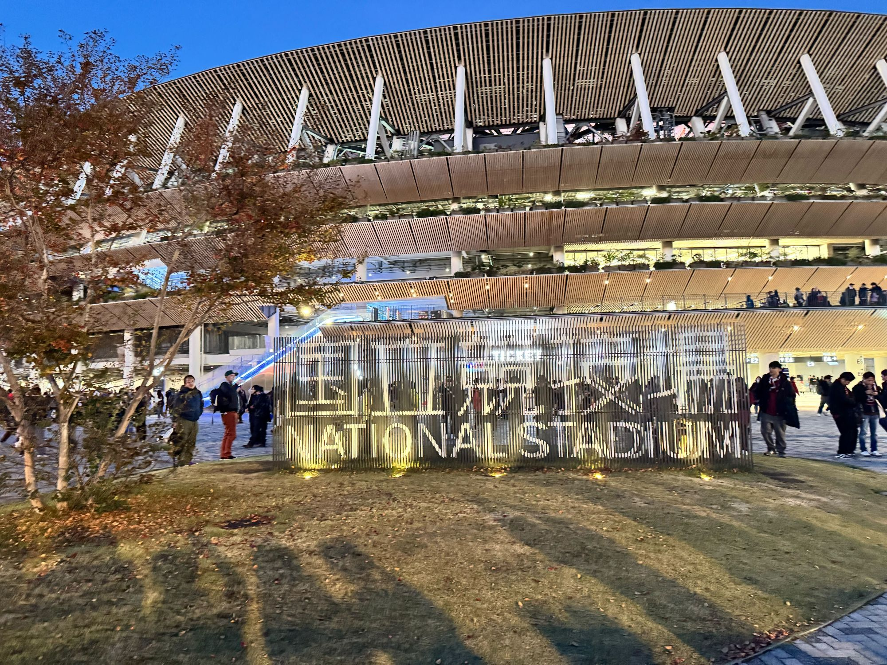
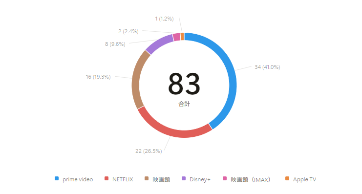
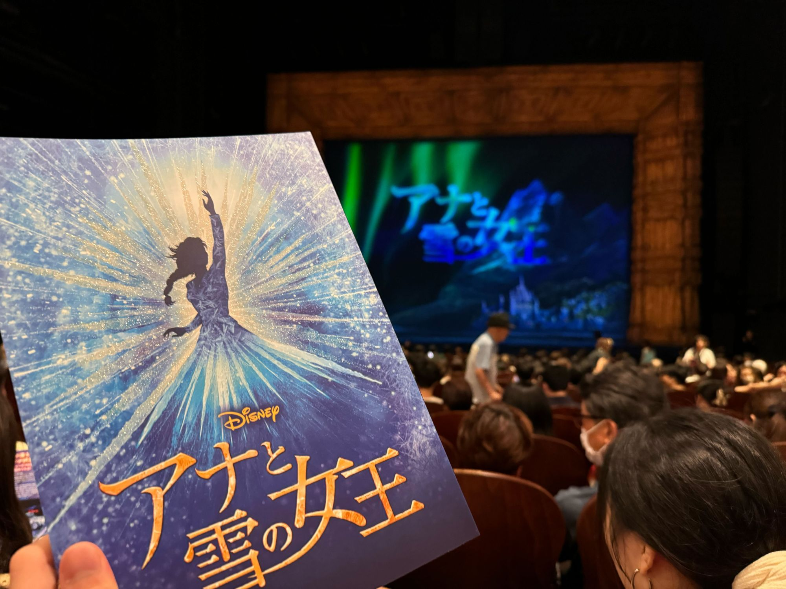
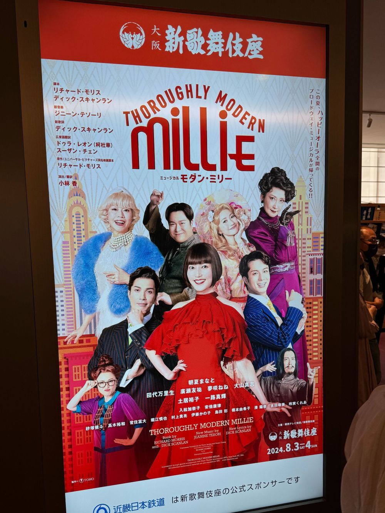
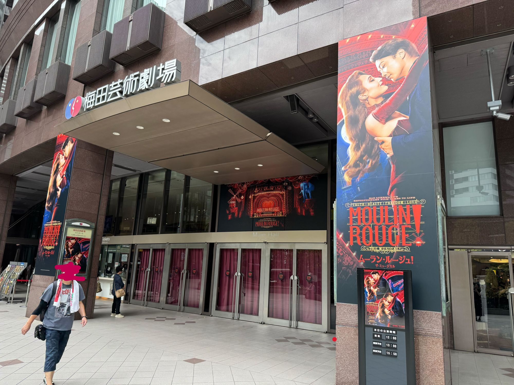
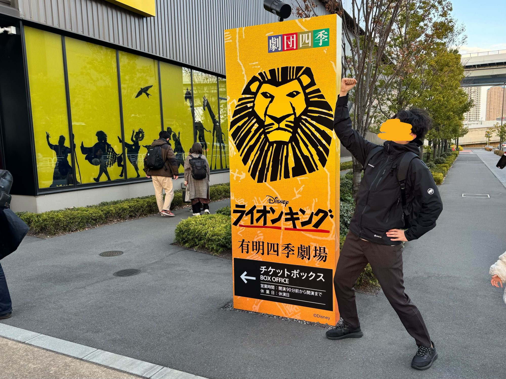

2024年も残すところあとわずか。前回の記事「[2024年上半期振り返り](../2024-first-half-summary/)」に続いて、下半期の振り返りと、2025年に向けての抱負を書いていこうと思います。



## 上半期の振り返り時にたてた目標

まずは、「上半期の振り返り」に書いていた目標を振り返ります。

- 仕事面
  - ひたすら勉強してソフトウェアエンジニア力を高めたい
- プライベート面
  - 映画を1年間で100本見ることを目標に、残り65本見るぞ！！
  - 痩せる！
  - 無駄遣いを抑える！

仕事面は、勉強不足を痛感することも多いですが、少しずつ成長を実感しています。

プライベート面は、3つとも達成できませんでした😇。映画に関しては後程触れます。痩せるに関しては2kgほど痩せましたが目標は未達。出費に関しては必要経費が色々と発生してあまり貯めることはできませんでした。

とりあえず、いつものごとく仕事とプライベート面に分けて振り返りを書いていきます。

## 仕事面の振り返り

仕事面では色々とよい経験をすることができました。5月に現職に転職しましたのでチームになじむところからでしたが、今では開発に主体的にかかわれるようになったと思います。

### チーム開発、アジャイル開発を学ぶ日々

技術的な面はもちろん、チーム開発におけるコミュニケーションやタスク管理なども多く学びました。また、アジャイル開発で進めていることもあり、開発プロセスについても考える時間が多かったです。前職では前職では主に個人作業が中心だったため、チームで1つのプロダクトを作り上げることの楽しさと難しさを実感中です。

9月頃から開発チーム内でいくつか役割を任せていただいたことも大きな経験でした。具体的には、開発をリードしてくださる方が不在時のタスクマネジメントや、スプリントレビューのリード、フロントエンド開発をお願いしている外部の方との連携などを任せていただきました。サブPMとかPMO的な側面があるイメージですかね。

この辺り、実際の開発プロセスの中で色々悩みながら改善したり、チームの方に色々と教えていただきなが成長出来ていると感じています。時間をとって体系的に学びたいところ。

### 技術面は少しずつ着実に

技術面ではやりたいと思っていたことに取り組むことができました。

- フロントエンドのコードを少しずつ触るようになったこと
- テスタビリティ、コードのレイヤー化など、コード実装時の考え方を実践レベルで学び、意識していること
- Azure上でのアプリ開発をしたこと
- OpenAIを使った様々な実装を経験したこと

あげだすときりがありませんが、環境を変えて取り組みたいと思ったことに挑戦できたかなと。なにより、チームで生成AIを使ったソリューション開発、研究開発を行っていることも仕事を楽しめている要因の1つです。チームメンバーと色々議論しながら、実装していく過程がとても楽しいです。

以下の記事も、業務の中で取り組んでいるときに「できるんじゃね？」と思ったことに取り組んだことをまとめたものです。



また、学生時代に取り組んでいた情報検索周りの内容も、取り組んでいるソリューション開発で重要な要素になりつつあるので、来年は改めて情報検索分野の技術もキャッチアップしていきたいです。

総じて、まだまだチームをリードするスーパーエンジニア達についていけていないので、少しでも追いつけるように頑張ります。

### 対外的な活動が充実し始める

Azure関連のイベントに参加したり、Microsoftのイベントで登壇したり、会社のコラムで記事を書いたりと、対外的な活動に多くかかわることができました。個人的にはこういった活動も積極的に参加していきたかったので、機会が増えたのはとてもうれしかったです。


  
  


来年は、関西でのイベントにも積極的に参加して行きたいと思っています。また、このブログをはじめ、技術的なアウトプットを増やしていきたい。

## プライベート面

### ヴィッセル、終わってみれば天皇杯優勝、Jリーグ2連覇の2冠👑

上半期の振り返り記事内にて以下のように書いていたのですが、蓋を開けてみたら天皇杯とJリーグの2冠を達成。失礼いたしましたとしか言いようがありません🙇‍♂️

> ヴィッセルを応援し始めたころに比べると、安定して優勝争いに食い込めてるのですごいのですが。連覇がミッションって言ってましたからね。試合の内容もうーんと思うのが多くて少し面白さに欠ける気がしています。

えらそうに語っていて恥ずかしい限りです😇

天皇杯優勝の瞬間も、Jリーグ優勝の瞬間も現地で見ることができました。天皇杯は当日新幹線が遅れてバタバタしたので、あれで負けてたら何とも言えない気持ちになっていただろうな...。


  
  


今年はあまり現地で観戦できなかったので、来年は旅行も兼ねてアウェイの試合に行こうかと思います。（毎年言っている気もするが...）

### 映画は100本に届かず...

映画は年間100本を目標にしていましたが、12月30日時点で83本に留まりました。目標を達成出来なかったものの、映画館に計17回行けたのは良かったかなぁと思います。

上半期に見た映画の中でのおすすめは上半期の振り返りで書いていますので、下半期見た映画の中でのおすすめを書いておきます。順番には意味はありません。

- ターミナル
- オットーという男
- フォード vs フェラーリ
- ラブアクチュアリー
- インセプション
- ソウルフルワールド
- インサイドヘッド2
- フォールガイ
- ソニックザムービー シリーズ
- フライ・ミー・トゥ・ザ・ムーン
- モアナ2

### 観劇は割とたくさん

上半期はアラジンだけでしたが、下半期は4作品見に行くことが出来ました。

1. 劇団四季「アナと雪の女王」
2. モダン・ミリー
3. ムーランルージュ
4. 劇団四季「ライオンキング」

ムーランルージュは2回目でしたが、再演される限り毎回見に行きたい作品です。

モダンミリーに関しては朝夏まなとさんが好きで見に行きましたが、良い作品と出会えたと思います。これからも、好きな俳優さんが出演している作品は積極的に見に行こうと考えています。

来年は、ウィキッドのチケットを確保しているので、あとはレ・ミゼラブルの大阪公演のチケットを確保できるかどうか...。東京公演のチケットは全くとることが出来なかったんですよね。


  
  
  
  



## まとめと2025年に向けて

少しざっくりした振り返りになりましたが、2024年の下半期は色々経験できた半年だったかなと思います。仕事面でもプライベート面でも、自分がしたいと思ったことにとりくめたことが良かったですね。

来年の目標をざっと。

- 無駄づかいを抑える！！！
- 映画を100本見る！！
- 観劇を楽しむ！
- 技術内容の記事を月1本必ず書く！

無駄遣い抑えるに関しては、月々の貯金額を明確に決めようと思います。マネーフォワードで家計簿はつけているので、ちゃんと計画を立てて制限をかけていきます。

映画100本に関しては、今年少し足りなかったので継続目標とします。幅広いジャンル、幅広い年代の映画を見ていく予定です。観劇に関しては、宝塚も観ていきたいですね。

あとはこのブログに月1本は必ず技術的なネタを投稿するということを徹底します。今年は結構さぼっていたので...。会社のテックブログもあり、そちらの記事も書いていきたいですが、個人のアウトプットも大事にしていきたいです。