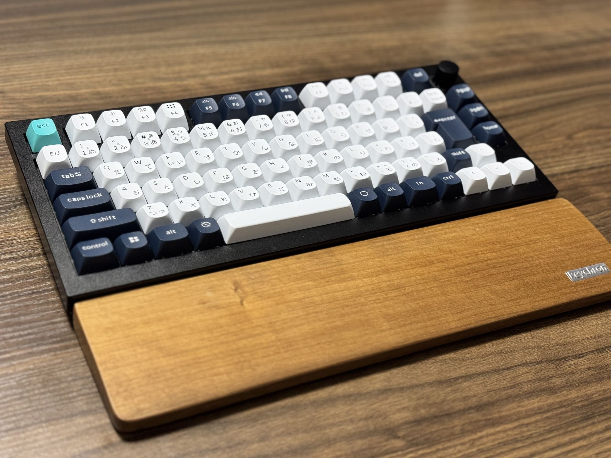
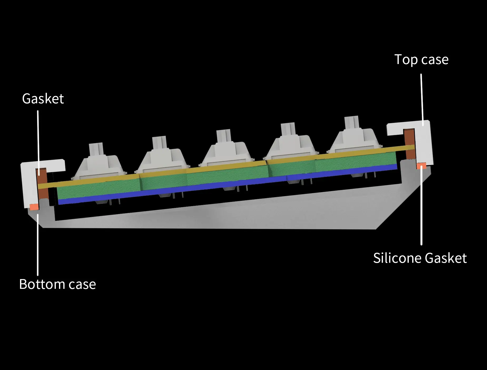
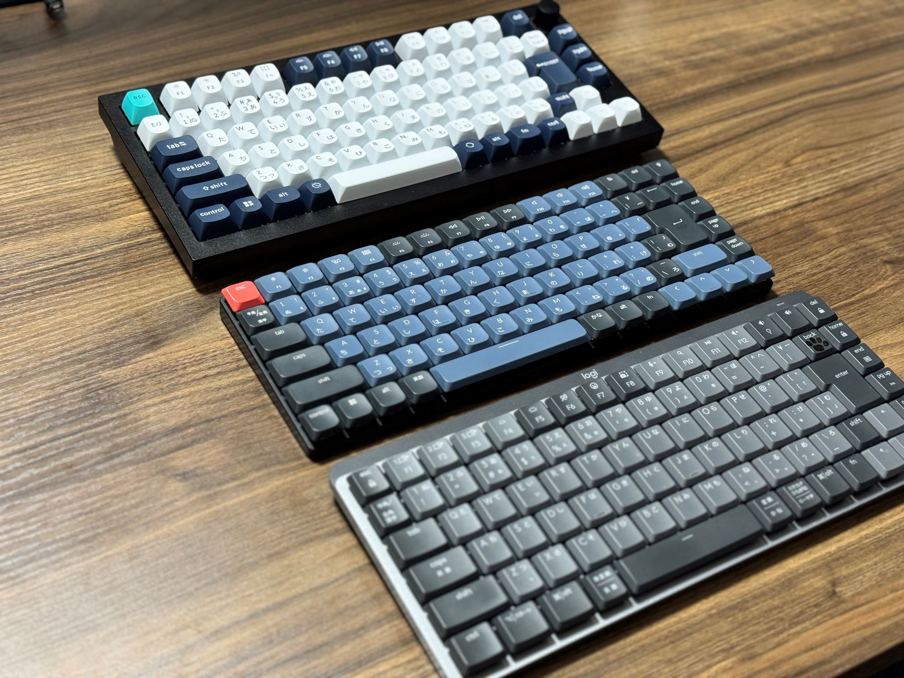
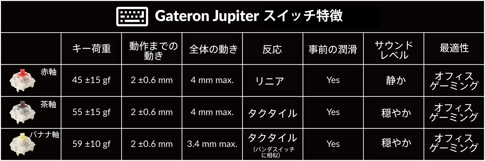
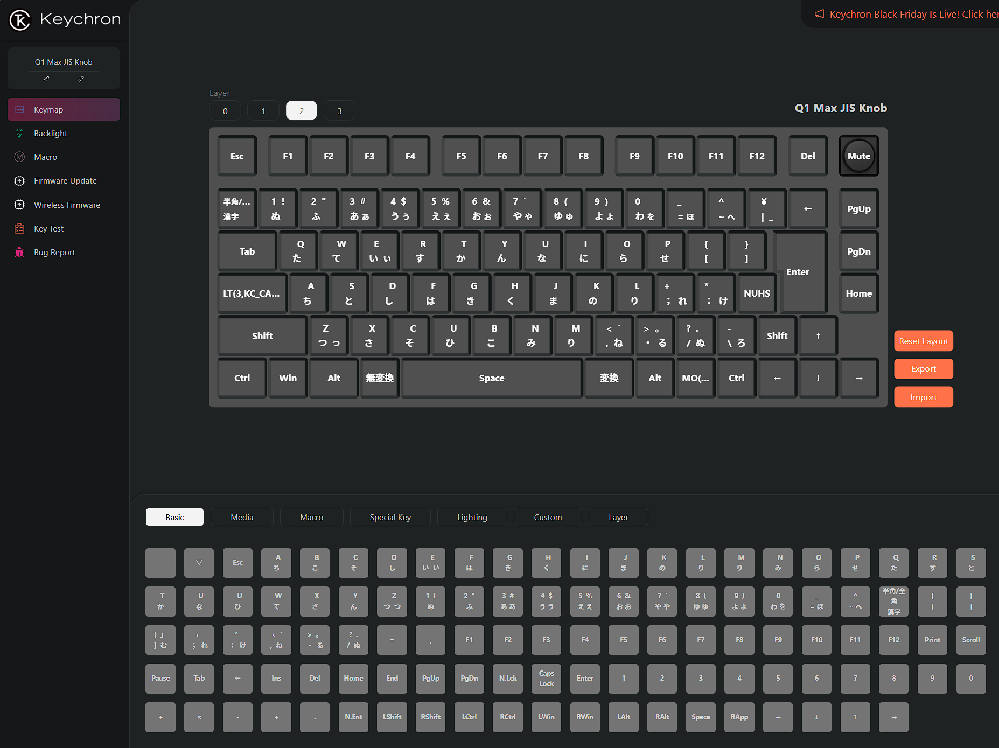
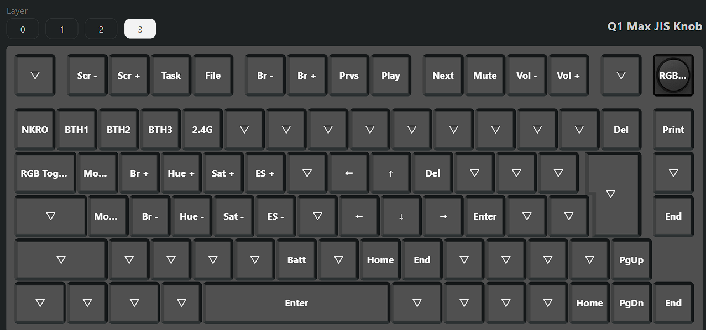
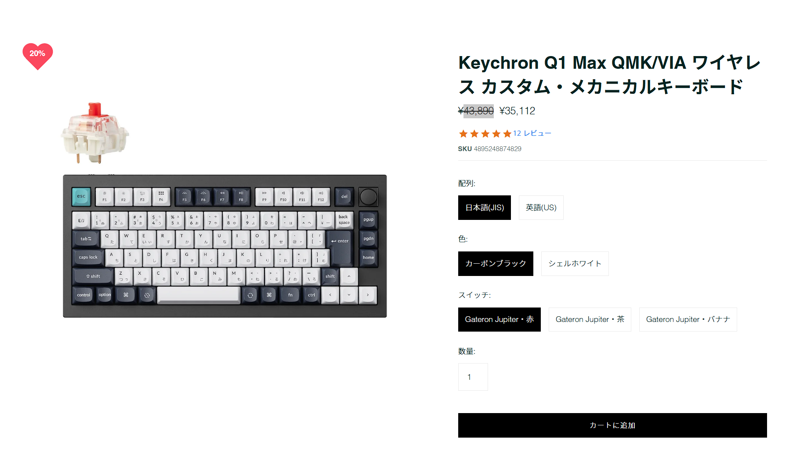

今年も気づけば12月。転職してからは本当に怒涛の日々だったので、いつも以上にあっという間に感じました...。

何とか今の環境にも慣れてきたので、自分へのご褒美にと高級なキーボードを買ってみました。それが、「**Keychron Q1 Max**」 です。購入記念に感想を書いてみようと思います。キーボードにめちゃくちゃこだわっているわけではなく、知識もそこまでないです。まともなレビューはできませんのがご了承ください。

購入を検討している方の疑問には答えられると思うので、質問がある方は右下のチャットから気軽に聞いてくださればと思います。

## Keychron Q1 Max QMK/VIA の簡単な紹介

わたしが購入したのは「Keychron Q1 Max QMK/VIA」のJIS配列、バナナ軸です。

> __以下、公式サイトより引用__
> 
> フルメタルQMK/VIAワイヤレスカスタムメカニカルキーボードKeychron Q1 Maxは、2.4GHzワイヤレス接続にアップグレードされ、1000Hzのポーリングレートを備えています。タイピングエクスペリエンスをさらに向上させるため、アコースティックフォームを何層にも重ね、キーを打つ度にプレミアムなサウンドクオリティ味わえるハイエンドキーボードです。
>
> ダブルガスケットデザイン、PBTキーキャップ、ねじ込み式スタビライザーなど、その他多くのプレミアム機能と組み合わされたKeychron Q1 Maxは、期待を超える比類なきタイピングの旅をお約束します。

最近割と見る機会が増えた、KeychronのフラグシップモデルであるＱシリーズの1つです。 
_※各シリーズの紹介はこちらがわかりやすいです_ ：[Keychronキーボードの選び方ガイドライン
](https://green-keys.info/keychron-syurui/)

わたしがこのシリーズの最大の特徴だと思っている部分は、ダブルガスケット設計です。ガスケットとは、キーボード内部の「プレート」（スイッチを支える板）をキーボードケースに直接固定するのではなく、ガスケット（通常はシリコンやゴムなどの弾性素材）を用いて間接的に固定する設計のことです。

Keychron Q1 Maxは、プレート上のガスケットに加え、トップケースとボトムケースの間にシリコンパッドを追加、衝撃を吸収し金属ノイズも軽減しているようです。この構造が打鍵感をよくしているようです。

 

この辺りのまじめな解説は、以下のYoutubeを参考にするとよいと思います（レビュー放棄）。わたしも購入の際は参考にしました。

<iframe src="https://www.youtube.com/embed/PNEyS6pC9po?rel=0" style="top: 0; left: 0; width: 100%; height: 100%; position: absolute; border: 0;" allowfullscreen scrolling="no" allow="accelerometer; clipboard-write; encrypted-media; gyroscope; picture-in-picture; web-share;"></iframe>

## 初めてのバナナ軸

わたしは今まで、次の順番でキーボードを乗り換えてきました。

1. logicool MX Keys Mini（[商品ページ](https://www.logicool.co.jp/ja-jp/products/keyboards/mx-keys-mini.html)）
2. logicool MX MECHANICAL MINI 赤軸（[商品ページ](https://www.logicool.co.jp/ja-jp/products/keyboards/mx-mechanical-mini.html)）
3. Keychron K3 Pro QMK/VIA 赤軸（[商品ページ](https://superkopek.jp/products/keychron-k3pro?variant=44076547997936)）

基本的にはキーキャップが高くないロープロファイル系のキーボードを好んで使ってきました。MX Keys Miniに関してはパンタグラフ式でめちゃくちゃ薄いですしね。

ちなみに歴代3つとも非常に自分好みでした。それぞれ乗り換えた理由を1行で書きます。

1. **MX Keys Mini → MX MECHANICAL MINI**：このいま使っているモデルのメカニカルが出ただと！？買うしかねぇ！！
2. **MX MECHANICAL MINI → Keychron K3 Pro**：deleteキーがbackspaceの右上にあるのが気に食わん！k3 proめちゃくちゃよさそう！
3. （**今回）Keychron K3 Pro → Keychron Q1 Max**：k3 pro：不満は特にないけど、Q1 Maxのダブルガスケット設計が気になる！
   

キーストロークがあまりないほうがいいなぁと思っていたこともあり、キー荷重も軽いほうがいいだろうということで今までは赤軸を選んでいました。ところが、今回のKeychron Q1 Maxはバナナ軸を選んでみました。

理由はこちらのQAサイト「<https://www.reddit.com/r/Keychron/comments/19dgz2m/keychron_q1_max_review/>」のやり取りを見たからです。バナナ軸をべた褒めしていたので、せっかくなら新しい軸を試してみようと思いました。

結論から言えば 「**バナナ軸🍌最高！！**」です。キー荷重が赤軸に比べてかなり重くなっているので、疲れが出るかなぁと思っていました。使って数週間、いまのところは全く気になっていません。それどころか「どんどんタイピングしたい！」という気持ちになっています。バナナ軸でタイピングした後に赤軸でタイピングすると、めちゃくちゃ軽く感じてしまうのは難ですが...。

青軸を使ったことがないので比較はできないですが、バナナ軸は青軸に近いが青軸ほど重くなく音も鳴らない、という風に表現している方がいました。いまは持ち運び時用にしている K3 Proもバナナ軸に変えようか検討しているレベルです。それくらい心地よいです。

## JIS配列でもダブルショットPBTキーキャップ

Keychronのほかのモデル、K3 Proもそうでしたが、JIS配列はキーキャップのモデルがABSのみということがままあります。K3 Proに関しては、矢印キーがまさかの1列ですしね（笑）。

こちらのQ1 MaxはJIS配列でもダブルショットPBTキーキャップを採用しています。エンジニアのくせにUS配列を使えない私にとってはとてもありがたかったです🥹

また単純にキーキャップの色合いも好みで、キーボード全体のデザインも気に入っています。よくひらがなが書いてるのはダサいという人がいますが、そこまでキーボード沼にはまっていないので気になっていません。

## キーマップ変更

K3 Proでもありましたが、Q1 MaxもQMK/VIA対応です。QMKはキーマップを自由に変更できるオープンソースのファームウェアです。VIAはQMKのGUIツールです。最近はKeychronが出している「[Keychron Launcher](https://launcher.keychron.com/)」を使えば簡単にキーマップを変更可能です。

以下はfnキーを押しているときに反映されるレイヤー3のキーマップです。わたしは、上記画像で設定しているように、「caps lock」の長押しでもレイヤー3に移行するようにしています。

ホームポジションに置いた際に、右手で矢印キーを押したりbackspaceを押せるようにしています（あまり使いこなせていませんが）。

## デメリット

- 持ち運ばないので良いが...やっぱり重い🏋️
- 値段がちゃんと高い💸

まず、アルミニウムボディなこともあり、しっかり重たいです。公式サイトには「**重量：約1724 g ± 10 g**」と書かれています。持ち運び用途にはまず使えないですね。私は家用に買っているので全く気になりません。ちょっと動かすくらいなら気にならないです。

そして、やはり値段が高いです。わたしはヨドバシカメラで買ってポイントを付けて実質10%OFFになりましたが、定価は「￥43,890
」ですからね...。

※ この記事を書いている現在（2024年12月1日）は、ブラックフライデーで20%OFFになっていました！

## まとめ

非常に簡単にではありますが、Q1 Maxの感想を書いてみました。激浅レビューであることは間違いないですが、キーボード好きの方々による濃密動画レビューがいっぱい上がってますしね。

わたしの意見としては、奮発して買うなら価値があるのでお勧めできる一品です。HHKBやRealforceなどの高級キーボードを使ったことがないので、比較はできませんが、それらに比べてまだまだ利用者が少なさそうなところも気に入っています。HHKBより好きな打鍵感って書いている人もいたので、機会があればお店などで触ってみるとよいかもしれません。

それでは、また次の記事でお会いしましょう！