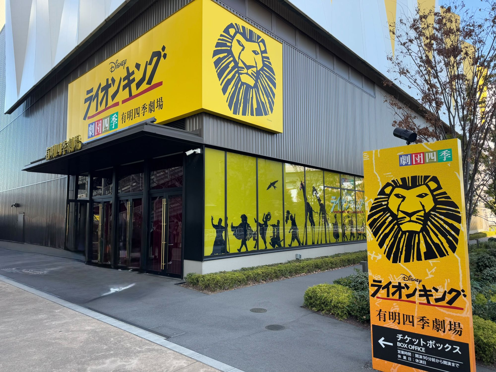
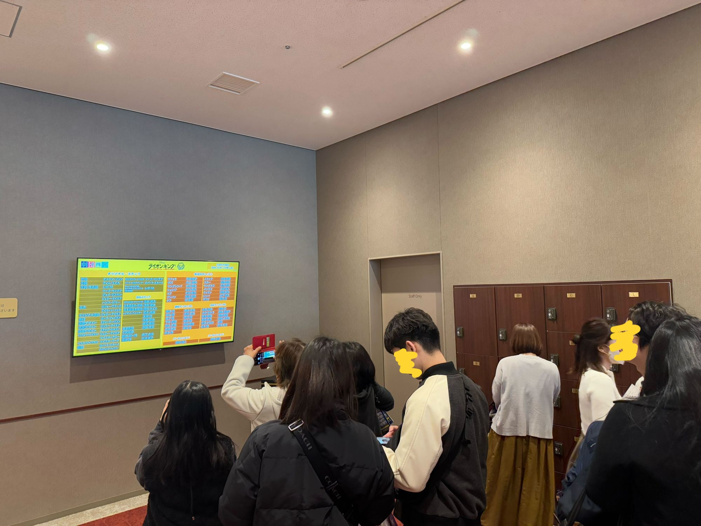
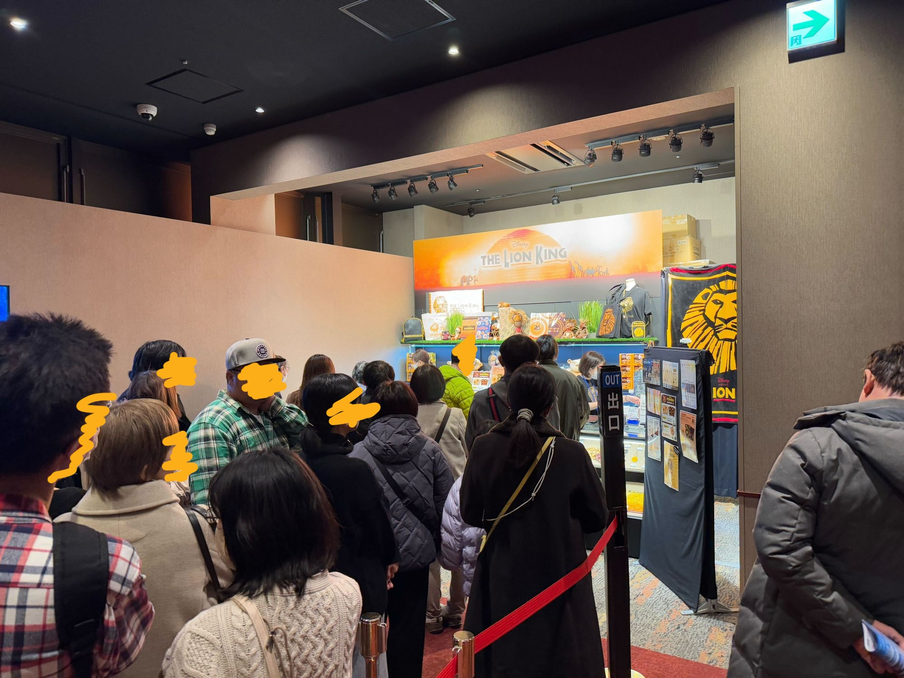
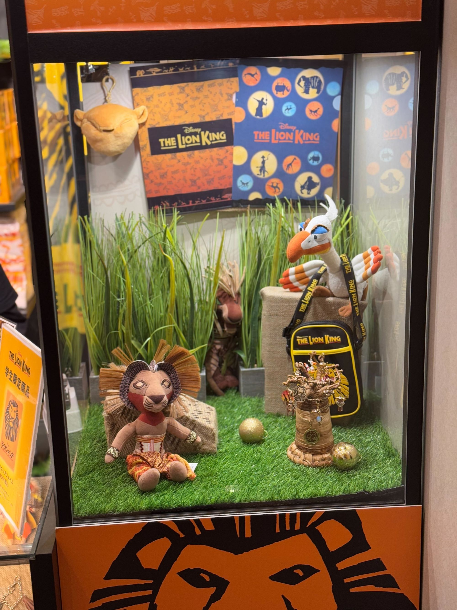
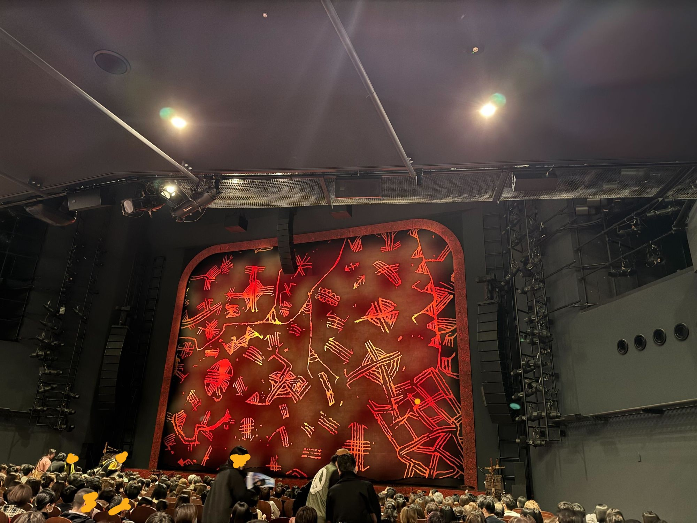

クリスマス、皆さんはどのように過ごしましたか？わたしは、イブに「ライオンキング ムファサ」を見に行っていました。映画館内でひたすら話すカップルにイライラしつつ、肝心の内容も正直微妙という何とも言えない思い出が残りました。

ライオンキングはライオンキングでも、先日、劇団四季の「ライオンキング」を鑑賞してきました。劇団四季は過去に「美女と野獣」、「アラジン」、「アナと雪の女王」とみてきて、それぞれブログで触れてきたので今回も触れていきます。

過去記事

- [2023年の振り返りとちょっと抱負（美女と野獣）](/posts/2023/2023-summary/)
- [1人で劇団四季「アラジン」に行ってみた](/posts/2024/trip-01-aladdin/)
- [劇団四季「アナと雪の女王」を見てきた](/posts/2024/shiki-anayuki/)

ちなみに中学生の時に修学旅行で鑑賞していたのですが、その時は途中で寝てしまいました...。今回鑑賞して、当時の私がどれだけもったいないことをしていたかを痛感したことを先に書いておきます。

## 有明四季劇場

現在、ライオンキングは有明にある「[有明四季劇場](https://www.shiki.jp/theatres/4026/)」にて公演されています。この劇場は有明ガーデンという商業施設の一角にあります。一角にあるというだけで、四季劇場\[春]のように建物が一緒なわけではなく、独立した建物になっていました。

行きは、ゆりかもめに乗って有明駅まで行き、徒歩で向かいました。有明駅からはそんなに離れていなかったと思います（HPでは徒歩8分）。帰りはりんかい線に乗って帰りましたがこちらもそこまで離れていません。

## 開演までの過ごし方

13時からの公演で12時15分に開場でした。少し早く着いたので、有明ガーデンで時間をつぶして12時10分くらいに入口に行くと待機列ができていました。わたしはロッカーに荷物を入れたかったので並びましたが、あえて並ぶ必要もないかもしれないですね。

### コインロッカー

建物に入るとエントランスフロアとなっており、入ってすぐ左側にコインロッカーがありました（下画像）。コインロッカーは無料で利用可能（100円返却式）で、とてもありがたかったです。劇場によってはコインロッカーがないこともあるので。ロッカーに入りきらないキャリーケースなどはサービスカウンターで預かってもらえるようです。

エントランスフロアの奥にもコインロッカーがありました。こちらはキャストボードの前だったり、トイレの前ということもあり人の出入りが激しいです。写真は開演前の様子ですが、人が多いのを見ていただけるかと。大きめのロッカーがあるのはこちらだけでした。

**基本的には入ってすぐ左のコインロッカーを使うのをオススメします**。開演前、休憩、終了後、空いていたので使いやすかったです。なお、わたしのリュックは26Lサイズでそれなりに大きいのですがギリギリ入りました。

### グッズ販売

グッズ売り場はエントランスフロアと、その1つ上の階にありました。エントランスフロアの方はすぐに列ができていたので、上の階の方が空いているかもしれません。

画像は上の階にあるグッズ売り場です。割と開始時間に近づいている状態でしたので並んでますが、開場後すぐならもう少し空いているかと。

ミュージカルを見る際はいつも買っているプログラムと、26周年記念クリアファイルを購入しました。四季の会に入ったこともあり、四季の会会員用のてさげ袋がもらえたのが地味に嬉しかったです。

### 座席から

今回は、S席 1階 15列 37番 で鑑賞しました。真上は2階席のため、もう少し前の列だったたら開放感があったかもしれません。下の写真は少し上にカメラを向けているため、天井がある様子がわかりやすいと思います。舞台までの距離感はそこまで感じなかったですが、次見る際はもっと前の方で見てみたいです。

また、演出の都合上、通路よりの座席がおすすめです。公演中、何度か観客席側の通路を使った演出があり、通路側に座っていればほとんど0距離で見ることができます。

## 簡単な鑑賞レポ

鑑賞レポートはあまり得意ではないですがせっかくなので少し。

### 「ハクナ・マタタ」だけじゃない！印象的な楽曲！

「サークル・オブ・ライフ」で始まるオープニングは、まさに圧巻！劇場全体が息を呑む瞬間でした。座席の通路にも様々な動物が登場し、劇場全体が舞台になっているようでした。

「早く王様になりたい」、「ハクナ・マタタ」はもちろん、「ワン・バイ・ワン」、「終わりなき夜」、「お前の中に生きている（リプライズ）」など、印象的な曲がたくさんあり、中学生のときに寝たのが本当に信じられません。

「お前の中に生きている（リプライズ）」は、気づけば何度も口ずさんでいます。「Hela hey marmela hela」の部分も結構好きなんですよね。サントラも絶賛ヘビロテ中です。

### 劇場でしか味わえない、ならではの演出と感動

動物たちの表現も工夫が凝らされていて、見ているだけでも楽しかったです。特にムファサやスカーのお面に惹かれました。姿勢を変えると、本当のライオンのような姿勢に見えるのは素晴らしい表現だと思います。キリンや象、ザズーを始め登場する動物が本当に生きているようでした。気になる方にはぜひ見てほしい。

演出としては、「ハクナ・マタタ」でヤングシンバから大人シンバに切り替わる直前、舞台照明が変わって、ヤングシンバとティモン、プンバが影のようになるところが印象的でした。あの瞬間の光景は今でも鮮明に思い出せます。

ヤングシンバの最後の出番と、大人シンバの登場が重なる瞬間。ヤングシンバへの拍手と、大人シンバの登場を待ちわびる拍手が交錯し、劇場の空気が一気に高まります。そして、舞台に現れた大人シンバが「しんぱいないさー」と圧倒的な声量で歌い上げる瞬間、盛り上がりは最高潮に達します。この感動は劇場でしか味わえないものだとおもいます。もう一度観たい、いや、何度でも観たい…！

### 26周年を祝う熱狂的なカーテンコール

私は12月21日の公演を見に行ったのですが、上演26周年の特別なカーテンコールがありました。全然調べてなくて普通にびっくりしましたが、特別なタイミングで見ることができて幸運でした。

その特別な状況であったとはいえ、私が今まで体験した中で最も長く、熱気に包まれたカーテンコールでした。割れんばかりの拍手が鳴り響き、26年というロングランの中で積み上げてきたものを感じることができました。私も思わず「ブラボー」と言いたくなりましたね。言う勇気はなかったですが。

30年40年とロングランを続けてほしいです。私も継続的に観に行きます。

## まとめ

簡単ではありますが、劇団四季「ライオンキング」の鑑賞記録を書きました。1人で観に行っているからこそ、ブログに書くことでこの体験を自分の中で消化したくなるんでしょうかね😑。

ブログを書きながら、昔めちゃイケのオファーシリーズで岡村さんがライオンキングに出ていたことを思い出しました。ハイエナダンサーやガゼル、草の役をこなしていた記憶があります。中学の時はすっかり忘れていましたが、今思えば劇団四季に興味を持った最初のきっかけはあの企画だったのかもしれません。

せっかく関西に住んでいるので、「ウィキッド」もチケットを確保して見に行きたいところです。映画もありますしね。他にも「バック・トゥ・ザ・フューチャー」も気になります。「美女と野獣」も、もう一度見に行きたい。

年内はあと数本ブログを書く予定です。元テックブログとして技術ネタも上げたいところ🫥