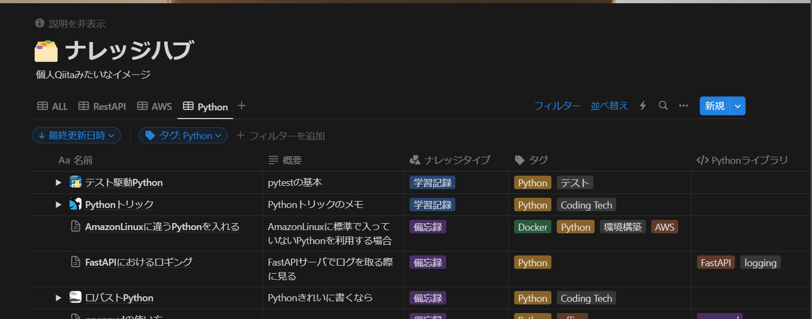
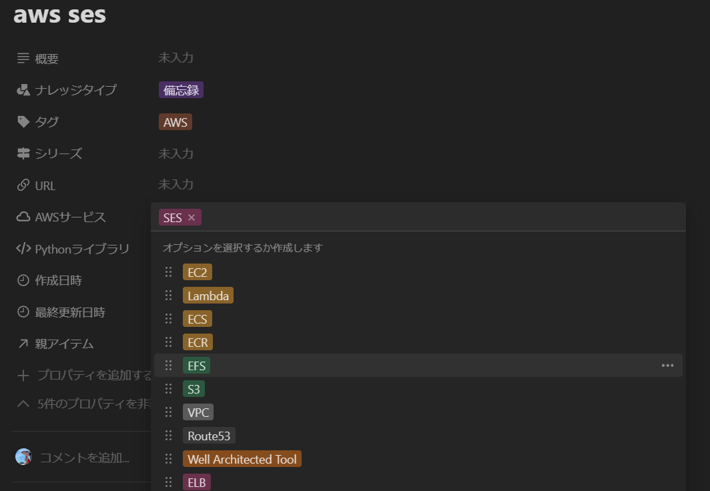

あけましておめでとうございます。今年もよろしくお願いいたします。

今回は、今までブログでは触れてこなかったNotionについて取り上げます。早速本題ですが、Notionを利用していて複数のデータベース（以降、DB）を作っていると、

🤔「あれ、この内容はどのDBで管理すれば良いんだろうか？」

と思ったことはありませんか？Notion自体は約4年前から使っていたのですが、この問題が多発するようになりました。そこで、大きく構成を変更したのでその内容を紹介します。

## 要点

本ページで説明する内容の要点を書いておきます。

- **情報（紙の資料やNotionのページ）をカテゴリで整理しようとすると必ず破綻する**
- **情報を時間軸で管理する（「超」整理法）**
- **Notion上でほぼすべての技術系ページを1つのDBに集約**
    - 分けたいときは「マルチセレクト（タグ）」を利用して、後からフィルタで抽出してビューを作る
    - 最終更新日、作成日で時系列管理する

## カテゴリ分けは必ず破綻する

私は技術系の備忘録からタスク管理、プライベートのメモなど様々なことをNotionで管理しています。実際に技術ネタを管理していたページが以下になります。

こちらを見てもわかるように、ある程度大きなジャンルでページ（DB）を切り分けて管理していました。ページ=DBのものもあれば、ページの中で複数のDBがある場合もあります。

このような管理をしていると、

- **🤔「Lambda（AWS）上のPythonプログラムについてのメモは、"Python”用DBか、"AWS”用DBのどっちに入れりゃいいんだ？」**
- **🤔「Docker使ってPythonの環境を整えたときはどこのDBに入れる？」**

ということが頻発するように...。メモを取ることが増えれば増えるほど悩むハメになります。このように、**カテゴリによる情報の整理は必ず破綻します**。

## 「超」整理法：情報を時間軸で管理する

この、「カテゴリによる情報の整理は必ず破綻します」という考えは、『[「超」整理法―情報検索と発想の新システム（野口悠紀雄 著）](https://www.chuko.co.jp/shinsho/1993/11/101159.html)』という本から来ています。大学時代、メールの整理方法に悩んでいたところ、お世話になっていた先生におすすめされて読みました。

この本の中で、**書類や資料をカテゴリなどで分けるのではなく、「時間軸」で管理したほうが良い**と紹介されていました（間違っていたらごめんなさい）。カテゴリで分ける方法は、前述の例のように必ずどこかで破綻してしまいます。しかし、時間軸であれば迷うことなく追加していけます。さらに、**人間はそれが「いつ」起こったかは結構覚えている**ので、後から書類を探す場合も簡単です。

実際の書類であれば、大きい茶封筒やファイルを使ってシンプルに時系列で上にどんどん重ねていきます。手前には新しいもの、奥が古いものになるような整理法になります。例えば、「確定申告」などは1年に1回見直すことになるでしょう。「1年前の書類を参考にしたい」と思ったとき、時系列で管理していれば1年前の書類を見ればよいのです。しかし、カテゴリで整理していた場合、どこにカテゴライズしたか悩む可能性があります。

また、一度検索・利用した書類は、利用した日時の位置に動かしておきます。こうしておくと、**頻繁に利用する書類は必然的に手前に来る**ようになり、あまり使わない書類が後ろに押し出されていく形になります。

## 実際のNotion

「超」整理法の考え方を反映し、Notionを再構成しました。実際の画面とともに紹介します。

### 10以上あったDBを1つに集約

技術・ビジネス関係のノートを1つのDBに集約することにしました。技術系ってカテゴライズしてるのでは？という疑問もあるかもしれませんが、さすがに日記や映画の感想なんかを書いているDBとは混ぜられないなと思い。そこが **“ほぼ1つ”** と表現している所以です。

様々な内容のページが存在しています。DBの説明にも書いていますが、「1人用Qiita」みたいなイメージです。並び替えは各ページの「最終更新日時」をもとにしているので完全に時系列です。この最終更新日時もNotion側で自動で管理されるので非常に簡単です。この管理の仕方であれば、1つのページに「AWS」、「Python」、「Docker」の内容がある場合も迷いなく追加できます。

もし、「Pythonに関連するものだけが見たい」という場合は、下記のようにフィルタを使って新しいビューを作ればよいのです。

### まとまりがあるものはサブアイテムを使ってまとめる

いつから追加されたのかわからないのですが、DB内でサブアイテムを作れるようになっていました。書籍を使って学習したときのメモや研修の記録など、明確なまとまりがあるものに関してはこの機能を使って管理しています。

この方法であれば、サブアイテムごとの内容が違っていても別のタグや概要を付けることができます。

### ページが持っている項目

このDBで管理しているページが持っている項目を紹介します。先程の画像では「概要」や「ナレッジタイプ」、「タグ」などがありました。現在私が用意している項目を以下に示します。

|項目|項目タイプ|補足|表示|
|-|-|-|-|
|概要|テキスト||常に表示|
|ナレッジタイプ|マルチセレクト|備忘録や学習記録等ざっくりとしたタイプ分け|常に表示|
|タグ|マルチセレクト|「Python」や「ネットワーク」のようにざっくりとしたタグ|常に表示|
|シリーズ|マルチセレクト|継続して書いていくものであれば利用|常に表示|
|URL|URL|どこかのページのまとめであれば利用|未入力時は非表示|
|AWSサービス|マルチセレクト|サービスの色とタグの色を揃えたかったのでタグから外だし|未入力時は非表示|
|Pythonライブラリ|マルチセレクト|ライブラリの数が多いのでタグから外だし|未入力時は非表示|
|作成日時|作成日時||常に非表示|
|最終更新日時|最終更新日時||常に非表示|
|親アイテム|親アイテム|対象ページがサブアイテムであれば親アイテムが表示される|未入力時は非表示|

「タグ」が一番よく使う項目で、多くの要素が存在します。ここで、タグの中でもAWSサービスやPythonライブラリを表すタグは外だしで別に項目を作っています。これらは単体で非常に多くの要素を持つ可能性があり、一つの項目に押し込むと大変になると考えました。また、AWSに関してはサービスの色が公式で分けられているので（コンピューティング系は黄色のような）、それに合わせる目的もあります。

この対応をしていると項目がめちゃくちゃ増えるのでは？という懸念もあるのですが、とりあえず項目は増やしておいて、使わなければ非表示にすることで対応しています。（Notionの機能をフルに使います）

上記の表にも項目ごとの表示基準を書いていますが、適用された結果は以下のようになります。非常にシンプルでわかりやすいと思います。

「ナレッジタイプ」はどういう要素を用意するか検討中なのですが、ページの役割を表現できればと思っています。「シリーズ」は前節で紹介したサブアイテムと若干役割が被っているので、あまり使わない気もしていますが念のため残しています。

## 現在の使用感と気づき

この構成に変えてからまだ1週間程度なのですが、次のメリットを感じています。

- **気楽にページを作れる**
- **管理コストが大幅減**
- **情報集約したことにより2次利用が容易**

今まではなにか新しい勉強を始めるとき「まずは新しい管理用ページを作って...」としていたのですが、そのコストが0になりました。とりあえずこのDBに突っ込んで、利用することが増えれば、関連するものだけ抽出するようにしました。この基本的な運用をまとめると次のようになります。

1. まずは何も考えず一本化したDBにページを追加する
2. 同じタグがついたものが増えてきたら、フィルタで絞った専用ビューを作る
3. 内容量も増えてきたら専用のWikiページを作る（参照を活用）

この利用方法に変えてから気づいたことがあります。それは、**「専用DB（ページ）を作ってもそんなに情報量が増えないことがある」** ことです。例えば、「〇〇について勉強するから専用DB作るぞ！」と意気込んだものの結局ほとんど利用せず、中身のない枠だけ残ってしまう感じです。こうなると、消すにも消しづらく、ほぼ利用することもないDBが誕生してしまいます。

とはいえ、今回紹介したページ管理方法で全く問題がない、というわけでもないと思います。今後も改善に取り組み、気が向けばこちらのブログで紹介していければと思います。

この記事の内容に関して、アドバイスやコメントありましたら、右下のチャットより連絡していただければと思います！