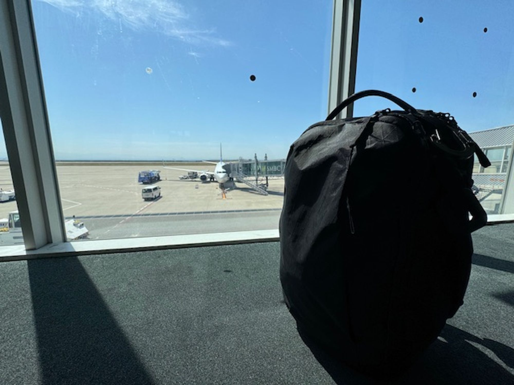
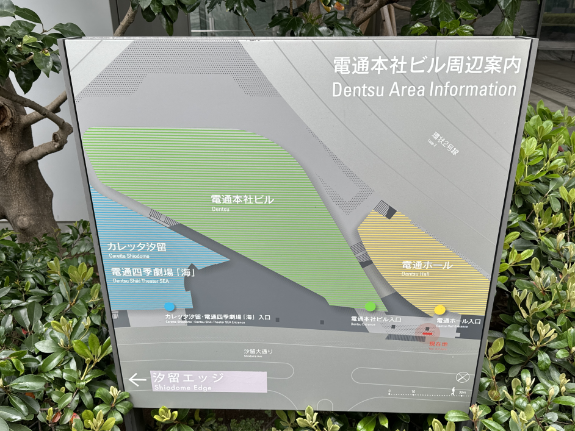
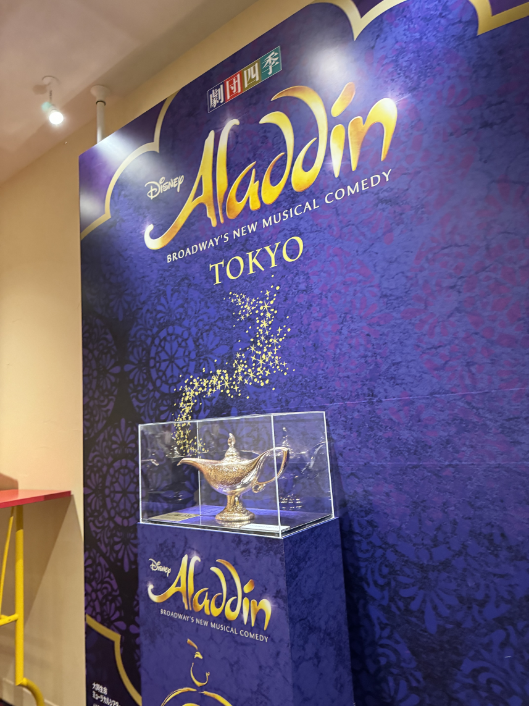
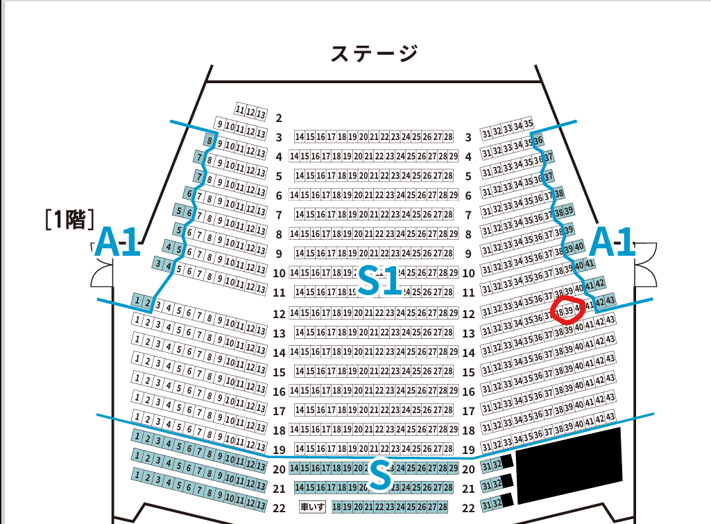
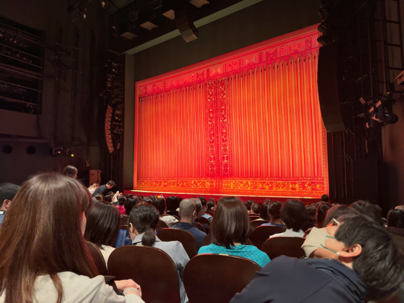

5月から新しい会社で働くことになり、4月の2周目くらいから有休消化していました。その期間で6泊7日の一人旅をしてきたので、旅の記録をいくつかに分けて書いていこうかと思います。

今回は旅の最初の目的であった劇団四季の「アラジン」について、簡単な観劇レポートでも書こうかと思います。

## 神戸空港から羽田空港、電通四季劇場\[海\]へ

今まで東京に行く機会は多かったのですが、ずっと新幹線を使ってきました。今回は6泊7日ということで極力節約したかったこともあり、飛行機を使って神戸空港から羽田空港まで移動することに。

アラジンを公演している「[電通四季劇場\[海\]](https://www.shiki.jp/theatres/0905/)」に、羽田から直接向かうことにしたので、以下のような経路となりました。


flowchart TD
    神戸空港 --🛫skymark--> 羽田空港
    羽田空港 --🚶‍♂️歩き--> 羽田空港第1ターミナル
    羽田空港第1ターミナル --🚟東京モノレール空港快速（浜松町行）-->浜松町
    浜松町 --🚃JR山手線内回り-->新橋
    新橋 --🚶‍♂️歩き--> 電通四季劇場海



バックパック1つで旅をしていたこともあり、移動自体はかなり楽でした。（バックパックの紹介は[こちら](/posts/2023/max-backpack)）。パッキングについてはまた機会があればまとめようかと思います。

発着が遅れたこともあり、劇場についたのはかなりギリギリになりました。

## 電通四季劇場\[海\]

### 外観

劇場の情報はあまり調べてなかったのですが、電通本社の隣にありました。ネーミングライツだけかと思ったらお膝元だったとは。今まで通ってきた劇場はパット見で“劇場”感があったのですが、ここは結構わかりにくかったです。


  
  
  


2枚目の写真の右奥が3枚目の写真となっています。平日で人通りが少なかったかったので、きれいに写真を取ることができました。

### 観劇まで

劇場に入ると、割とコンパクトな空間だなぁという印象。舞浜アンフィシアターは割と広々としていたので相対的にコンパクトに感じました。

3Fには魔法のランプが展示されていて、自由に鑑賞することができます。


  
  


電通四季劇場\[海\]の内部にはコインロッカーはなく、大きな荷物の預かりサービスがあります。上記写真の30Lサイズのバックパックを預けようとしたのですが、「バックパック等は預かっておりません。キャリーケース等のみで」とのこと。

6泊7日の荷物を詰め込んだバックパックで、それなりのサイズだったので正直預かってほしかった気持ちはあったのですが仕方がないです。

結局公演時間ギリギリだったこともあり、持ったまま観客席に向かうことに。なんとか席の下に収まったので良かったですが、次来ることがあれば近くのコインロッカーに預けようと思います。

### 座席について

割と直前にチケットを買ったので、S席ではあったものの端よりの席でした。具体的には「S1席 1階 13列 39番」です（下の座席表で丸つけてるところ）。購入したときは見えやすいか心配でしたが、実際座ってみるとかなり見やすかったです。写真は座席から撮影したものになります。

距離もそれなりに近く、裸眼でも普通に演者さんの表情がわかります。横から見ることになるので若干見切れるところもあるのかなと思ってましたが、私は全く気になりませんでした。


  
  


また、ちょうど14列の上くらいに2階席があるので、13列であれば開放的な印象でした。決して14列以降は見にくいということではないですが、可能であれば13列までの席を取るのがオススメなのかなと。（もちろん中央寄りの席であればなお良しです。）

今回座った席で、十分にアラジンの様々な演出を満喫することができました。魔法のじゅうたんの演出のことを考えると、あえて2階席の最前列とかも面白いかもしれません。

身長が180cmあるので劇場によっては足が窮屈なのですが、ここはあまり気になりませんでした。荷物さえ少なくしていたら問題なかったなと。

## 舞台アラジン！🧞

観劇レポートはあまり得意ではないのですが、少しだけ書いてみます。

### アグラバー王国へ！🏰

アラジンは原作アニメと実写版両方見ていたので、シンプルに登場人物の違いや構成、音楽の微妙な違いに驚きました。アブーが登場せず、3人の仲間(カシーム・オマール・バブカック)が登場。イアーゴが人間になっていたり虎も登場しません。

驚きはしたものの違和感は全くなく、むしろ舞台の演出に合わせているのだろうと感じました。購入したパンフレットを見ると、もともと原作の時点で案として出ていたものを舞台版に持ってきたりしているみたいですね。

初っ端から登場するジーニーに魅了されていると、おなじみの「アラビアンナイト」が。一気にアグラバーの世界に引き込まれます。アラジンが盗みをして逃げるシーンでは、いろいろな方法で衛兵をかわすのが華麗で目が離せません。月並みな感想ですが、歌いながら踊り、演技もするキャストはすごい...。

ジャファーとイアーゴの掛け合いも絶妙でした。もちろん1幕は「理想の相棒 - フレンド・ライク・ミー」が最高なのですが、舞台版オリジナルの「バブカック、オマール、アラジン、カシーム」が中毒性抜群。仲良し4人組の絶妙な掛け合いやダンスは、ぜひ現地で見てほしいです。（サブスクでも聴けます！）

### 怒涛の人気曲ラッシュ🕺💃

フレンド・ライク・ミーで1幕が終了し、2幕開幕直後に「プリンス アリ」、「ホール・ニュー・ワールド」が続くという豪華な流れ。

フレンド・ライク・ミーは8分近くあり、魔法の演出やダンス、ジーニーの魅力が詰まっています。個人的には実写版のウィル・スミスのフレンド・ライク・ミーがめちゃくちゃ好きなのですが、舞台版ならではの演出がたくさんの劇団四季版も負けてないくらい良かったです。

私の語彙力では表現できないですが、キャストさんの笑顔やダンス、歌声のすべてがキラキラしています。アラジンがジーニーを“理想の相棒”として信用するように、不安な気持ちなんて1つもなくなってしまうようなエネルギーを感じました。

ホール・ニュー・ワールドでは、劇団四季「アラジン」見せ場の1つである魔法のじゅうたんが登場します。シンプルに感動しました。うまく舞台の光を調節していて、アラジンとジャスミン、じゅうたん、星空以外は何も見えません。ちょっと釣り上げてるワイヤーとか見れるのかなと思っていた自分が恥ずかしい...。

男の私でもうっとりしてしまう、素敵な空間がそこにはありました。終幕後、隣りに座っていた方も「魔法のじゅうたん何回見ても良いわ～」と言っていましたが、激しく同意です。

### 終わらない舞台版オリジナルの演出

捕まったアラジンを助けに行くために3人の仲間が宮殿に乗り込むのですが、そのときの「危険な冒険」がめちゃくちゃ良い！ノリが良くて耳に残る曲が大好きな私にとってはバッチリの曲です。衛兵との戦闘シーンでの、軽快でコミカルな演出が音楽とマッチしていてグッド！こちらも舞台版オリジナルなので、ぜひ見てほしいところ。

パンフレットにも書かれていましたが、舞台化にあたり楽曲を追加したり、日本語訳を新たに作り直しているそうです。劇団四季にしかない良さがあるので、見に行ってよかったなと思います。

## まとめ

観劇レポートと言うにはシンプルではありますがまとめてみました。普段技術紹介が中心なので、この記事を書くのは時間がかかりました。自分の感動を言葉に落とし込むのはなかなか難しいですね。

舞台後はパンフレットとクリアファイルを購入しました。ポスターとかも売って欲しいんですが、だいたいクリアファイルになんですよね～。

一人旅の記録はもう少し続きます。
