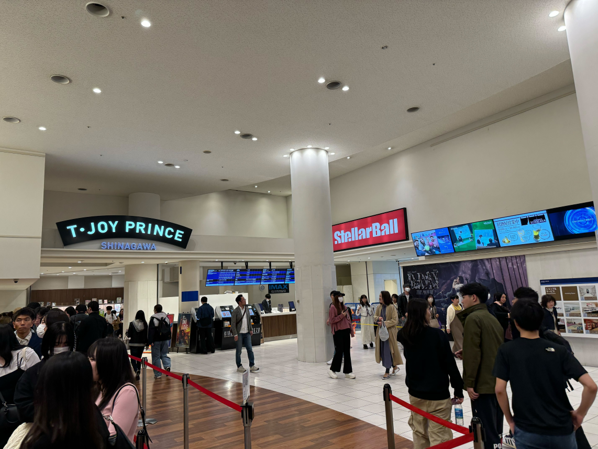

転職前の放浪記2本目は、国立競技場でのヴィッセル神戸観戦記と品川のIMAXでコナン映画を見たことについて。

## 初めての遠目アウェイ遠征🛫

そもそも「1週間くらい1人旅するぞ！」と決めたときに、一番最初に決めたイベントが「ヴィッセル神戸vs町田ゼルビア@国立競技場」でした。

ヴィッセル神戸自体は2017年くらいから応援しているのですが、アウェイの試合は大阪（長居とパナスタ）くらいしか行ったことがありませんでした。遠目のアウェイも1回行ってみたいと思っていたところ、町田との試合が国立開催ということでこれは行くしかない！と。

町田の本来のホームスタジアムはかなりアクセスが悪いそうなので、国立で良かったと思います（以下参考リンク）。

## 人生初の国立競技場⚽️

試合は昼からだったので、午前中は[Honda本社のウェルカムプラザ](https://global.honda/jp/welcome-plaza/)に行ってレッドブル・レーシングのTシャツを買ったり、表参道の方をぶらぶら歩きました。

国立競技場に向かう途中、虎が全面のTシャツを着たThe阪神ファンがいて謎の安心感がありました。同じ日に明治神宮で野球、秩父宮ラグビー場でラグビーの試合をしていたようです。

国立競技場にたどり着き、早速記念撮影。おそらく町田サポだと思われる方に撮影をお願いしました。気前よく撮っていただき感謝。

スタジアム外のグルメなどは何がおすすめかあまりわからなかったので、コンコースの売店で食べ物を調達することにしました。しかし、あまり選択肢がなく、店員さんもドライな反応だったので、満足度は低め。ヤムニョムチキンとチュロスを頼んだのですが、味も微妙...。

ヴィッセルの本拠地であるノエビアスタジアムやガンバのパナスタに比べると、味・バリエーション・接客すべてが見劣りしました（関西人が関西好きなだけなのかも）。サッカー専用スタジアムでないからなのかなぁ。

観客席は思ったより見やすく、前後間隔もそこまで狭くなかったので良かったです（↓座席からの写真）。

肝心の試合は、快進撃をしている町田相手に1-2で勝利。町田は何かと話題のチームですが、なんとか勝てて安心しました。アウェイでの勝利は気分が良いですね～。ただ、1人でサッカー観戦は少し寂しかったです。ゴールのときとか誰かと盛り上がりたい...

## T・ジョイ PRINCE 品川でIMAXコナン👓️

「せっかく東京に来たし、でかいスクリーンで映画でも見るかぁ」と思い、コナンのIMAXを急遽見ることに。池袋にある日本一大きいスクリーンでみたかったものの、時間的に厳しかったため品川の[T・ジョイ PRINCE 品川](https://tjoy.jp/tjoy-prince-shinagawa)を選択。

友人宅に泊まる予定だったので、その友人も無理やり誘って行きました（笑）。コナンが見たい！というよりはIMAXで見たい！という感じだったのですが、なんだかんだ久しぶりのコナン映画を楽しめました。

コナン映画は「から紅の恋歌」を最後に劇場では見ていませんでした（もしかしたら他にも見たかもしれない）。いわゆるコナン映画のテンプレートにしっかりのっとっているので、謎の安心感があります。

最近は、イケメンキャラのアクションシーンと恋愛シーンが盛り沢山で、アクションに関しては少し笑っちゃうレベルでした。ある意味IMAX適正が高いのかもしれない...

最後に怪盗キットに関する秘密が投下されたので、かなりびっくりしました。「まじっく快斗」の漫画は昔読んでいたので、映画でこんなこと言っちゃっていいの！？と思いましたが、最近は割と映画で重要な要素を出してるみたいですね。

一つだけ不満だったのはポップコーンの値段です。東京だから高いのか、Tジョイだから高いのか不明ですが、普段自分が行く映画館で言えばSサイズのポップコーンが東京ではMサイズとして売られていました。提供も遅くのんびりしていたので、もうちょっとテキパキやってくれ～と。

## まとめ

国立での試合観戦と、品川での映画鑑賞について記録を書きました。ヴィッセルに関しては、年1、2回はこういった遠征をしてみたいですね。

転職で東京が本社の会社になるので、東京近辺は行けることが増えそうですが。映画に関しても一度池袋のIMAX見てみたいものです。

