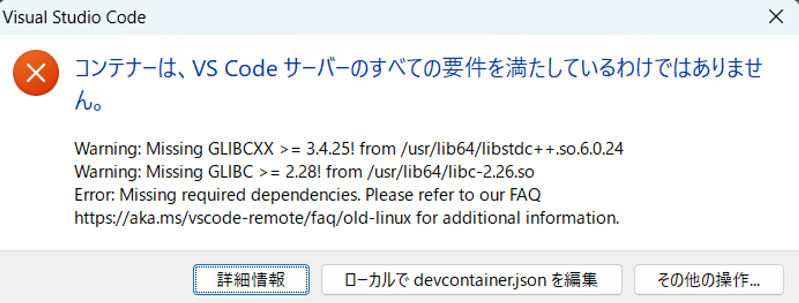

2024年2月2日にVSCodeのバージョンが1.86.0に更新されました。そして同時に開発で使っていたDevcontainer環境が壊れました。というより、VSCodeの更新に伴い、開発に利用していたコンテナに入っているライブラリが、最低要件を満たさなくなりました。

この問題について簡単に調査したので、対処法と合わせてまとめておきます。

## エラーの原因

DevContainerで接続していたコンテナイメージはAWSのLambda用イメージです。

```text
public.ecr.aws/lambda/python:3.11
```

こちらのコンテナを使っていつも通り開発を続けようとしたところ、前述の通りエラーが発生しました。その時のエラーは以下のとおりです。



エラーの内容について公式ドキュメントを参照すると、以下のように書かれています(自動翻訳しています)。

> VS Code リリース 1.86 以降、リモート サーバーのビルド ツールチェーンの最小要件が引き上げられました。VS Code によって配布されるビルド済みサーバーは、glibc 2.28 以降に基づく Linux ディストリビューション (Debian 10、RHEL 8、Ubuntu 20.04 など) と互換性があります。
> 
> セットアップがこれらの要件を満たさず、Linux ディストリビューションをアップグレードできない場合は、VS Code クライアントをバージョン 1.85 にダウングレードして、リモート開発を引き続き使用できます。VS Code クライアントは、デスクトップと Web の両方でダウングレードできます。
>
> 引用元：<https://code.visualstudio.com/docs/remote/faq#_can-i-run-vs-code-server-on-older-linux-distributions>

## エラーの対処法

こちらのエラーに対して、現状の対処法は以下3通りのようです。

- 開発コンテナ側（Linuxディストリビューション）を更新する
- VSCodeのバージョンを1.85に戻す
- バージョン1.85のVSCodeをポータブル版で利用する

1つ目の対処法が一番手っ取り早いのですが、開発中で色々と都合があり変更できなかったので採用できず。2つ目の対処法も極力回避したい。ということで3つ目の対処法を試すことにしました。

## VSCodeのポータブル版

こちらのサイトを参考にしました。

<div class="iframely-embed"><div class="iframely-responsive" style="width:75%; padding-bottom: 52.5%; padding-top: 120px; margin:auto;"><a href="https://zenn.dev/ythk/articles/6e0e031cfc7534" data-iframely-url="//iframely.net/rOEkZu6"></a></div></div><script async src="//iframely.net/embed.js"></script>

VSCodeの関連ファイルをフォルダ単位で管理し、独立したVSCode環境を作るイメージです。

### VSCodeのzip版を取得

まずはVSCodeのzip版をダウンロードします。以下ページから対象となるバージョンのリンクを取得します。

<https://code.visualstudio.com/docs/supporting/faq#_previous-release-versions>

私はWindows環境でしたので、ベースURLは次のようになります。

```text
https://update.code.visualstudio.com/{version}/win32-x64-archive/stable
```

`{version}` の部分をダウンロードしたいバージョンに入れ替えます。今回1.85.2を利用したいので以下のURLになります。

```text
https://update.code.visualstudio.com/1.85.2/win32-x64-archive/stable
```

取得したzipフォルダを解凍します。

### 解凍したフォルダに「data」フォルダを作成

残る作業は簡単です。解凍したフォルダに「data」フォルダを作成し、「Code.exe」を実行すればポータブル版での起動が完了です。


私はポータブル版の「Code.exe」のショートカットをプロジェクトフォルダに作って起動しやすくしています。

ポータブル版は独立した環境になるので、拡張機能等は入れ直しになります。しかし、そもそもDevContainer用の拡張機能は「.devcontainer.json」等にまとめているので、そこまで手間ではありませんでした。（テーマやらフォントの設定はポータブル版でも行いました）

しばらくはこのやり方で対応していくことになると思います。

## まとめ

簡単にではありますが、VSCodeのバージョンアップに伴うDevContainerでおきた問題の対処についてまとめました。普段からDevContainerを使っている人にとっては、結構影響の大きい変更だと思います。今後アップデートで対応してくれるとありがたいのですが、動向を見守るしかなさそうですね。
