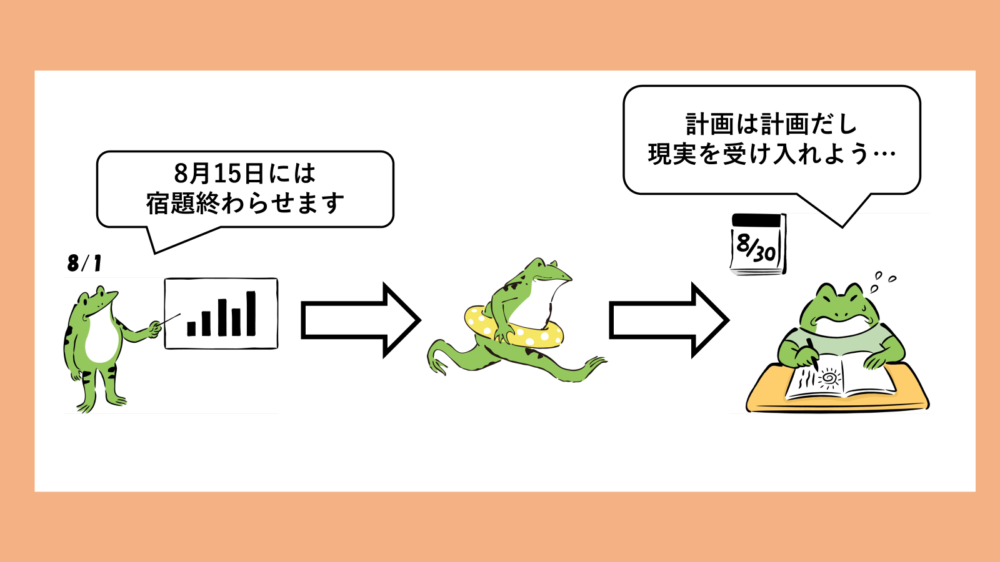

「怠惰であれ（Be Lazy）」

私が最近読んだ本に書かれていたマインドセットです。その本は、「[世界一流エンジニアの思考法](https://www.amazon.co.jp/%E4%B8%96%E7%95%8C%E4%B8%80%E6%B5%81%E3%82%A8%E3%83%B3%E3%82%B8%E3%83%8B%E3%82%A2%E3%81%AE%E6%80%9D%E8%80%83%E6%B3%95-%E6%96%87%E6%98%A5e-book-%E7%89%9B%E5%B0%BE-%E5%89%9B-ebook/dp/B0CKSZV5DQ/ref=sr_1_1?adgrpid=158312900361&dib=eyJ2IjoiMSJ9.WN9dlBzdmT5YgtLfftaRnqqiqOXQJGI3F9mn__rJl3v-ISoK1-GRG0cqK-mt5B-Y9_HK8Es-WSCXwQpnM2kJBOdxiq3gETLSPznBJOGNcOS9uXRFRe2UP4--PkpHkrXQLJMqqAiNl1jNs8yiwYQPjxzI2X2HoNgNeWt_B-U8pVOMcxpuGZYmX5-9KjeIU0mnN04g9V5IYlLg8bQ8rS2am1bcmA-7AbWg30eCPDN-5Wfn6vy4lFnvs6TaWoVlzdl1GLYjcSC8XpE1Qd6Cp2nWZxxhb5AmmyurAIiQY5FhT686RaoAnk5iTVNbgh76lvgMHZ_BdZdjzA8AV6bVjJVSrA3Z_79qPDsv7HOjh137DVGGIOSfEnISq77luiPJsDCRW8T-rdIxltFv1QpVYDn45aZ3hsD0H93YPyRPnlsjo2jxiICXJd3yUDbZw1eA5HG3.OggaZumCwLSX_IZLcsay8c6WWb6ziAfpsljz8SZjppo&dib_tag=se&gad_source=1&hvadid=678960091422&hvdev=c&hvlocphy=1009559&hvnetw=g&hvqmt=e&hvrand=8235935149528769590&hvtargid=kwd-2260433045664&hydadcr=1797_13657020&jp-ad-ap=0&keywords=%E4%B8%96%E7%95%8C%E4%B8%80%E6%B5%81%E3%82%A8%E3%83%B3%E3%82%B8%E3%83%8B%E3%82%A2+%E3%81%AE+%E6%80%9D%E8%80%83%E6%B3%95&mcid=251ad38b4a38325db69181f7d165b20a&qid=1738386110&sr=8-1)」という、米マクロソフトでエンジニアとして働かれている方によって書かれた本です。著者は、執筆時点でAzure Functionsというクラウドサービスの開発チームに所属しており、そこでの経験を元に、エンジニアとしての思考法をまとめています。

この本自体はとても有名なので、いろいろな方が紹介記事を上げています。私も後輩からおすすめされていたのですが、最近まで読んでいませんでした。読もうと思ったのは、昨年転職してから働き方で悩むことが増え、マインドセットから変えていく必要があると感じたからです。大事にしたい考え方がいくつも書かれていたので、こちらで少しまとめようと思います。

今回は私が特に大事にしたいと思ったことをピックアップしてみます。（ので、書籍に書かれている順番、構成等は無視しています）

## 1. エンジニアとしてのマインドセットの刷新

エンジニアとして働くうえでベースとなる考え方になりそうな部分をまとめます。転職してからの悩みの多くが、プロダクト開発に関わるエンジニアとしての悩みだったので、この部分はとても参考になりました。

### 1.1 怠惰であれ（Be Lazy）

 **「より少ない時間で価値を最大化する」** という考え方を表す言葉として **「怠惰であれ（Be Lazy）」** が紹介されていました。著者いわく、 **「一流のエンジニアたちは『いかにやることを減らすか？』」** に頭を使っているとのこと。

この考え方を実現する習慣も紹介されていました。

> - 望んでいる結果を達成するために最低限の努力をする
> - 不必要なものや付加価値のない仕事をなくす
> - 簡潔さを目指す
> - 優先順位をつける
> - 時間や費やした努力より、アウトプットと生産性に重点を置く
> - 長時間労働しないように推奨する
> - 会議や会議の時間内で効率的かつ生産的に価値を提供する

これだけ見ると割と当たり前のような気がしますが、実践するのは大変です。書籍では「優先順位をつける」を題材に例が挙げられていました。この例は私自身経験していることと似ていたので、少し紹介します。

開発チームでリリースに向けての5つの「バックログ（やることリスト）」があるとします。ここで、リリースに向けての優先順位をつけたとします。このとき、**「優先順位が高いものからこなしていこう。時間が間に合えば5つ全て取り組もう」と考える人は多い** のではないのでしょうか？。実際私もこのタイプでした。

しかし、**著者の所属するチームでは「最初の1個をピックアップしてやったら他はやらない。その一つにフォーカスしよう」** となるそうです。



「より少ない時間で価値を最大化する」ために1つに集中しましょうという考え方です。あれもこれもと実装しようとすると、全てがの品質が低下することになりますし、どれも中途半端になる可能性があります。そうすれば、本当に実現したかったバックログにまで影響が出る可能性があります。

さらに、ソフトウェアで実装された機能のうち、実際に使われる機能は40%程度だと言われています。これらを踏まえても、優先順位が低いものを積極的に拾うのではなく、優先順位の高い（=価値の高い）ものに集中したほうが良いと考えられるでしょう。それが「より少ない時間で価値を最大化」することに繋がると思います。

私も今のチームに入ってすぐのときは、あれもこれも実装しようとしていました。リリーススコープを検討する際も、可能な限り多くの機能を入れようとしていました。そんなとき、開発チームのリードをしている方に **「スコープ縮小することは悪ではない。大事なのは価値を提供することで、機能をたくさん提供することではないですよ💁‍♂️」** とアドバイスを貰いました。

今思えば、これも「怠惰であれ」の考え方に繋がるアドバイスだったのかなと思います。

### 1.2 不確実性を受け入れる

> **計画は「いまのところは、こういう予定」ぐらいの感覚で見たほうが良い**

リリースに向けて計画を立て、開発を進めていると、どうしても当時の予定通りに進まないことがあります。このとき「あの時、〇〇で決まったし、やるしかないなぁ」と考えてしまうことはよくあるのではないでしょうか？ここで、当初の「計画通り」に遂行しようとして、結果リリースに間に合わない、リリースに間に合ったとしても品質が低いものになってしまうことがあります。これでは本末転倒です。大事なのは「価値を提供すること」で、「計画通りに進めること」ではないと思います。 
※契約上、計画通りに進めないといけない場合は別ですが...🫥

著者は「『納期は絶対』の神話は捨てよう」と述べています。アメリカでは日本ほど納期に厳しくないようです。多くの案件では期日通りにリリースされているが、実は中身は予定よりも少ない量に変更されていることがよくあるとのこと。確かにMicrosoftやAppleなどの大企業でも、リリース日が延期されたり内容が変更されることは多々あります。それでも、多くの人はその製品を使い続けていますよね。（他に選択肢がないというのもあるかもですが。）

私が所属するチームでは、ほぼ月1度のリリースを行っています。このリリース日に関しては、比較的柔軟に対応していると思います。プロダクトオーナー（PO）と開発チームで調整し、「本当に必要な機能の実装」と「絶対に守らないといけない期日」を見極めています。

**見極めるために重要なのは、進捗の「実績」を整理し、それをもとに判断を行うことです**。そのためには、「あの時、〇〇で決まったし、やるしかないなぁ」と捉えるのではなく、「不確実性」を受け入れて、柔軟に対応することが大事だと思います。

また、後述のコミュニケーションにも繋がりますが、こういった計画変更に関する提案を気楽にできるチームであることも重要ですね。

## 2. チーム開発とコミュニケーション

チーム開発を行う際の考え方についてまとめます。現在、私も10名程度の開発チームで開発に取り組んでいますが、チームメンバーとの連携は開発を進めるうえでとても大事な要素の1つです。

チーム開発において一番意識しておく必要があるのは **「人と人が関わって仕事をしている」** ことだと私は思います。人と人が仕事をしている以上、理屈や正論だけでうまくいくとは思いません。チームメンバーの心理的安全性を保ちながら、意見を出し合い、議論を行うことができる環境を作ることが大事だと思います。

### 2.1 気軽に聞ける・断れる空気感を作る

**「気軽に聞ける空気感を作ること」が大事であることはイメージしやすいですが、それと同じくらい「気軽に断れる空気感を作ること」も大事**だと書かれていました。

気軽に聞くことができる環境になると、チームメンバーは自分がわからないことを聞いたり、頼ることができるようになります。しかし、ここで、気軽に断れる環境がないと、自分もすぐには答えられないことを引き受けてしまう可能性があります。こうなると、自分の仕事は滞ってしまいますし、聞いた側も気を使ってしまい、気軽に聞くことが難しくなります。

**簡単なことであっても「知らなければ気楽に聞く」、「聞かれてもわからなければ気軽に断る」** 

ということを大事にすべきと紹介されていました。「簡単なこと」とは言いますが、どれくらい簡単なことを聞くかと言うと、著者は以下のように紹介しています。

> 「Azureって何？」みたいな初歩レベルの質問をしても誰も問題視しない

誰も問題視しないというのがとても素敵だと思います。私は割とわからないことは「わからない」といえる方だと思いますが、「Azureって何？」みたいな疑問なら自分で調べてしまうかもしれません。「こんな事も知らないの？」と思われてしまうのが少し怖いからです。ただ、この本を読んで、そういったことも気軽に聞いていいのかなと思うようにしました。

**「わからないことをわからない」と言っている時点で、その人は知ろう・学ぼうとしているのです。その姿勢を尊重し、サポートすることが大事だと思います。** もし、チーム内で「こんなこと質問するな！」という内容があるなら、その内容をまとめて事前に連携すべきなのです。それがないのであれば、質問したことに対して「知らないの？」と問題視する人が悪いと思いましょう。（もちろん、過去に教えたことを何度も何度も聞いているのであれば、聞いている側にも努力が必要だとは思います）

それに、誰かが質問することによって、周囲の理解に繋がる可能性もあります。同じように疑問を持っていた人もいれば、間違って理解している人もいたでしょう。こういったことを考えても、気楽に質問できる環境を作ることは大事だと思います。

とはいえ、お客様とのMTGや社内の重要なMTGなど、その場の雰囲気によっては質問をすることが難しい場合もあるかと思います。この場合は会議が終わった後、チーム内の人に質問するとよいのかなと。

質問したことによって、相手の時間を取らせてしまうのが気になる場合もあるかと思います。その場合は、質問する前に、相手に「質問してもいいですか？」と確認すればよいでしょう。オンライン会議が増えた現在であれば、チャットで質問するのもよいでしょう。相手の時間を取る可能性はありますが、それは「気楽に断れる環境」にも繋がります。忙しいのであれば気楽に断ればよいのです。

**「聞くこと」、「断ること」。どちらもチームコミュニケーションにおける大事な要素だと思います。**

### 2.2 心にぐさっと来ないコミュニケーションを取る

> たとえ言っていることが正しくとも、伝え方のマナーの伴わない言葉は建設的な相互理解には結びつかないだろう

仕事をしていれば、何かを決める際に意見を出し合って議論することがあると思います。**意見が対立することもあると思いますが、その際に大事なのは「相手を否定しない」こと**だと思います。

エンジニアとして働いていれば、仕様や設計、実装方針など、さまざまな意思決定の場面があります。著者は実装方針に関して、同僚エンジニアからシビアな指摘を受けた事があったものの、「心にぐさっとこなかった」と述べていました。なぜそう思ったかと言うと **「私を否定したり、私のアイデアへの否定ではない。私を尊重していることが、言葉だけでなく態度からもにじみ出ていた」** からだと述べています。そしてその上で、3つの鉄則を紹介しています。

1. 相手を否定しない
2. 相手のアイデアを否定しない
3. 自分の考えとして意見を言う

これらの鉄則を守るために、反対意見を言うときや他と異なる自分の意見を言うときのフレーズも紹介していました。それは、**「自分の意見では」** とか **「自分の意見を述べさせてもらいますが...」** などです。GitHubのissueなどで、海外のエンジニアたちが会話するときも頻繁にこのフレーズが用いられており、健全な議論の下、意見を出し合っている様子が見受けられます。感謝の言葉もよく見かけます。（結構皮肉めいたことを意図的に言ってる時はもちろんありますが）

言葉の表現だけでなく、表情や言い方にも気をつけることが大事だとは思います。**とくに、チャットベースのコミュニケーションで意見を述べる場合、受け取り手の「心が辛くならない」ように気をつけるべきだと思います**。チャットのやりとりであれば、見えている文字以上の情報は伝わりません。表情や言い方、声のトーンなどが伝わらないため、相手がどのような気持ちでメッセージを送っているのかを想像しにくいです。

私自身、チャットのやり取りで「心が辛くなる」瞬間がありました。相手の意図がわからず、怒られているような感覚になり、チャットを返すのがしんどくなってしまうのです。自分が直接関係ないやり取りを見たときでも「こんな言い方しなくていいのに」と思い、なんとも言えない気持ちになることがあります。

この経験を踏まえ、私は受け取り手の「心が辛くなる」チャットメッセージを送らないよう気をつけています。柔らかい表現を入れたり、絵文字なども時には使うようにしています🙋‍♂️。相手と気持ちよく会話できるのであれば、たった数文字加えるのなんて手間ではありません。

ビジネスの場において、端的に必要なことを伝えることは大事だとは思います。無駄な労力を割きたくないと思う方もいるかも知れません。しかし、それ以前に **「人と人が関わっている」ことが前提であることを忘れてはいけない** と思います。

このことに関して、私が感じた心遣いを紹介します。私の所属する開発チームでは、GitHubのPull Request（PR）で「Changes Requested」を利用せず、変更依頼を出すときは「Comment」を利用しています。開発をリードしている方に理由を聞いたところ、「過去に自分が参加したプロジェクトで、Changes Requested が多く出された結果、PRを出すのがちょっと辛くなる雰囲気があったんですよ」とのことでした。

私はこの運用がとても好きです。本当に些細なことかもしれませんが、これも「心がぐさっと来ない」コミュニケーションの一環だと思います。

## まとめ

今回は、「世界一流エンジニアの思考法」を読んで、私がとくに大事にしたいと思った考え方についてまとめてみました。

- **シンプルイズベスト！**
  - やることを必要最低限に絞って、最も大事な部分に集中することで、無駄を省いて成果を出す。たくさんのタスクに手を出すより、1つ1つにしっかり向き合うのが大事
- **計画通りにいかなくても大丈夫！**
  - 予定どおりに進むことは稀。変化や不確実性を受け入れ、柔軟に対応することが、結果的に質の高いアウトプットにつながる
- **チームの空気作りが大事！**
  - 気軽に質問できる環境、そして断ることもOKな雰囲気を作ることで、メンバー同士がストレスなくコミュニケーションできる。相手を否定せず、みんなが安心して意見を出し合えるのが、良いチームワークを生む

少しでも、楽しく仕事に取り組むためにも、これらの考え方を意識していきたいです。もちろん、すぐに実践できることばかりではないですが、少しずつでも取り入れていけたらと思います。