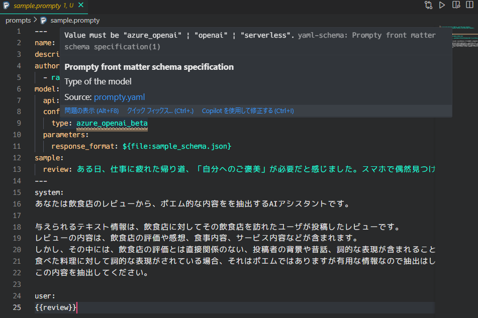

今回は、生成AIのプロンプトをテンプレートファイルで管理できる「[Prompty](https://prompty.ai/)」を使って、以前投稿した「[飲食店レビューからポエムを撲滅！OpenAI の Structured Outputを使ったテキスト抽出](/posts/2024/poem-extraction-by-structured-output/)」の内容を再現してみます。

以前の記事


## promptyについて

### 簡単な説明

生成AIを活用するにあたり重要になるのは、生成AIに役割を与えたり出力方式の指示を与える “プロンプト” です。生成AIを組み込んだシステムを構築する際、プロンプトをどのように管理するかは課題の1つです。この課題を解決するためのフレームワークが「Prompty」です。

Prompty は Microsoft が開発しているフレームワークで、生成AIのプロンプトをテンプレートファイルで管理できるようにすることで、開発の効率化を目指しています。

- GitHubリポジトリ
  <div class="iframely-embed"><div class="iframely-responsive" style="height: 140px; padding-bottom: 0;"><a href="https://github.com/microsoft/prompty" data-iframely-url="//iframely.net/lQbZjKO?card=small"></a></div></div><script async src="//iframely.net/embed.js"></script>

- 公式サイト
  <div class="iframely-embed"><div class="iframely-responsive" style="height: 140px; padding-bottom: 0;"><a href="https://prompty.ai/" data-iframely-url="//iframely.net/UvaaqYd"></a></div></div><script async src="//iframely.net/embed.js"></script>

### テンプレートファイル

Promptyでは以下のようなテンプレートを使用します（公式チュートリアルのサンプル）。

```yaml
---
name: Basic Prompt # <テンプレートファイル名>
description: A basic prompt that uses the GPT-3 chat API to answer questions # <テンプレートの説明>
authors: # <テンプレート作成者>
  - sethjuarez
  - jietong
model: # <利用するモデルの情報（接続先など含む）>
  api: chat
  configuration:
    api_version: 2023-12-01-preview
    azure_endpoint: ${env:AZURE_OPENAI_ENDPOINT}
    azure_deployment: ${env:AZURE_OPENAI_DEPLOYMENT:gpt-35-turbo}
sample: # <パラメータの入力例>
  firstName: Jane
  lastName: Doe
  question: What is the meaning of life?
---
system: # <システムメッセージ>
You are an AI assistant who helps people find information.
As the assistant, you answer questions briefly, succinctly, 
and in a personable manner using markdown and even add some personal flair with appropriate emojis.

# Customer
You are helping {{firstName}} {{lastName}} to find answers to their questions.
Use their name to address them in your responses.

user:
{{question}}
```

※[GitHubリポジトリより抜粋](https://github.com/microsoft/prompty/blob/b18a21e0c466cabe37876dc458939d51f9932e1f/runtime/prompty/README.md?plain=1#L11-L41)

上記のテンプレートは、生成AIモデルに対する1回のリクエストに対応しています。この形式をPromptyで読み込んで実行するだけで、簡単にタスクを処理可能です。実際に実行するプログラムは以下のとおりです。

```python
import prompty
# Azure OpenAIを使う場合
import prompty.azure

response = prompty.execute("テンプレートファイルのパス")

print(response)
```

## promptyを使ってStructured Outputsを試してみる

### 飲食店レビューからポエムを抽出する

[以前の記事](/posts/2024/poem-extraction-by-structured-output/)では、飲食店レビューからポエム文を抽出するために[Structured Outputs](https://platform.openai.com/docs/guides/structured-outputs?context=without_parse#introduction)を使用しました。この仕組みをPromptyで再現してみます。Structured Outputsについては[以前の記事](/posts/2024/poem-extraction-by-structured-output/)を参照してください。

レビュー文を文単位で以下の情報を抽出します。

- 対象文：ポエムと判断される文
- 理由：ポエムと判断した理由
- 文の種類：「お店のこと」または「自分のこと」

実際に抽出される形式は以下のようになります。

```json
{
    "poem_messages": [
        {
            "sentence": "ある日、仕事に疲れた帰り道、「自分へのご褒美」が必要だと感じました。",
            "reason": "これは投稿者自身の感情や背景を表している部分で、ポエム的な表現と思われます。",
            "sentence_type": "自分のこと"
        }
    ]
}
```

### 実際の実装例

Promptyを使った実装例を紹介します。以下の3つのファイルを作成しました。

- テンプレートファイル
- Structured Outputs用のスキーマファイル
- 実行用のPythonスクリプト

#### テンプレートファイルの実装例

テンプレートファイルには、Structured Outputsを利用する設定を記載します。

```yaml
---
name: Structured Outputsによる飲食店レビューからのプロンプト抽出
description: Structured Outputsによる飲食店レビューからのプロンプト抽出
authors:
  - rakuichi
model:
  api: chat
  configuration:
    type: azure_openai_beta # <Structured Outputsを使う場合はazure_openaiではなく、azure_openai_betaを指定>
  parameters:
    response_format: ${file:sample_schema.json} # <Structured Outputsのフォーマットを指定>
sample:
  review: ある日、仕事に疲れた帰り道、「自分へのご褒美」が必要だと感じました。スマホで偶然見つけたこのステーキ屋さん。その写真越しに伝わる肉の輝きに惹かれ、気づけば予約ボタンを押していました。扉を開けた瞬間のあの香り――それは、疲れた心に優しく語りかけるような芳醇な肉の誘い。注文したヘレステーキは肉汁があふれ、今までに経験のないおいしさがありました。
---
system:
あなたは飲食店のレビューから、ポエム的な内容をを抽出するAIアシスタントです。

与えられるテキスト情報は、飲食店に対してその飲食店を訪れたユーザが投稿したレビューです。
レビューの内容は、飲食店の評価や感想、食事内容、サービス内容などが含まれます。
しかし、その中には、飲食店の評価とは直接関係のない、投稿者の背景や昔話、詞的な表現が含まれることがあります。
食べた料理に対して詞的な表現がされている場合、それはポエムではありますが有用な情報なので抽出はしないでください。
この内容を抽出してください。

user:
{{review}}
```

前節で紹介した公式のチュートリアルのサンプルと違うところは、modelの `type` に `azure_openai_beta` を指定していること、`parameters` に `response_format` を指定していることです。

`type` について、Structured Outputsを使う場合は `azure_openai_beta` を指定する必要があります。これは、内部で呼び出されているOpenAIのSDKの影響です。OpenAIのSDKではStructured Outputsを使う場合、`openai.OpenAI.client.beta` を使ってリクエストを送信します。\
（公式サイト参照：<https://platform.openai.com/docs/guides/structured-outputs#introduction>）

Structured Outputsを使わない場合、OpenAIのSDKでは `openai.OpenAI.client` を使ってリクエストを送信します。この場合はテンプレートファイルの `type` に `azure_openai` を指定します。

なお、vscodeのPrompty拡張では `azure_openai_beta` を指定すると怒られます。（拡張機能がまだ対応していないようです）



`response_format` にはStructured Outputsのフォーマットを指定します。ここでは、`sample_schema.json` というファイルを指定しています。

また、入力されるパラメータとして `review` を指定しています。

#### Structured Outputsのスキーマファイルの実装例

次に、Structured Outputsのスキーマファイルです。スキーマファイルのフォーマットは[公式サイト](https://platform.openai.com/docs/guides/structured-outputs?context=ex1#supported-schemas)を参考にすると良いです。

```json
{
    "type": "json_schema",
    "json_schema": {
        "name": "ExtractPoemResponse",
        "description": "テキストに含まれるポエムのリスト",
        "strict": true,  
        "schema": {
            "type": "object",
            "properties": {
                "poem_messages": {
                    "type": "array",
                    "items": {
                        "type": "object",
                        "properties": {
                            "sentence": {
                                "type": "string",
                                "description": "テキストに含まれていたポエム的な内容"
                            },
                            "reason": {
                                "type": "string",
                                "description": "ポエムと判断された理由"
                            },
                            "sentence_type": {
                                "type": "string",
                                "description": "内容が自分の話か、お店の話かを判定してください",
                                "enum": ["自分のこと", "お店のこと"]
                            }
                        },

                        "required": ["sentence", "reason", "sentence_type"],
                        "additionalProperties": false
                    }
                }
            },
            "required": ["poem_messages"],
            "additionalProperties": false
        }
    }
}

```

`strict` を `true`、 `additionalProperties` を `false` にすることで、スキーマ通りの出力を強制します。この辺りは[公式サイト](https://platform.openai.com/docs/guides/structured-outputs#additionalproperties-false-must-always-be-set-in-objects)にて詳しく説明されています。

#### 実行するPythonプログラムの実装例

最後に、実行するPythonプログラムの実装例です。

```py
import json
import os
from pprint import pprint

import prompty
import prompty.azure_beta # typeで指定したazure_openai_betaを使う場合はこちらをimportする
from prompty import Prompty


def load_prompty(prompty_file: str) -> Prompty:
    """Promptyのテンプレートファイルを読み込む

    Notes:
        Promptyコード内でAOAIクライアントを初期化する部分を見ると、
        azure_endpointなどの引数は`prmoty.model.configuration.items()`で取得できるkey-valueを渡している。
          参考：<https://github.com/microsoft/prompty/blob/b18a21e0c466cabe37876dc458939d51f9932e1f/runtime/prompty/prompty/azure_beta/executor.py#L73-L109>
        そのため、AOAIの設定値を取得するためには、Promptyのテンプレートファイルを読み込んで、
        model.configurationに、AOAIクライアントに渡す引数を入れておけばよい。

    Args:
        prompty_file (str): Promptyのテンプレートファイルパス

    Returns:
        prompty.Prompty: Promptyのインスタンス
    """

    prompty_ = prompty.load(prompty_file)
    prompty_.model.configuration["azure_endpoint"] = "<AzureOpenAIのエンドポイント>"
    prompty_.model.configuration["api_version"] = "2024-12-01-preview"
    prompty_.model.configuration["api_key"] = "<AzureOpenAIのAPIキー>"
    prompty_.model.configuration["azure_deployment"] = "<モデルのデプロイ名>"

    return prompty_


def extract_poems_from_review(prompty_: Prompty, review: str) -> dict:
    """Promptyを実行する

    Args:
        prompty_ (Prompty): Promptyのインスタンス
        review (str): 入力テキスト
    """
    structured_output = prompty_.execute(prompt=prompty_, inputs={"review": review})
    return json.loads(structured_output)


if __name__ == "__main__":
    prompty_ = load_prompty("<テンプレートファイルのパス>")

    review = """ある日、仕事に疲れた帰り道、「自分へのご褒美」が必要だと感じました。スマホで偶然見つけたこのステーキ屋さん。その写真越しに伝わる肉の輝きに惹かれ、気づけば予約ボタンを押していました。扉を開けた瞬間のあの香り――それは、疲れた心に優しく語りかけるような芳醇な肉の誘い。まるで、「今日という日をよく頑張ったね」と囁いてくれるかのようでした。

店内は、落ち着いた木の香りが漂う癒しの空間。壁には地元のアーティストが描いたらしい抽象画がかかり、どこか「静かなる情熱」を感じさせるようなインテリア。窓の外には小さな庭が広がり、ライトに照らされた植物たちが夜の静寂を美しく彩っていました。

「この空間は、料理を味わうためだけに存在しているんだな」と思わせるような、静かでありながらも温かい雰囲気。

頼んだのはお店の一番人気、特選サーロインステーキ200g。運ばれてきた瞬間、肉の表面で輝く美しい焼き加減に目を奪われます。ナイフを入れると、予想以上に柔らかく滑らかに切れていき、そこから溢れる肉汁に思わず息をのみました。

ナイフを入れた瞬間、肉の繊維がするするとほぐれていくのが見て取れます。一口頬張ると、まるで「肉の小宇宙」が広がるかのような感覚。噛むたびに、肉汁とともに溢れ出る深い旨味と甘み。それは、ただの食事ではなく、一種の芸術体験に近いものでした。付け合わせのポテトグラタンも絶品。ほのかに香るチーズが、肉の重厚さを優しく受け止め、次の一口をさらに待ち遠しいものにしてくれます。

スタッフの方々の心遣いもまた感動的でした。「お肉がこの温かさで一番美味しいタイミングです」という一言に込められたプロフェッショナルの矜持。それが、食事全体の信頼感をさらに高めてくれました。

総評
ただの食事ではなく、心を満たすひとときを提供してくれる、そんなステーキ屋さんでした。このお店を訪れた日を、私の「食の記憶」に残る大切な1ページとして忘れることはないでしょう。また、あの魔法の一皿に会いに行きたいと思います。"""

    result = extract_poems_from_review(prompty_, review)
    pprint(result)
```

Azure OpenAIにリクエストを送る部分は、`extract_poems_from_review()` 内の `prompty_.execute()` です。ここで、事前にテンプレートファイルを読み込んだ `Prompty` オブジェクトと、テンプレートファイル内で用意していた `review` を渡しています。このリクエストに対するレスポンスはJSONで返ってくるので、`json.loads()` でPythonの辞書型に変換しています。

`Prompty` オブジェクトは、`load_prompty()` 内の `prompty.load()` でテンプレートファイルを読み込んで作成します。テンプレートファイル内では、Azure OpenAIのエンドポイントやAPIキーなどの設定を記述せず、テンプレートファイルを読み込んだ後にプログラム内で直接指定しています。

この辺りの実装は、[こちら](rakuichi4817/study-llm/)にもあげているので興味があれば参考にしてください。ここにのせているコードとは若干異なりますが、基本的な流れは同じです。

#### 実行結果

このPythonファイルを実行すると、Structured Outputsのフォーマットに従った以下の結果が出力されます。無事にポエムが抽出されていることが確認できます。

```json
{
    "poem_messages": [
        {
            "sentence": "ある日、仕事に疲れた帰り道、「自分へのご褒美」が必要だと感じました。",
            "reason": "これは投稿者自身の感情や背景を表している部分で、ポエム的な表現と思われます。",
            "sentence_type": "自分のこと"
        },
        {
            "sentence": "扉を開けた瞬間のあの香り――それは、疲れた心に優しく語りかけるような芳醇な肉の誘い。",
            "reason": "このセンテンスは、投稿者の心情や印象を詩的に表現していると判断しました。",
            "sentence_type": "お店のこと"
        },
        {
            "sentence": "まるで、「今日という日をよく頑張ったね」と囁いてくれるかのようでした。",
            "reason": "この表現は個人の感情について詩的に述べられており、ポエム的です。",
            "sentence_type": "自分のこと"
        },
        {
            "sentence": "窓の外には小さな庭が広がり、ライトに照らされた植物たちが夜の静寂を美しく彩っていました。",
            "reason": "飲食店の環境を詩的に描写しているため、ポエム的な表現と考えました。",
            "sentence_type": "お店のこと"
        },
        {
            "sentence": "まるで「肉の小宇宙」が広がるかのような感覚。",
            "reason": "この表現は料理の体験について詩的な比喩を用いており、ポエム的と判断しました。",
            "sentence_type": "お店のこと"
        },
        {
            "sentence": "ただの食事ではなく、心を満たすひとときを提供してくれる、そんなステーキ屋さんでした。",
            "reason": "この表現は飲食店に対して詩的な感想を述べている部分であり、ポエム的と思います。",
            "sentence_type": "お店のこと"
        }
    ]
}
```

## まとめ

今回は、生成AIのプロンプトをテンプレートファイルで管理できる「Prompty」を使って、以前投稿した「[飲食店レビューからポエムを撲滅！OpenAI の Structured Outputを使ったテキスト抽出](/posts/2024/poem-extraction-by-structured-output/)」の内容を再現してみました。

Prompty自体はプロンプトをテンプレートファイルで管理できるため、柔軟なプロンプト利用が可能です。また、Structured Outputsを使う場合も、スキーマファイルなどを用意することで管理することができるのは便利な点だと思います。

出力結果を踏まえてさらに処理を行う場合は、新しいPromptyテンプレートファイルを作成し、そこの入力パラメータに出力結果を渡す形にすれば、複雑な処理も実装できそうな気がします。

Prompyの公式ドキュメントはまだまだ充実していない印象ですが、機能面含め今後のアップデートが楽しみです。
