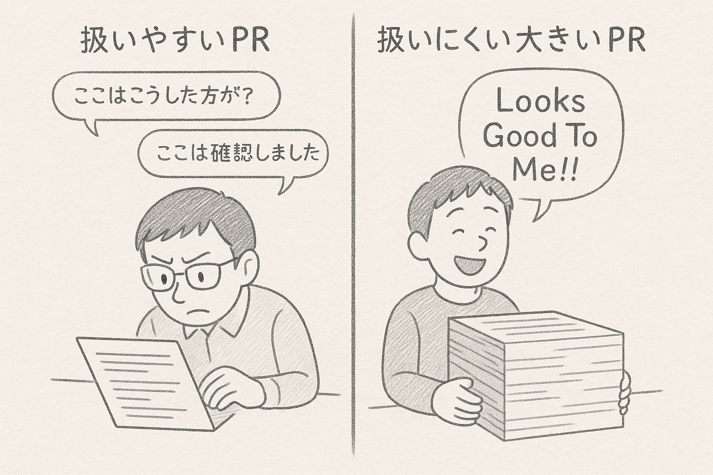
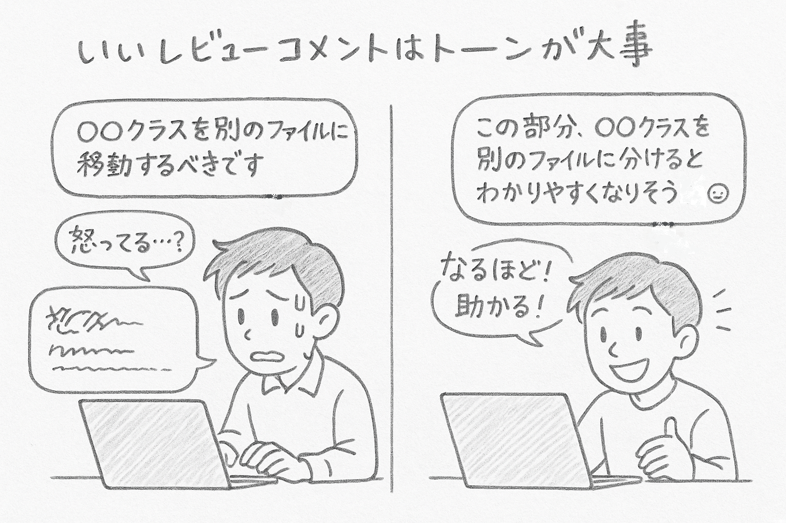
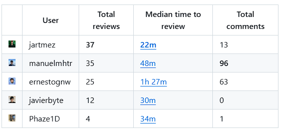


開発って結局人間がやるねん...（白色って200色あるねん風）


久しぶりの投稿です。今回は「Looks Good to Me」という、ソフトウェア開発の「コードレビュー」に焦点を当てた本を読んだので、雑に感想を書きます🙋‍♂️

 


**コードレビューって？**  
参考：<https://about.gitlab.com/ja-jp/topics/version-control/what-is-code-review/>


## 全体の感想💬

読み終えての印象は、

**「開発は人と人とのコミュニケーションによって成り立っている。コードレビューはその典型例である。」**

でした。

本書の1章でも触れられていますが、コードレビューの目的は大きく2つです。

1. **コード（ソフトウェア）の品質向上**  
   バグの早期発見や、コードの可読性向上。
2. **チームの理解促進**  
   チームメンバー間の知識共有や、相互理解を深めること。

この2つの目的を達成するには、コードレビューの質が大事です。
プログラミング言語やコードベースの理解も大切ですが、**レビュー依頼者（コード実装者）とレビュワーがストレスなくレビューできる環境を作ることも重要**だと強調されています。

本書は、 **「コードレビューをチームで円滑に進める方法」** を、具体的な事例とともに解説しています。
逆に、「プログラミングの慣習」や「開発のベストプラクティス」には触れていません。コードレビューの進め方や、コミュニケーションのコツにフォーカスしています。
「良いレビューコメント」「悪いレビューコメント」については解説がありますが、具体的なコードの書き方や設計のポイントはありません。そういった情報を求める方には向いていないかもしれません。

私は、最近チームでレビューをする機会が増えたので、**レビュワーとしての心構えを学ぶのに役立つ1冊**でした。

## 面白かったポイントをいくつか

チームでソフトウェア開発に取り組んでいる方であれば、役割にかかわらずおすすめの1冊でした。レビュワーであってもなくても、もはやエンジニアであってもなくても読んでみてほしいです。ここでは、簡単に面白かったポイントを紹介しようと思います。

私は普段GitHubを使っているので、コードレビューは[Pull Request（PR）](https://docs.github.com/ja/pull-requests/collaborating-with-pull-requests/proposing-changes-to-your-work-with-pull-requests/about-pull-requests)で行っています。以降は「PR」と表記します。

### PRのテンポはチームが決める⏱️

「PRのテンポ」とは、PRが作成されてからマージされるまでの進め方のことです。この表現はとても気に入っています。

書籍では、PRレビューのテンポはチームによって違うと書かれています。PRが提出されてからマージまで、1時間で終わるチームもあれば、1週間かかるチームもあります。
大事なのは、 **「チームでコードレビューの進め方について共通認識を持つこと」** です。
また、 **「PRレビューはPR作成者とレビュワーのコミュニケーション」** です。機能追加や修正など、コミュニケーションをとりながら進めています。

つまり、 **「PRレビューのテンポ = コミュニケーションのテンポ」** とも言えます。


**💡所属チームでは...**

私のチームでは、PRが提出されてからマージまで1日以上かかることはほとんどありません。

これは「レビューを適当にしている」わけではありません（きっと）。レビュワーはしっかりレビューしますが、どんどんマージして開発環境で動かすことを重視しています。もちろん、理解のために時間をかけることもありますが、気楽にレビューできる環境づくりを心がけています。

また、後述の「扱いやすいPR」にもある通り、PRを小さくすることでサイクルを速く回しています。これが私たちの「テンポ」ということですね。


### 扱いやすいPRにするために📦

扱いやすいPRのガイドラインとして、以下の6つが挙げられています。

- アトミック（小さく分割できない）な変更や機能に焦点を当てる
- 関連する必要なファイルのみを含める
- 各部分を個別のレビューに分割する
- 10分から20分程度でレビュー可能な規模にする
- 通常、コードの変更は500行以下に収める
- 通常、変更ファイル数は20未満にする

これらのガイドラインに沿ったPRは、レビューしやすいです。実際、最近はチームで様々なPRをレビューしていますが、結果的にこのガイドラインに沿ったPRは、レビューにかかる負担が少なかったと考えています。

扱いやすいPRはコメントや質問も活発になり、バグにも気づきやすいです。一方、規模が大きすぎるPRは、考慮点が多くなり、「Looks Good To Me!!」とだけコメントしてしまうこともありました（本書のタイトルですね）。

経験から考える最も大事な要素は、 **「そのPRで議論すべき内容が明確に絞られていること」** です。

内容を絞るには、PRに必要なコメントや関連情報のリンクを記載することがまず大事です。コード読む前にレビュワーにコンテキストを伝えましょう。作成するPRに含まれる変更がアトミックであることも重要です。これらは**PR作成者がレビュワーのために行うコミュニケーション**であり、作成者の役割です。

コミュニケーションが適切で内容が明確なら、コードの行数やファイル数は厳密に守る必要はないと思います（少ない方が助かるのは事実ですが）。

例えば、ユーザ追加機能とユーザ一覧取得機能はPRを分ける方が基本的には適切でしょう。しかし、ユーザが持つ情報を変更する場合は、関連するこれらの機能はすべてを1つのPRでまとめた方が分かりやすいこともあります。

また、コードの行数やファイル数に厳密な制限を設けると、作成者に不要なプレッシャーが生じることもあります。例えば「500行を超えたPRはレビューしません」といったルールがあると、作成者はそのために工夫したり、本質的でない部分に気を使うことになるかもしれません。

対人関係の観点では、作成者とレビュワーの間に壁ができる可能性もあります。「レビュワーは500行を超えるとレビューしてくれない」、「作成者はもっとルールを守るべきだ」といった感情が生まれることも考えられます。

もちろん、OSSなど多くの人がPRを提出する場合は、一定のルールが必要です。しかし、メンバーが固定されたチーム開発なら、お互いが気持ちよくコミュニケーションを取ることを優先してほしいと思います。


**👥所属チームでは...**  

開発タスクを割り振るメンバーはある程度決まっています。

このタスクがPRの単位になり、割り振ったメンバーがレビュワーになることが多いです。なるべくタスクを分解してPRも小さくし、コミュニケーションしやすくしています。

この運用の課題は、割り振るメンバーにレビューが集中すること、受け取る側が全体感を把握しづらいことです。対策として、タスク確認時間のファシリテートの役割を回す、仕様書をきちんと書いて認識を合わすなどの工夫をしています。


### いいレビューコメントはトーンが大事💡

コードレビューで大事なのは、 **「開発者ではなくコードに焦点を当てる」** ことです。

書籍では、「有害」「無害」に分類されたコードレビューの議論パターンについて調べた研究結果が紹介されています。**「有害」なテキストには「あなた」という言葉が頻出していた**そうです。特に「あなた」で文が始まる傾向が強く、「あなたは○○だ」のような個人攻撃が多かったと。一方、「無害」なコードレビューには技術用語が多く使われていたそうです。これは、コードの内容に焦点を当てていて、個人攻撃ではなかったことを示しています。

**ただし、有害と思われるコメントすべてが「あなた」に関するわけではありません**。繰り返しにはなりますが、PRレビューはPR作成者とレビュワーのコミュニケーションです。 コミュニケーションである以上、伝え方はとても大事です。さらに、レビューコメントは通常テキストです。トーンやニュアンスが伝わりにくいことがあります。

例えば、以下のようなコメントは命令的に感じる人が多いでしょう。

> 「○○クラスを別のファイルに移動するべきです」

このコメントは、レビュワーの意図に関係なく、受け取る側が「命令された」と感じることがあります。人の感じ方は様々です。私はこのコメントを見ると少し冷たく感じます。もちろん、普段の関係性にもよりますが。

テキストコミュニケーションはトーンやニュアンスが伝わりにくいです。今回なら、 **「この部分、○○クラスを別のファイルに分けるとわかりやすくなりそうですね😀」** と書けば、ほとんどの人がポジティブに受け取れるでしょう。

「仕事だからPRレビューは端的に伝えるべき！気遣いは不要！」と思う方もいるかもしれませんが、人間には感情があります。特に、レビュワーはPRを承認する権限を持ち、作成者はその承認を得るためにコミュニケーションしています。冷たいトーンのコメントは、作成者が「自分のコードが否定された」と感じる原因になります。

トーンの工夫はいろいろありますが、書籍では「あなた」ではなく「私たち」という表現を使うよう勧められています。「あなたはこうするべき」ではなく、「私たちはこうしていきたいですね」というニュアンスです。小さな心遣いが、チームのモチベーションに影響するなら、積極的に取り組むべきでしょう。

この辺りは過去の記事にも触れていますので、よければ合わせてご覧ください。



### やり取りが長くなるようであれば直接会話する📞

書籍では、コードレビューのやり取りが長くなりそうな場合は、直接会話することを勧めています。特に、PRの内容が複雑であったり、レビュワーがコードの意図を理解しづらい場合は、直接会話することで誤解を減らせます。

上記のトーンの話とも関連しますが、テキストコミュニケーションはトーンやニュアンスが伝わりにくいです。特に、コードレビューではコードの意図や背景を理解することが重要で、テキストで何往復もするのであれば、直接会話した方がお互いにとって効率的です。

### PRの承認を止めるべきものは何か🚦

PR作成者がPRを出したとき、レビュワーは承認するかどうかを判断します。承認する場合は、内容が問題ないことを確認し、マージされます。

ここで、PRの承認を止めるべき問題（ブロッキング）と、止めなくていい問題（非ブロッキング）について紹介されていました。

#### 非ブロッキング問題👌

PRの承認を止めるほどのものではない問題として、以下のようなものが挙げられていました。

- **スタイルの好み**：自分の好みとは異なるコードスタイル
- **軽微なフォーマットの不一致**：一貫性のないスペースやインデントなどの些細な問題
- **ドキュメントの細かい指摘**：ドキュメント内の些細な不整合や誤字脱字、不一致
- **任意の機能の欠如**：PRが必須の機能を満たしているものの、任意の機能が欠けている場合
- **軽微なリファクタリングの機会**：機能に影響せず、別のPRで対処できるコードの改善
- **無関係な改善**：元のPRと関連せず、別のPRで対処できる提案

レビュワーはこのような問題を見つけたら、コメントはつけつつPRは承認しましょう、ということです。

#### ブロッキング問題🙅‍♂️

PRの承認を止めるべき問題としては以下が挙げられています。

- **必須機能の欠如**：PRが満たすべき内容を満たしていない場合
- **セキュリティの問題**：個人情報や機密データの漏洩リスクがある変更
- **コーディング規約違反**：コードが、チームやプロジェクトの規約から逸脱している
- **コードの臭い**：構造や可読性がよくなかったり、アンチパターンが含まれている
- **リグレッション**：コードが予期しない副作用を引き起こしたり、既存の機能を壊している
- **パフォーマンス問題**：コードがパフォーマンスやリソースの仕様に悪影響を与えている
- **テストの失敗**：コードの変更によりテストが失敗している、必要なテストが不足している

これらの問題を見つけたら、レビュワーは作成者に変更をお願いしましょう。この時、**「なぜブロッキングなのか」を説明することが大事**です。


**👥所属チームでは...**

コードの修正依頼は「Changes Requested」ではなく「Comment」を使っています。

これは「Changes Requested」が多いとPRを出すのが辛くなる雰囲気ができた、というリーダーの経験からです。私はこの運用が好きで、積極的にPRを出せること、コミュニケーションを大事にしています。

後述しますが、コーディング規約違反やテストなど自動化できるものはGitHub Actionsを活用しています。



### なるべく自動化する🛠️

「PRの承認を止めるべきものは何か」で挙げた問題のいくつかは、GitHub Actionsで自動チェックできます。例えば、コーディング規約違反の確認や自動テスト、ライセンスチェックなどです。これらを自動化することで、レビュワーが本質的な部分に集中できます。
書籍で紹介されていた、PR提出時に情報を追加するツールも紹介します。

- PRサイズのラベル：提出されたPRの変更量や変更ファイルに応じてラベルを付けることで、PRの特徴を把握しやすくする
  - <https://github.com/actions/labeler>
  - <https://github.com/CodelyTV/pr-size-labeler>
- PRの統計：チーム全体でレビューの作業負担がどのように分散されているかを把握するためのツール
  - <https://github.com/marketplace/actions/pull-request-stats>

- レビュワーの自動割り当て：PRの内容に応じて、適切なレビュワーを自動的に割り当てる
  - ※CODEOWNERSファイルを使うことで、特定のファイルやディレクトリに対して自動的にレビュワーを割り当てることもできます。

※CODEOWNERSについて：<https://docs.github.com/ja/repositories/managing-your-repositorys-settings-and-features/customizing-your-repository/about-code-owners>

最近はCopilotによるコードレビューもあります。私やチームでも使っていますが、有用なコメントが多く、今や欠かせない存在です。

---

## まとめ📝

「Looks Good to Me」を読んで、コードレビューは人同士のコミュニケーションであり、チーム開発の質を左右する大切なプロセスだと改めて感じました。導入するだけでなく、チーム全体で文化として育てることが重要だと再認識しました。

特に、レビュワーの心構えやコメントのトーン、PRの扱いやすさなど、すぐに実践できるアドバイスが多く参考になりました。本を読みながら自分のレビュー方法を振り返り、改善点も見つけられました。

また、ここ2か月の経験から「レビューに慣れるには、実際にレビューをするしかない」と強く感じました。レビューを重ねることで、PRを出すときも「レビュワーは何を気にするか」「どんなコメントが来るか」を意識できるようになり、より良いPR作成につながるのかなと。

経験のためにも、チーム内の誰もが気軽にレビューに挑戦できる雰囲気や仕組みを作ることが大事だと思います。それが結果的に、チーム全体の成長につながるのかなと。

とても良い本でした。チーム開発に取り組む方はぜひ読んでみてください！

では、また👋