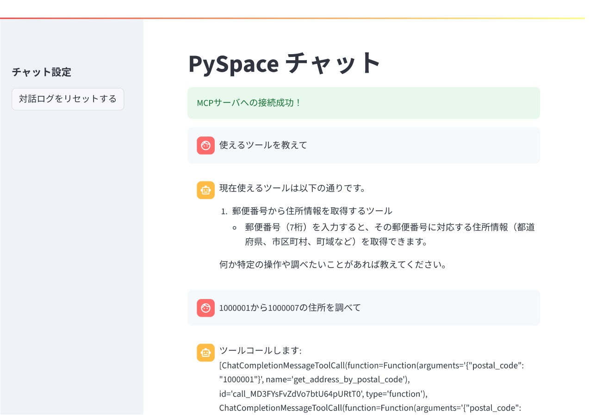
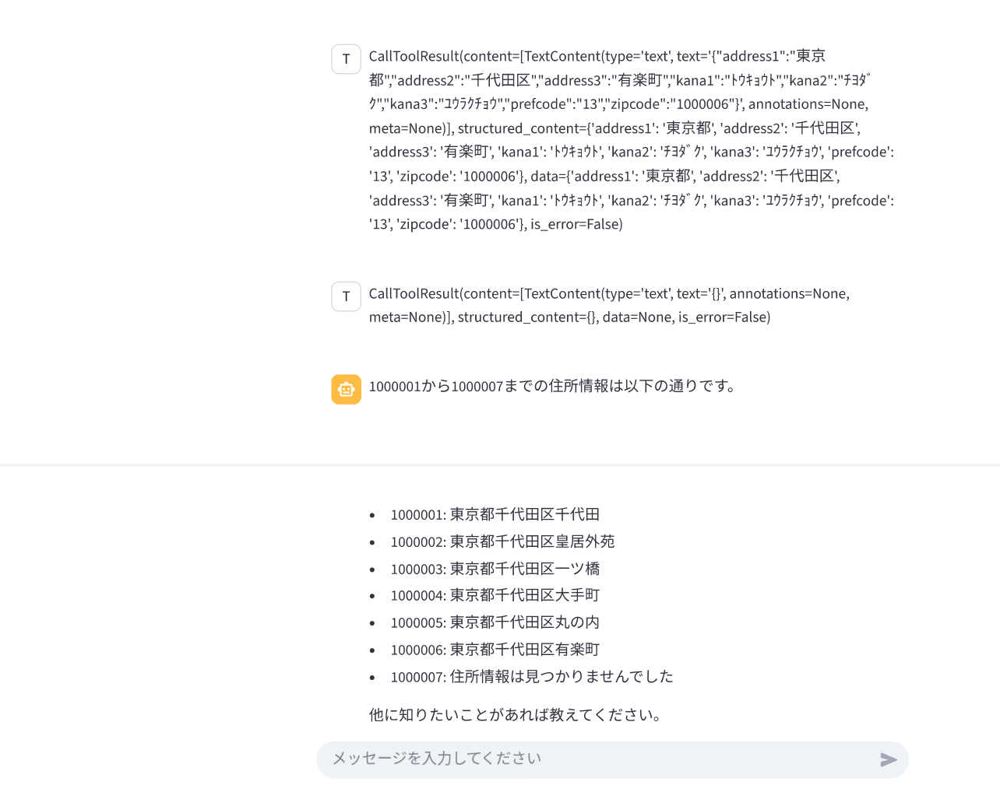

今回は、Model Context Protocol（MCP）の学習も兼ねて、[FastMCP](https://gofastmcp.com/getting-started/welcome)を利用して、ツール呼び出しが可能な対話アプリを作成してみます。LLMの呼び出しには[LiteLLM](https://www.litellm.ai/)を利用してみます。

## Model Context Protocol（MCP）とは？

MCPは2024年末にAnthropicが提唱した、LLMモデルと外部システムを連携させるためのオープンプロトコルです。公式サイトでは以下のように説明されています。

> MCP provides a secure, standardized, simple way to give AI systems the context they need.
> （翻訳）MCP は AI システムに必要なコンテキストを安全かつ標準化されたシンプルな方法で提供します。

「MCPはAIのUSBポートのようなもので、AIが外部の情報やツールにアクセスするための共通のインターフェースを提供します。これにより、AIは特定のプロトコルに依存せずに、さまざまなシステムと連携できるようになります。」という説明がいろいろなところで書かれているのですが、個人的にはあまりピンときていませんでした。

ということで、実際に試してみることにしました。

今回は、リモートMCPサーバー（Streamable HTTP接続）を構築し、簡易アプリケーションからMCP経由でツールを呼び出してみます。

MCPについて調べるなら公式ドキュメントを読むか、以下の記事が参考になります。

- [公式ドキュメント](https://modelcontextprotocol.io/overview)
- [Qiita記事 - ちゃんと理解したい初心者のための「MCP」まとめ](https://qiita.com/to3izo/items/99dd3cde237c2e5a007f)
- [Zenn記事 - MCP概要説明](https://zenn.dev/mkj/articles/0ed4d02ef3439c)

## 利用するライブラリ

今回、MCPサーバーの構築には[FastMCP](https://gofastmcp.com/getting-started/welcome)を利用し、LLMの呼び出しには[LiteLLM](https://www.litellm.ai/)を利用して、簡易的な対話アプリを作成します。

### FastMCPとは？

FastMCPは、Model Context Protocol (MCP) を手軽に扱うためのPython製フレームワークです。

<div class="iframely-embed"><div class="iframely-responsive" style="height: 140px; padding-bottom: 0;"><a href="https://gofastmcp.com/getting-started/welcome" data-iframely-url="//iframely.net/N5ByKufk?card=small&theme=light"></a></div></div>

公式ドキュメントでは「MCPサーバーやクライアントを高速かつPythonicに構築する方法」だと説明されています。もともとFastMCP 1.0は公式のMCP Python SDKに統合される形でリリースされましたが、現在のFastMCP 2.0では機能拡充が進み、MCPエコシステムを包括的に扱えるツールキットとして積極的に開発が続けられているそうです。

FastMCPは以下の4点に重点を置いています。

> - 🚀 Fast: High-level interface means less code and faster development
> - 🍀 Simple: Build MCP servers with minimal boilerplate
> - 🐍 Pythonic: Feels natural to Python developers
> - 🔍 Complete: A comprehensive platform for all MCP use cases, from dev to prod

実際触ってみてですが、確かに上記のポイントを意識した設計になっていると感じました。pythonに触れたことがある方であれば、直感的に使えるあと思いました。

MCPは、いくつかの接続方式が存在していますが、今回は「Streamable HTTP接続」を利用します。Streamable HTTPによる接続なので、リモートMCPサーバーを構築することになります。これにより、アプリケーションサーバーとリモートMCPサーバー間でHTTPを介してツール呼び出しやデータの送受信が可能になります。

### LiteLLMとは？

LiteLLMは、複数のLLMプロバイダを横断して統一的なインターフェースで利用できるようにするオープンソースのSDKです。

<div class="iframely-embed"><div class="iframely-responsive" style="height: 140px; padding-bottom: 0;"><a href="https://www.litellm.ai/" data-iframely-url="//iframely.net/rXwuDybx?theme=light"></a></div></div>

OpenAIやAzure OpenAI、Anthropic、Google Vertex AIなど100種類以上のLLMモデルを、単一のAPI形式で呼び出せます。開発者はプロバイダごとのAPIの違いを意識せずに、統一されたインターフェースでLLMを利用できます。

個人的に良いなと感じた点は、「**OpenAI互換の統一API**」であることです。もともとAzure OpenAIを使うことが多かったこともあり、OpenAI互換のAPIは非常に助かります。

また、「コスト管理」のための画像対応の判定機能なども存在しており、LLMシステムを構築するうえで非常に便利なツールかなと感じました。

## 作ったサンプルアプリ画面

MCPサーバー側に郵便番号を入力すると、住所を返すツールを登録し、対話アプリからそのツールを呼び出せるようにしました。非常にシンプルな構成としています。



途中は省略して…



対話形式で利用可能なツールを確認したり、ツールの利用を行っていることがわかるかと思います。

## コードの紹介

以下で紹介するコードはGitHubで公開しています。本記事内ではStreamlitを用いたアプリの部分は省略しています。気になる方はリポジトリを見ていただければと思います。



今回目指す処理の流れは次のとおりです。

1. アプリ起動時にリモートMCPサーバーからツール情報を取得
2. ユーザからチャットを受け取る
3. チャット情報とツール情報をLLMに渡す
4. ツール利用が選択されたら、リモートMCPサーバに対しツール利用をリクエスト
5. 得られたツール結果と過去の対話履歴をLLMに渡す
6. ツール利用が選択されなくなるまで3〜5を繰り返す
7. 回答をユーザ側へ返す

### FastMCPを用いたリモートMCPサーバーの構築

早速ですが、FastMCPを利用してリモートMCPサーバーを構築し、郵便番号から住所情報を取得するツールを作成してみます。

```python
import requests
from fastmcp import FastMCP

mcp = FastMCP("Sample MCP Server", "これはテスト用のMCPサーバーです")  # type: ignore


@mcp.tool()
def get_address_by_postal_code(postal_code: str) -> dict:
    """
    郵便番号から住所情報を取得する。

    Parameters
    ----------
    postal_code : str
        住所を取得したい郵便番号（7桁）

    Returns
    -------
    dict
        住所情報（都道府県、市区町村、町域など）を含む辞書。該当なしの場合は空の辞書。
    """
    API_URL = "https://zipcloud.ibsnet.co.jp/api/search"
    params = {"zipcode": postal_code}
    try:
        response = requests.get(API_URL, params=params, timeout=5)
        response.raise_for_status()
        result = response.json()
        if result["status"] == 200 and result["results"]:
            return result["results"][0]
        else:
            return {}
    except Exception:
        # エラー時は空の辞書を返す
        return {}


if __name__ == "__main__":
    mcp.run(transport="streamable-http")

```

こちらのコードでは単純にAPIをたたいているだけですが、ツール内で整形処理を行うことなども可能です。ツールとして扱うためには`@mcp.tool()`デコレーターを使って関数を登録します。これにより、MCPサーバーはこの関数をツールとして認識し、外部から呼び出せるようになります。

※ツール内で利用しているAPIは、<https://zipcloud.ibsnet.co.jp/doc/api> を参照してください。

これでMCPサーバを起動すると、デフォルトではローカルの `http://127.0.0.1:8000` で起動します。環境に応じてポートやホストを変更してください。

サーバーを起動するには、上記のコードをファイルに保存し、以下のコマンドで実行します。

```bash
python sample_mcp_server.py
```

### 最低限のMCPクライアントコード

次に、クライアント側の最低限の実装は以下のようになります。 接続先を`http://127.0.0.1:8000/mcp`として`client`オブジェクトを作成します。FastMCPで構築したサーバに対して、Streamable HTTPで接続を行う際は、末尾に`/mcp`を付けたエンドポイントを利用します。

`list_tools()`メソッドを呼び出すことで、MCPサーバーで提供されているツールの一覧を取得できます。

```python
import asyncio

from fastmcp import Client


async def main():

    # MCPクライアントの準備
    client = Client("http://127.0.0.1:8000/mcp")

    async with client:
        # MCPサーバで提供されているツール一覧の取得
        tools = await client.list_tools()
        print(f"Available tools: {tools}")


if __name__ == "__main__":
    asyncio.run(main())
```



[MCP公式ドキュメント](https://modelcontextprotocol.io/specification/2025-03-26/basic/transports#streamable-http)では、Streamable HTTP接続用のエンドポイントはPOSTとGETリクエストをサポートしている必要があると書かれています。ここで、`/mcp` を付けたエンドポイント例を挙げています。

特に理由がなければ`/mcp`を付ける形にするとよいでしょう。特に意識せずともFastMCPなどを利用すればそうなりますが。
NotionなどのリモートMCPも同じく`/mcp`を付ける形になっていました。


### LiteLLMを用いたLLMに対するリクエスト部分

次にLiteLLMを利用した部分についてです。

まず、FastMCPから受け取ったツールの情報をLiteLLM経由でLLMに渡すための形式に変換するロジックです

```python
from typing import Any
from mcp import Tool


def fastmcp_tools_to_litellm_tools(tools: list[Tool]) -> list[dict[str, Any]]:
    """
    fastmcpのTool情報をlitellm function call用tools dict形式に変換する。

    Parameters
    ----------
    tools : list[Tool]
        fastmcpで取得したToolオブジェクトのリスト

    Returns
    -------
    list[dict[str, Any]]
        litellm function call用tools(dict)リスト
    """
    return [
        {
            "type": "function",
            "function": {
                "name": tool.name,
                "description": tool.description,
                # 実装により inputSchema / input_schema の差異があるため両対応
                "parameters": getattr(tool, "inputSchema", getattr(tool, "input_schema", None)),
            },
        }
        for tool in tools
    ]

```

次に、LiteLLMを利用してAzure OpenAIにリクエストを送る部分のコードです。AOAIへの接続情報は環境変数に設定することも可能ですし、コード内で直接指定することもできます。（参考：[公式ドキュメント](https://docs.litellm.ai/docs/providers/azure/)）

```python
import litellm
from litellm.types.utils import ModelResponse
from mcp import Tool
from typing import Any


def call_llm_with_tools(
    messages: list[dict[str, Any]], tools: list[Tool], model: str = "azure/gpt-4o-mini"
) -> ModelResponse:
    """
    メッセージ履歴とツール情報を渡してLLMのfunction call出力を得る。

    Parameters
    ----------
    messages : list[dict[str, Any]]
        チャット履歴（role, content, tool等を含む）
    tools : list[Tool]
        fastmcpで取得したToolオブジェクトのリスト
    model : str, optional
        利用するLLMモデル名（例: azure/gpt-4o-mini や azure/gpt-4.1-mini など、環境に合わせて）

    Returns
    -------
    ModelResponse
        LLMの応答
    """
    litellm_tools = fastmcp_tools_to_litellm_tools(tools)
    response = litellm.completion(
        model=model,
        messages=messages,
        tools=litellm_tools,
        tool_choice="auto",
        # 環境変数（AZURE_API_KEY / AZURE_API_BASE / AZURE_API_VERSION）を設定している場合は省略可
        api_base="<AOAIのAPIエンドポイント>",
        api_version="<APIバージョン>",
        api_key="<AOAIのAPIキー>",
    )
    return response  # type: ignore
```

※Azure OpenAI を使う場合は、`AZURE_API_KEY` / `AZURE_API_BASE` / `AZURE_API_VERSION` を設定し、モデルは `azure/<デプロイメント名>` として指定します。

あとは上記メソッドを呼び出しながら、ツールコールが走ればツール実行をリモートMCPサーバーにリクエストし、結果を受け取る、その情報を踏まえてLLMに再度リクエストを行うという流れになります。

ツール呼び出しは、`mcp.call_tool()` メソッドを利用して行います。以下のようなコードになります。

以下のコードは、ツールコールがある場合にリモートMCPサーバーに対してツールを実行し、結果を履歴に追加、ツールコールが選択されなくなるまで、履歴をまとめてLLMに渡すループ処理になります。

```python
async def request_completions(
    messages: list[dict],
    tools: list[Tool],
    client: Client,
    logger: logging.Logger,
):
    """
    チャット履歴とツール情報を使用してLLMからの応答を取得し、履歴を更新する。

    Notes
    -----
    ツールコールがある場合はMCPサーバのツールを実行し、結果を履歴に追加する。

    Parameters
    ----------
    messages : list[dict]
        チャット履歴（role, content）
    tools : list[Tool]
        MCPサーバのツール一覧
    client : Client
        MCPクライアント
    logger : logging.Logger
        ロガー

    Returns
    -------
    list[dict]
        追加されたメッセージ履歴（role, content）
    """
    history = messages.copy()
    logger.info(f"チャット履歴: {history}")
    while True:
        response = call_llm_with_tools(history, tools)
        logger.info("LLM（OpenAI）からの応答を受信: %s", response)
        message = response["choices"][0]["message"]
        # ツールコールがなければ終了
        if not (hasattr(message, "tool_calls") and message.tool_calls):
            history.append({"role": "assistant", "content": message["content"]})
            break

        # ツールコールがある場合
        history.append(
            {
                "role": "assistant",
                "content": f"ツールコールします: {message.tool_calls}",
                "tool_calls": message.tool_calls,
            }
        )
        # すべてのツールコールを実行
        for tool_call in message.tool_calls:
            tool_name = tool_call.function.name
            tool_args = tool_call.function.arguments
            logger.info(f"ツール呼び出し: {tool_name}({tool_args})")
            args_dict = json.loads(tool_args)
            logger.info(f"MCPツール {tool_name} を実行: 引数 {args_dict}")
            async with client:
                tool_result = await client.call_tool(tool_name, arguments=args_dict)
            logger.info(f"ツール {tool_name} の実行結果: {tool_result}")

            history.append(
                {
                    "tool_call_id": tool_call.id,
                    "role": "tool",
                    "name": tool_name,
                    "content": str(tool_result),
                }
            )
        # ツール結果をLLMに渡してループ継続
    return history
```

## ざっと使ってみて

FastMCPは非常にシンプルで、リモートMCPサーバーを簡単に構築できました。LLMを組み込んだアプリケーションに、さらにツールという概念を組み合わせるのはかなり大変です。今回試してみたリモートMCPサーバーを利用することで、アプリケーションロジックとツールロジックの分離が容易になり、開発の効率化が狙えるのかなと思いました。

LiteLLMはLangChainのようなフレームワークとは違い、各LLMモデルへのAPI呼び出しを統一的に扱うことに特化しているので、シンプルで使いやすいなという印象でした。もちろん、メッセージ履歴の管理などは自分で行う必要がありますが、フレームワークへの依存度が少なく、必要な機能をシンプルに利用できるのが大きなメリットだなと感じました。

## 参考

<div class="iframely-embed"><div class="iframely-responsive" style="height: 140px; padding-bottom: 0;"><a href="https://zenn.dev/yamaday/articles/litellm-python-sdk" data-iframely-url="//iframely.net/QWmPi4Bj?card=small&theme=light"></a></div></div><script async src="//iframely.net/embed.js"></script>
