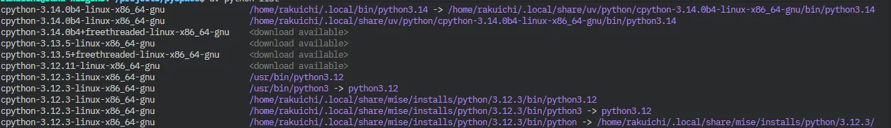

最近は暑すぎて外に出るのがおっくうになっております。日差しが強すぎて、汗が止まらないですね。

日差し🌞、紫外線😎、uv...、uv!!

uvといえば、最近注目のPythonパッケージマネージャ「[uv](https://docs.astral.sh/uv/)」はご存じですか？本日は簡単に「uv」によるPython環境構築の方法を紹介します。<br>
（とんだ茶番で申し訳ないです。そして、uvは割と前から注目されています）

<div class="iframely-embed"><div class="iframely-responsive" style="height: 140px; padding-bottom: 0;"><a href="https://docs.astral.sh/uv/" data-iframely-url="//iframely.net/feEFR0LH?theme=light"></a></div></div><script async src="//iframely.net/embed.js"></script>

## uvとは？

「uv」は、[Astral](https://astral.sh/)が開発した超高速なPythonパッケージマネージャ兼仮想環境ツールです。従来の`pip`や`poetry`、`pipenv`と比べて、圧倒的に速いのが特徴です。

Astralは、[ruff](https://docs.astral.sh/ruff/)の開発も行っており、Pythonエコシステムの改善に力を入れています。ruffが人気を集めているように、uvもそのパフォーマンスと使いやすさで注目されています。

> 公式のuvの紹介文和訳:
>
> - ⚡️ pipより10〜100倍高速
> - 🗂️ ユニバーサルなlockファイルによる包括的なプロジェクト管理
> - ❇️ インライン依存関係メタデータ付きでスクリプト実行が可能
> - 🐍 Pythonのバージョン管理・インストールが可能
> - 🛠️ Pythonパッケージとして公開されたツールの実行・インストールが可能
> - 🔩 pip互換のインターフェースで、使い慣れたCLIと高いパフォーマンス
> - 🏢 Cargoスタイルのワークスペース対応で大規模プロジェクトも管理可能
> - 💾 グローバルキャッシュによる依存関係の重複排除でディスク効率が良い
> - ⏬ RustやPython不要、curlやpipでインストール可能
> - 🖥️ macOS、Linux、Windowsに対応
>
> 公式サイト：<https://docs.astral.sh/uv/>

私自身は、Pythonの環境構築について、Anaconda→pipenv→poetryと移行してきました。正直、現状のpoetryでも十分便利ですが、ruffが非常に優秀なので、uvも試してみたくなりました。今はまだ軽く触っている段階ですが、かなり良い印象を持っています。

個人的な感覚としてはこんな感じ？あくまで個人の感覚です。

| 機能         | uv           | poetry       | pipenv      | pip         |
|--------------|--------------|--------------|-------------|-------------|
| 仮想環境管理 | ○            | ○            | ○           | △（venv等） |
| lockファイル | ○（uv.lock） | ○（poetry.lock） | ○（Pipfile.lock） | ×           |
| 速度         | ◎（爆速）    | 〇            | ×           | ○           |
| 依存解決     | ◎            | ○            | △           | △           |

過去記事




## miseとuvの役割

私は今のところ、miseとuvを組み合わせてPython環境を構築しています。使い分けは以下の通り。

| ツール  | 役割                                                         |
|--------|--------------------------------------------------------------|
| mise   | Python自体のバージョン管理とプロジェクトの設定管理、タスクランナーとしての利用 |
| uv     | Pythonライブラリの管理                                        |

仮想環境「.venv」の作成はmiseからでもuvからでも可能です。

※miseを使ったuvによるPython環境構築について：<https://mise.jdx.dev/mise-cookbook/python.html>

また、uvでPythonのバージョン管理をすることも可能です。以下のようにmiseとuvそれぞれでPythonのバージョンを管理することが可能です。



画像を見ていただくとわかると思いますが、`.local/share/mise/` にmiseが管理するPython、 `.local/share/uv/python/` にuvが管理するPythonがそれぞれインストールされます。

uvを使ったPythonバージョン管理は後程紹介します。

今回実際に利用したPythonプロジェクトは、以下リポジトリから確認できます



## miseを使ったuvのインストール方法とプロジェクト作成

uvは、`curl`や`pip`を使って簡単にインストールできます。[公式ドキュメント](https://docs.astral.sh/uv/getting-started/installation/)には様々な手順（`curl`、`wget`、`pip`など）が紹介されていますが、私はmiseを使ってuvをインストールしています。

まずGitリポジトリを作成し、プロジェクトルートで以下のコマンドを実行します。

```sh
$ mise use uv@latest
$ uv --version
uv 0.8.0
```

これでuvがインストールされました。続いて、プロジェクトで利用するPythonのバージョンを指定します。ここではPython 3.13を指定します。

```sh
mise use python@3.13
```

これでPython 3.13がプロジェクトで利用できるようになります。

次に、uvを使ってプロジェクトの初期化を行います。その前に、作成されたmiseの設定ファイル「mise.toml」を以下のように修正しておきます。

```toml
[env]
_.python.venv = { path = ".venv", create = true }

[tools]
python = "3.13"
uv = "latest"
```

この設定をしておくことで、今後miseを使って環境を構築する際（`mise i` 実行時）に、自動でプロジェクトルートに「.venv」ディレクトリが作成され、Python 3.13の仮想環境が構築されます。

それでは、`mise i`を実行して仮想環境を作成します。

```sh
$ mise i
mise all tools are installed
mise creating venv with uv at: ~/projects/pyspace/.venv
Using CPython 3.13.5 interpreter at: /home/rakuichi/.local/share/mise/installs/python/3.13.5/bin/python
Creating virtual environment at: .venv
Activate with: source .venv/bin/activate
```

これで、プロジェクトルートに「.venv」ディレクトリが作成され、Python 3.13の仮想環境が構築されました。

次に、uvを使ってプロジェクトの初期化を行います。以下のコマンドを実行します。

```sh
uv init
```

これで、プロジェクトの初期化が完了し、「pyproject.toml」ファイルと「.python-version」ファイルが作成されます。私は「mise.toml」の設定でPythonのバージョンを指定しているので、「.python-version」ファイルはいったん削除しています（そのままでも問題ありません）。

## uvを使ったPythonライブラリの追加

uvを使ってPythonライブラリを追加するのは非常に簡単です。例えば、`streamlit`ライブラリを追加する場合は以下のコマンドを実行します。

```sh
uv add streamlit
```

`ruff`などのライブラリを開発用の依存関係として追加する場合は、`--dev`オプションを付けます。

```sh
uv add ruff --dev
```

このあたりはpoetryとほぼ同じコマンドなので、poetryを使ったことがある方はすぐに慣れると思います。

ただし、「pyproject.toml」の記述方法はpoetryとは少し異なります。

以下は実際に私が作成した「pyproject.toml」です。

```toml
[project]
name = "pyspace"
version = "0.1.0"
description = "Add your description here"
readme = "README.md"
requires-python = ">=3.13"
dependencies = [
    "pydantic>=2.11.7",
    "streamlit>=1.47.0",
]

[dependency-groups]
dev = [
    "mypy>=1.17.0",
    "pytest>=8.4.1",
    "ruff>=0.12.4",
]
```

「pyproject.toml」の`dependencies`セクションに依存関係が記載されます。`dependency-groups`セクションでは、グループごとの依存関係が管理されます。

`--dev`オプションを付けることで、`dev`グループに依存関係が追加されます。その他、任意のグループ名を指定する場合は、`--group <group-name>`オプションを使います。


ライブラリを削除する場合は、以下のコマンドで可能です。

```sh
uv remove <library-name>
```

## uvのコマンドを少し紹介

ここで、uvの主なコマンドを紹介します。

```sh
uv init
uv add <パッケージ名>         # 依存パッケージの追加（poetry addと同様）
uv remove <パッケージ名>      # 依存パッケージの削除（poetry removeと同様）
uv sync                      # lockファイルに従って依存パッケージをインストール（poetry installと同様）
uv update                    # 依存パッケージのアップデート（poetry updateと同様）
uv install                   # 依存パッケージのインストール
uv run <コマンド>            # 仮想環境内でコマンドを実行（poetry runと同様）
uv lock                      # lockファイルの生成・更新
uv list                      # インストール済みパッケージ一覧表示
uv show <パッケージ名>        # パッケージの詳細情報表示
uv check                     # 依存関係の整合性チェック
uv python                    # Pythonバージョンの管理・切り替え
uv --help                    # コマンド一覧・ヘルプ表示
``` 

ご覧いただくと分かる通り、`poetry`とほぼ同じコマンドが用意されています。

前述のuvによるPythonの特定バージョンをインストールするコマンドは以下の通りです。

```sh
uv python install 3.14
```

また、uvは`uvx`というコマンドを提供しており、これを使うことでインストールしたツールを簡単に実行できます。例えば、`ruff`や`mypy`などのツールは以下のように実行できます。

```sh
uvx ruff check .
uvx mypy .
```

`uvx`は実質的に`uv run <コマンド>`のエイリアスです。

さらに、uvには従来のpipコマンドと互換性のある`uv pip`コマンドも用意されています。
例えば、以下のようにpipと同じ感覚でパッケージのインストールやアンインストールが可能です。

```sh
uv pip install <パッケージ名>
uv pip uninstall <パッケージ名>
uv pip list
uv pip freeze
```

この`uv pip`コマンドは、pipの使い慣れたインターフェースをそのまま利用できる上、uvの高速な処理が活かされるため、従来のpipよりも圧倒的に速くパッケージ管理が行えます。

このあたりは公式ドキュメントの[こちら](https://docs.astral.sh/uv/reference/cli/)に詳しく書かれています。

## miseをタスクランナーとして活用

miseは、Pythonのバージョン管理やツール管理だけでなく、タスクランナーとしても利用できます。例えば、テストやビルド、フォーマットなどの定型作業を「mise.toml」に記述しておくことで、簡単なコマンドで実行できるようになります。

私が実際に作成した「mise.toml」は以下の通りです。

```toml
[env]
_.python.venv = { path = ".venv", create = true }

[tools]
python = "3.13"
uv = "latest"

[tasks.init]
description = "Install dependencies"
run = "uv sync --all-extras" # すべての依存関係をインストール

[tasks.lint]
run = "uvx ruff check . && uvx mypy ."

[tasks.format]
run = "uvx ruff format ."

[tasks.test]
run = "uvx pytest"

[tasks.app]
run = "uvx streamlit run src/main.py"
```

これにより、プロジェクト内の各種スクリプトやコマンドを一元管理でき、開発効率が向上します。npmの`scripts`や`Makefile`のような感覚で、Python以外のツールもまとめて管理できるのが特徴です。

それぞれのタスクは以下のように実行できます。

```sh
mise run init
mise run lint
mise run format
mise run test
mise run app
```

これにより、プロジェクトの初期化やコードの整形、テストの実行などを簡単に行うことができます。

私の作成した[サンプルプロジェクト](https://github.com/rakuichi4817/pyspace)であれば、以下のような流れで環境構築が完了します。

1. `mise i` でPythonとuvのセットアップ
2. `mise run init` で依存関係のインストール

```text
pyspace/
├── src/              # アプリ本体
│   ├── main.py       # Streamlitサンプル
│   └── __init__.py
├── tests/            # テストコード
│   ├── test_sample.py
│   └── __init__.py
├── mise.toml         # miseタスク定義
├── pyproject.toml    # Pythonプロジェクト定義
├── uv.lock           # uvロックファイル
└── README.md
```

## おまけ：GitHub ActionsによるCI/CD設定

最後に、GitHub ActionsでのCI/CD設定も紹介します。以下のような「quality-test.yml」を「.github/workflows/」ディレクトリに配置することで、GitHub ActionsによるCI/CDが可能になります。

Actionsの環境上でuvをセットアップする際は、以下のように`astral-sh/setup-uv`アクションを使用します。

```yaml
name: Quality & Test

# このワークフローは、PR作成やmainブランチへのpush時に
# ruffによるフォーマットチェック・mypyによる型チェック・pytestによるテストを
# Python 3.10/3.11/3.12の3バージョンで実行します。

on:
  push:
    branches:
      - main
  pull_request:
    branches:
      - main

jobs:
  quality-test:
    name: Quality & Test (lint, type, test)
    runs-on: ubuntu-latest
    # Pythonのバージョンごとに並列実行
    strategy:
      matrix:
        python-version: ["3.10", "3.11", "3.12"]
    steps:
      - uses: actions/checkout@v4
        # リポジトリのソースコードを取得
      - name: Install uv
        uses: astral-sh/setup-uv@v6
        with:
          enable-cache: true
        # uvをインストールし、キャッシュも有効化
      - name: Set up Python
        uses: actions/setup-python@v5
        with:
          python-version: ${{ matrix.python-version }}
        # matrixで指定したPythonバージョンをセットアップ
      - name: Install dependencies
        # uvで依存パッケージをインストール（uv.lockを利用、dev依存も含む）
        run: uv sync --locked --all-extras --dev
      - name: Run ruff format check
        # ruffでコードフォーマット・静的解析チェック
        run: uv run ruff check .
      - name: Run mypy type check
        # mypyで型チェック
        run: uv run mypy .
      - name: Run pytest
        # pytestでユニットテストを実行
        run: uv run pytest
```

この設定では、PR作成やmainブランチへのpush時に、ruffによるフォーマットチェック・mypyによる型チェック・pytestによるテストをPython 3.10/3.11/3.12の3バージョンで実行します。

## まとめ

今回は、miseとuvを利用したPython環境構築の方法を簡単に紹介しました。

最近はpoetryで落ち着いていましたが、今後はuvを使っていこうかなと考えております😎

気が向けば、poetryで作成したプロジェクトをuvに移行する記事も書いてみるかな...

紫外線の「uv」には気をつけて、また次回お会いしましょう👋