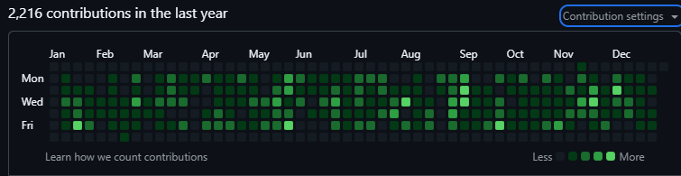
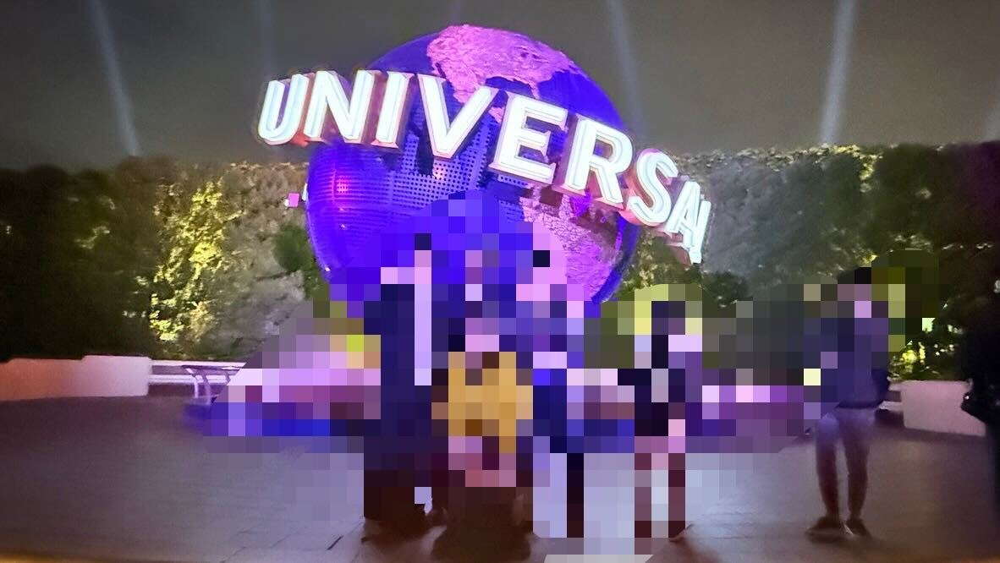
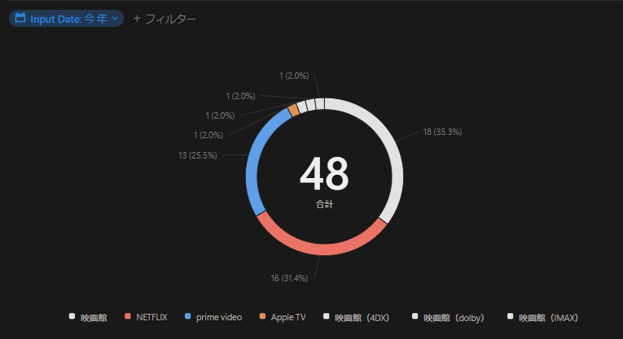
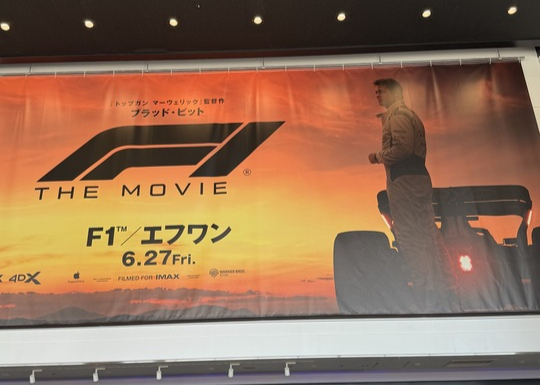
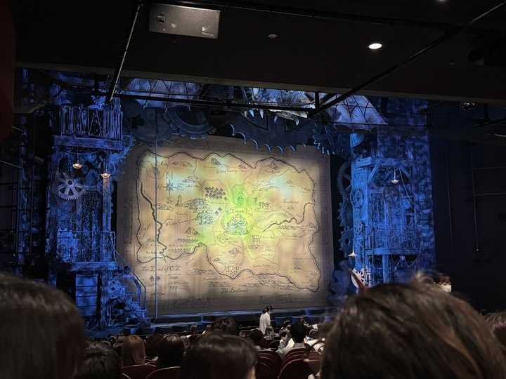
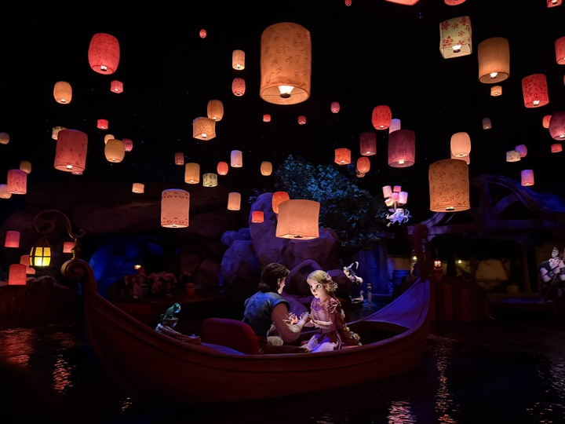

例年通り、今年の振り返りと来年の目標を書いておきます。仕事面とプライベート面の大きく分けて2つに分けて振り返ります。

## 仕事面

### プロダクトと向き合い、生成AIの流行は冷静に

仕事面では、昨年に引き続き自社生成AIプロダクトに関わる業務が中心でした。生成AIを扱うプロダクトということもあり、最新の技術動向を追いかけつつ、ユーザーのニーズにこたえる機能の開発に取り組んできました。他にも新人のOJTや学会参加なども主導しました。

AI界隈は「エージェント」やら「MCP」やらで盛り上がっており、社内でも期待感を感じる日々でした。何でもかんでも「AI」の時代から、何でもかんでも「エージェント」時代になっており、皆自分が考えるエージェントについて熱く語っています。

一方で開発チームとしては、プロダクトにとって本当に必要な機能は？保守運用はどうするの？といった観点を大事にしてきました。PoC的なアプリケーションを作るわけではないですからね。



※権証兼、自己学習は忘れずに

このような流れの中で、開発をリードしてくれる方が常々「お金にならないと意味がない」、「顧客にとって価値のあることを優先すべき」、「先のことを見据えて、機能開発の順番も意識したい」、「提供できる範囲で少しずつ進める」と意識付けしてくれていたのは自分にとって大きかったです。

新しい機能を急いで作れば、コードの整備が間に合わなかったり、ドキュメントの整備が追い付かなかったりします。開発目線に立つとこれらの整備に時間を割きたくなります。特にコーディングエージェントの登場により、コードの増加スピードも上がっているのでなおさらです。

しかし、これらの整備は「顧客に価値を届けるための投資」と捉える必要があるのだろうなと。将来的な機能実装を見据えたときに「今整理しないとヤバイ」状況なら取り組み、今後の顧客価値に直結しないなら後回しにする、といった判断が大事だと学べました。



**ソフトウェア開発は常に時間が足りない**



と、どこかで聞いたことがありましたが、本当に実感しまくりでしたね。

既にプロダクトとしては開発・提供されてから3年程度たっている状況で、エージェント機能含め機能拡張を続けられているのは、チームの一員として誇らしいです。整備するべき時に整備し、価値提供は怠らない。来年もこのバランスを大事にしながら、プロダクトと向き合っていきたいと思います。

### 個人の観点

個人の観点で言えば、設計や実装はもちろん、チーム全体の最適化を考えた1年だったなと思います。スプリントごとのタスク作成や割り振りはもちろん、コードレビューやドキュメント整備、会議体の見直しやファシリテーションに取り組みました。チーム内の振り返りで、チームメンバーからそのあたりを評価してもらえたのは嬉しかったですね。

開発者としても、コードレビューを通じて他のメンバーのコードを読む機会が増えたこともあり、設計力や実装力も向上できたかなと感じています。コードを見ることでプロダクトの理解も深まりました。

プロダクトオーナーやビジネス側メンバーとの会議においても、開発者の視点から意見を述べる機会が増えました。技術的な観点からの意思決定にも貢献できたのでは？と個人的に結構嬉しかったりします。

一方でコードレビューの機会が増えたことで、バグを見落としてしまう失敗も多く経験しました。リリース後に顧客からバグ報告があったときの「やっちまった感」は半端ないですね。クリティカルなバグはレビューで見逃さないようにしなければ。



### 結局はコミュニケーションが大事という気づき

開発チームが効率よく連携し、良いプロダクトを作るためには「**何においてもコミュニケーション**」ということを痛感した1年でもありました。

今年は2つのエージェント機能を開発しましたが、どちらの機能開発もコミュニケーションで大きな課題を感じました。ビジネスオーナーやプロダクトオーナーと開発側の認識が合わず、実装コスト以上にコミュニケーションコストをかけてしまったのです。

開発としては「この機能であれば価値もあるしリリース可能」と考えていても、ビジネス側から見ると「この機能は価値が薄いし、もっと機能を追加するべき」という認識のズレが生じていました。ここのすり合わせをしながら開発を進めるのは、精神的にも時間的にも大きな負担です。今思い出すだけでも辛い。

結果的には、開発側の提案する形でリリースを行い、ビジネス側（顧客）にも評価していただけたのですが、もっと早く認識を合わしておくべきだったと反省する出来事でした。

開発の外側にいる人からすれば、動くものがないとイメージしづらい。口頭の説明だけでは伝わらないことが多いのだなと痛感しました。プロトタイプやモックを早めに作成、開発外への共有を行うことの重要性は、想像以上に大きいです。この辺り、具体的にどういう対策・アクションを取っているかは、会社のブログで共有できればと思います。

これらの経験を経て、今年の後半は意識的にコミュニケーション面を改善してきたと思います。加えて、新たにチームに参加したマネジメント経験豊富なメンバーの力もあり、チーム全体のコミュニケーションが円滑になってきたと感じています。

来年もこの調子で、**みんなで同じ方向を向いて、より良いプロダクトを作っていきたい**と思います。

## プライベート面

### 映画は思ったより見ることができなかった

毎年映画100本を目標にしていますが、今年はからっきしでした...。なんでこんなに少なかったのだ...。

結構映画館には行けてますね。20回くらい映画館に行ってそう。あまり自宅で映画を見ていなかったな～と思います。仕事で遅くまで何かしていることが多かったのかね...。来年はもっと平日の夜に映画を見たい...。

もし、このブログを見ているチームの方がいれば、平日の夜に映画を見る時間を確保できるようにしていただけると嬉しいです（小声）。

今年見た映画で印象に残っているのは、

- F1 THE MOVIE
- 国宝
- 花まんま
- ソニックシャドウ東京ミッション

あたりですかね。特にF1 THE MOVIEは、万博公園にある西日本最大のIMAXシアターで見られたのが最高でした。大迫力の映像と音、映画体験ってこういうことだよな！！！

### 観劇もぼちぼち満喫

今年の観劇記録はざっとこちら。

- 1月
  - 美女と野獣
- 3月
  - レミゼラブル
- 4月
  - アラジン
- 5月
  - Wicked
  - ウェイトレス
  - フランケンシュタイン
  - Kinky Boots
- 9月
  - BACK TO THE FUTURE
- 11月
  - 美女と野獣
- 12月
  - アナと雪の女王

一番良かったのは間違いなくWickedですね。映画版も見ましたが、舞台の満足感の方が圧倒的でした。ストーリーも音楽も演出も素晴らしかったです。再演する際は必ず見に行きます。

Kinky Bootsも再演したら行きたいと思える作品でした。「やるしかないのさ」は仕事が忙しいときずっと聴いてました。歌詞の中に「**やるしかないのさ～、苦境に立っても～**」という歌詞がありますが、本当にその通りなんすよ。苦境はほどほどにお願いしたい。

### ヴィッセルは残念、F1を満喫

今年のヴィッセルはなんかこうパリッとしなかったですね。最終的には無冠で終わりました...。

リーグの最終順位は5位。天皇杯も決勝で敗退と。主力陣の年齢が上がっていること・それに伴う稼働率の低下が響いたのかなぁ。3年続いた吉田監督体制も今年までということで、来期からはスキッベ監督に期待したいと思います。チームの若返りと新しい戦術をなにとぞ。


  
  


今年はヴィッセルに加えて、F1観戦も満喫しました。昨年から少しずつF1を見始めていましたが、今年は角田がレッドブルに昇格したのをきっかけに鈴鹿にも乗り込みました。あの熱狂を現地で味わうことができたのはなかなかラッキーでした。会社の上司にフルエスコートしてもらえたんですよね。実家にも泊めてもらえましたし...。

F1にはまってからは、ヴィッセルの試合と合わせて週末が楽しみでした。DAZNで金土日と楽しみ、試合後はYouTubeでハイライトや解説動画を見まくる日々。気づけばレッドブルグッズも増えていた...恐ろしい。角田がシートを失ってしまい残念ではありますが、純粋にF1を楽しんでいきたいと思います。

### ファンタジースプリングスにもついに

念願だったファンタジースプリングスにも行くことができました。ラッキーなことに主要3アトラクションに乗ることができ大満足です。

アナ雪に関しては入園した時点でDPAが売り切れていて、常時3～4時間待ちだったこともありあきらめかけていました。しかし、お昼過ぎに追加されるDPAをゲットでき、無事エンジョイ。あきらめないことが大事。（チケット画面を更新し続ける地獄は、夢の世界の現実を見た気がします。）


  
  


ラプンツェルのアトラクションは短くて少し残念でしたが、隣に座っていた子供連れのお父さん「かがや～いて～いる～」って歌いだしたのがツボでした。

ファンタジースプリングスの雰囲気も満喫できましたが、うれしかったのは各プリンセスが一斉に出てきてグリーティングしてくれたことですね。ベル、アナと写真を撮ることができたので大満足。以前行ったときは、無限供給される子供たちに時間をとられて、写真を撮ることができなかったので...。アリエルやエルサ、シンデレラもいて、ディズニー成分を全身に浴びることができました。

## 来年の目標

仕事にプライベートに、かなり充実した1年だったかなと思います。仕事は自分自身で自分によく頑張ったと言ってあげたい。

来年の目標は以下のような感じかな。

1. 無駄な肉を削る！
2. 無駄な出費を削る！
3. 映画100本、観劇10本！
4. ヴィッセルとF1を楽しむ
5. フロントエンドとクラウドサービスの知識を深める！

何より肉を、肉を削りたいのです。仕事を頑張る以上に肉を削りたい。そして無駄な出費も削りたい...。貯金を増やしたいのです。

仕事面の目標が少ないようにも見えますが、今年の振り返りで書いたように、チーム全体で良いプロダクトを作ることに注力したいと思います。個人のスキルアップも大事ですが、チーム全体のパフォーマンスを最大化することが最優先かなと。**今後の自分のキャリアにおいても、重要な経験を積む1年になる気がしています**。

具体的な目標には入れてませんが、技術アウトプットも引き続き頑張りたいです。今まで技術的な内容もこのブログ上で書いてきましたが、Zennのアカウントを作ったので、技術的な内容はZennに集約していこうかな～と考えています。このブログに書いてもインデックスされない時があり悲しいので。

では、来年もまたよろしくお願いいたします。