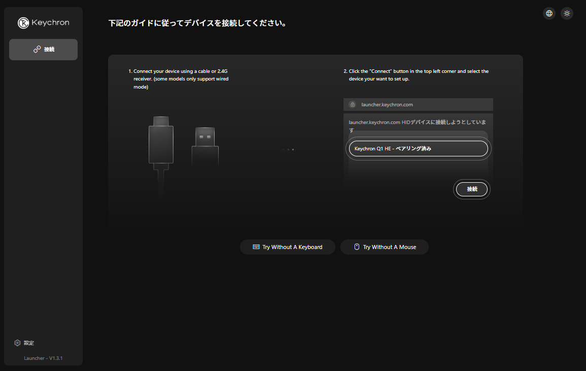
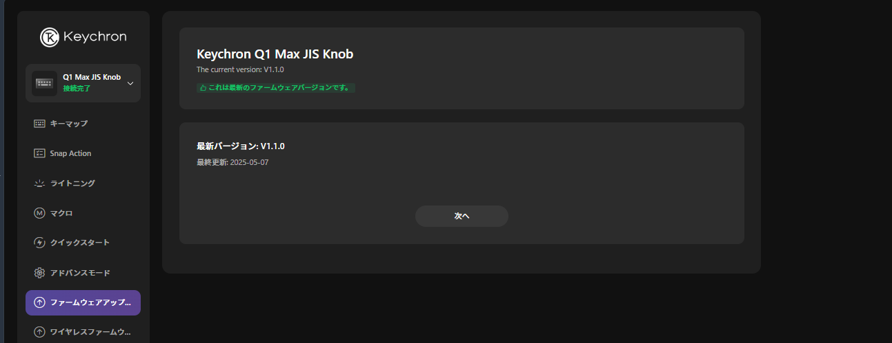
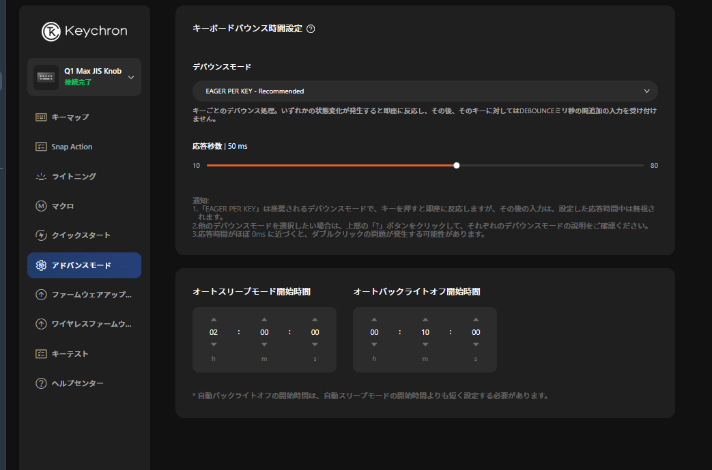

2024年末に「Keychron Q1 Max QMK/VIA JIS」を購入してから気に入って使っていたものの、いつからか連続入力（チャタリング）問題が発生するようになりました。1回しか「A」を押していないのに、「AA」みたいな形で入力されてしまう状態ですね。

こちらの問題の解決策を見つけるまでに結構時間がかかったので、同じような問題で困っている人の参考になればと思い簡単に紹介します。

以前キーボードを紹介した際の記事。



## 解決策

結論は...

ファームウェアアップデートをしましょう！

**Keychron Launcher経由でファームウェアアップデートを行うと、チャタリングの問題が解決**しました。どうやらデバウンスの設定が修正され、チャタリングが抑制されるようになったようです。ついでに、デバウンスの値も調整できるようになっています。

[Keychron Launcherへのリンク](https://launcher.keychron.com/)

上記リンクにアクセスすると以下のような画面が表示されるので、キーボードを有線接続し「接続」ボタンを押下します。そして接続するキーボードを選択します。

その後、左サイドバーの「ファームウェアアップデート」を選択します。画面の指示に従ってアップデートを進めればOKです。

この時点で、チャタリングの問題は改善されるはずです。「アドバンスモード」メニューを選択するとデバウンス設定ができるようになっています。

デバウンスの値を大きくするほどチャタリングが抑制されるようになりますが、あまり大きくしすぎるとキー入力の反応が遅くなってしまいます。アップデートした時点では50msに設定されていました。

## Keychronのキーボードには同様の問題がある？

解決策を探す中でredditなどを見ていると、Keychronのキーボード全般でチャタリングの問題が発生しているような投稿をいくつか見かけました。以下のページが参考になります。

<https://www.reddit.com/r/Keychron/comments/1ip03k0/comment/mhlga9b/>

アップデート前はデバウンス時間が20msに設定されていたようで、アップデートのタイミングでそこの値を調整して緩和した。という形のようです。

> デフォルトのチャタリング数値（GitHub）
> <https://github.com/Keychron/qmk_firmware/blob/666862cb8123b64a6b96718d739c6203ad99031f/keyboards/keychron/q1_max/info.json#L76>

スレッドを見ていると、Keychronのキーボードにおける構造的な課題があるというコメントも多くみられます。自分はほかにも K3 proを持っていますが、そちらはチャタリング問題は発生していないので、モデルや製造タイミングなどが関係しているのかもしれません。個体差もあると思います。

とはいえ、非常に高価なモデルであるQ1 Maxでチャタリング問題が発生していたのはちょっと残念でしたね。今後、キーボードを新しく購入する際には、この辺りも考慮してメーカーを選ぼうかな～と思います。今のところキーボード欲は落ち着いていますが...
