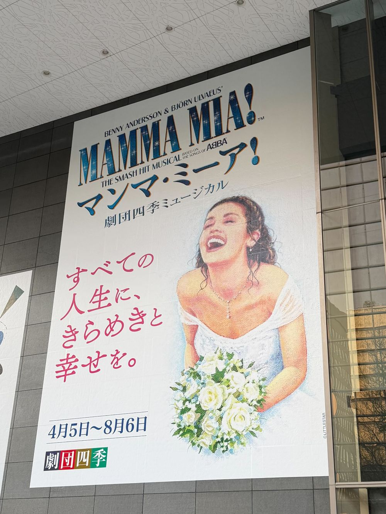
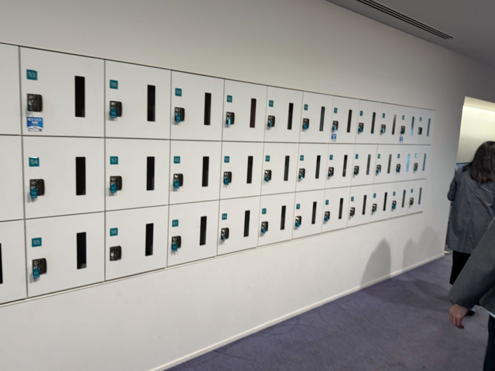
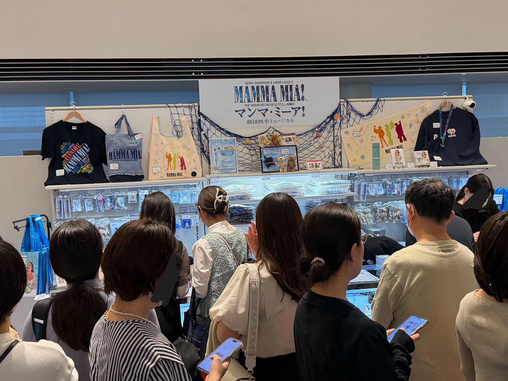
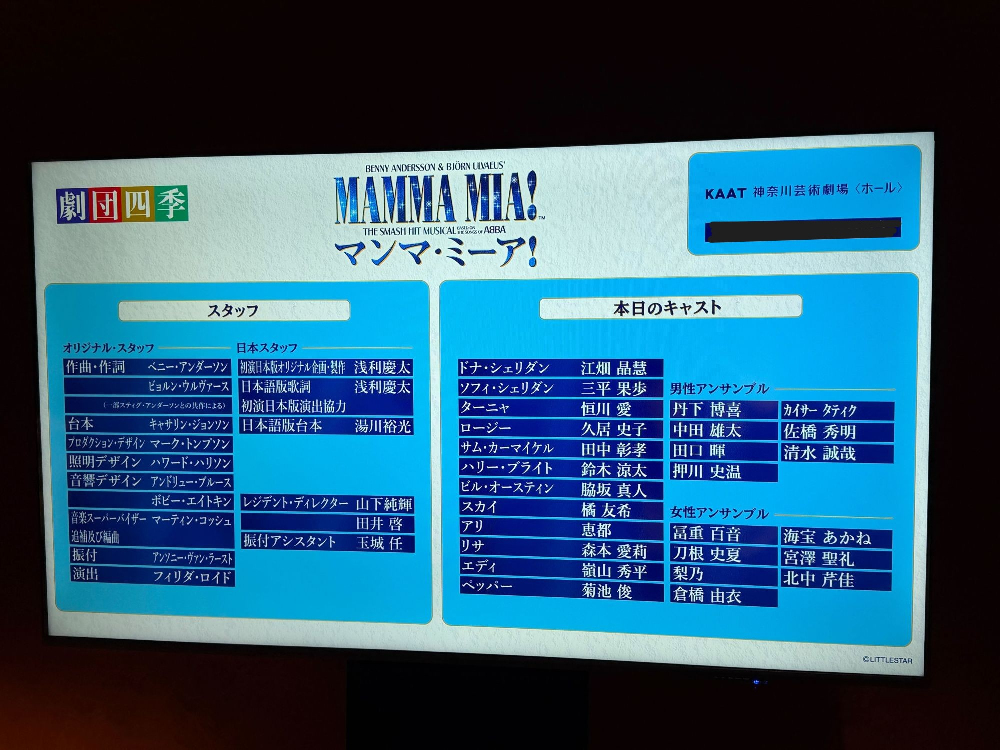

今年のGWは特に予定もなくのんびりしているので、最近投稿していなかった観劇メモでも書きます。

今回鑑賞したのは、**劇団四季の『マンマ・ミーア！』** です。KAAT神奈川芸術劇場での公演でした。

過去にも劇団四季の観劇記事もいくつか書いているので、気になる方はそちらもどうぞ。

- [1人で劇団四季「アラジン」に行ってみた](/posts/2024/trip-01-aladdin/)
- [劇団四季「アナと雪の女王」を見てきた](/posts/2024/shiki-anayuki/)
- [1人で劇団四季の「ライオンキング」を鑑賞してきた](/posts/2024/12/shiki-lion-king/)

## 開演までの過ごし方

### KAAT神奈川芸術劇場

横浜公演ということで、今回はKAAT神奈川芸術劇場で鑑賞しました。最寄り駅はみなとみらい線の日本大通り駅で、そこから徒歩数分の距離にあります。

みなとみらいからも近く、私は横浜観光もかねて桜木町駅で降りて、赤レンガ倉庫や大さん橋、氷川丸などを散策してから劇場に向かいました。

神奈川に住んでる同僚に色々連れて行ってもらいましたが横浜イイですね。海と街の感じかなり好きです。神戸に住んでる私ですら「デカい神戸だ！」とおもいました。ま、山がないんで神戸には及ばないですが。

こちらの劇場は、劇団四季専用というわけではないです。NHKの施設も入ってるようですね。ホールは3階建てで1,200席ほどの規模とのこと（劇場HP参照）。

劇場HP：<https://www.kaat.jp/>

### コインロッカー

私は旅行の際は1つの大きなバックパックで移動することが多く、観劇前には劇場のコインロッカーに荷物を預けます。舞台ではクロークがあることが多いですが、バックパックは大きくても預かってもらえないんですよね...そのため、コインロッカーの存在は非常に大事なのです。

こちらの劇場はチケット確認直後のホール1Fロビーにコインロッカーが設置されていました。ホール2Fのロビーにもコインロッカーがあり、数としては十分な数が用意されていました。

コイン返却式で、大きさは26Lのバックパックがちょうど入るくらいでしたね。

### グッズ販売

グッズ販売はホールのM2F（入場してから1階上がったところ）で行われていました。パンフレットとアンコール時用ペンライトだけ買うのであれば専用レジも用意されています。自分はパンフレットのみでしたので、専用レジを利用してそこまで並ぶことなく購入できました。

支払い方法は以下のようになっています。

> お支払い方法：現金・クレジットカード（VISA、MasterCard）・PayPay  
> 詳細情報はこちら：<https://www.shiki.jp/navi/news/renewinfo/033713.html>

## 観劇メモ

恒例のキャストボード。

### 座席

今回は以下の座席で鑑賞しました。

- S席 2階 A4列 6番

いつも思うのですが、S席で2階って少し残念な気分になるんですよね。1階の後ろの方と2階の前の方ではどっちがいい？みたいな話もあると思いますが、舞台と同じ目線で見たい派の自分としては、2階席は少し距離があるな～と感じてしまいます。

写真撮影していいかわからなかったので、座席からの写真はなしです。一応公式サイトにもホールの写真がありますので、気になる方は参考にどうぞ。

<https://www.kaat.jp/about/facility_hall#linkPoint>

2階席でも前の方だったのもあり、舞台はかなり見やすかったですね。流石に少し距離は感じましたが、全体の演出や舞台装置はしっかり見えました。また、座席の前後間隔も広くて快適でした。私は比較的身長が高いほうなので広さは重要です。

2階席のサイドの席で立見席があるのですが、そちらは手すりのない座席が用意されていました。公演開始前にスタッフの方から案内されていましたが、立見席では立っても座っててもいいとのことでした。ほとんどの人は立ってみていましたが、自由に立ったり座ったりできるのは結構いいのかもな～と思いました。もちろん周囲の人の動きが気になるとかは起こってしまうかもですが。

### ヴ～レ～ブゥ～、ゥアハッ！

マンマ・ミーア！は、映画の方も見たことがあったのですが、非常に明るいストーリーとABBAの素晴らしい楽曲が印象的です。この作品はABBAの楽曲を使うことを前提として、そこにオリジナルストーリーをつけて作られたミュージカルだそうです。（パンフレットに書いてました）

_※特定のアーティストの曲を使って作られたミュージカルは、他にも「ジャージー・ボーイズ」などがありますがこちらはアーティスト自体を題材にしています。_

明るいストーリーと印象的な楽曲は、舞台でもしっかりと表現されていました。エネルギッシュな演技を生で見ると自然と体も動いていたように思います。一緒に観劇した同僚は、マンマミーアのストーリーを知らなかったのですが、しっかり笑って楽しんでいました。

個人的には、**1幕最後の「Voulez-Vous」が最高** でした。クラブというより「ディスコ」ソングっぽい曲の雰囲気と、一糸乱れぬダンス、照明の演出が最高にかっこよかったです。（ま、クラブもディスコも行ったことないんですが...）

**「ヴ～レ～ブゥ～、ゥアハッ！」** のところがめちゃくちゃいいんですよ。「ゥアハッ！」のところでライトがピカッ🔦と光る演出がありテンションが上がります。一緒に舞台に立って踊りたかった...。  
（「アハ！」じゃなくて「ゥアハッ！」です。私の耳にはそう聞こえました。）

3人の父親候補がみんな「私が父親だ！エスコートは任せろ！」と主張するシーンでもありますが、結婚式前夜の興奮と混乱が入り混じる様子がばっちり表現されていたな～と思います。周囲の興奮とソフィの混乱がエスカレートしていくにつれ、「ヴ～レ～ブゥ～、ゥアハッ！」も激しくなっていくんですよね～。

今でもこのシーンを思い出しながら曲を聴いてます。

<iframe src="https://www.youtube.com/embed/alhVUKh36_Q?rel=0" style="top: 0; left: 0; width: 100%; height: 100%; position: absolute; border: 0;" allowfullscreen scrolling="no" allow="accelerometer *; clipboard-write *; encrypted-media *; gyroscope *; picture-in-picture *; web-share *;" referrerpolicy="strict-origin"></iframe>

↑映画版の動画

### 恒川 愛さんカッケェ

**今回の観劇で一番印象に残ったのは、ターニャ役を演じていた恒川 愛さん**でした。ターニャは結婚と離婚を繰り返す奔放なキャラクターですが、恒川さんがカッコよすぎてターニャ役がハマりまくっていた印象です。

恒川さん声がカッケェんですよね。あとから調べたところ、以前リトルマーメイドのアースラ役を演じていたようです。納得のキャスティング。私、女性の低音すごい好きなんですよね～～～。あと身長が高くて足が長く、舞台上での存在感もすごかったです。一緒に行った同僚もカッケェといっていました。

そんな恒川ターニャ、ドナ、ロージーの3人グループ「ドナ・ザ・ダイナモス」の「Mamma Mia」のシーンも大好きです。3人の女性が友達同士楽しそうに歌ってるのがいいんですよ。自分は男なんで分からないですが、仲いい女性同士ってあんな感じなんですかね。コミカルな演技で楽しさ100％って感じでした。私は、ドライヤーをマイクにして歌う恒川ターニャを目で追っかけてました（笑）。

今後も恒川さんの出演する舞台は積極的に見に行きたいです。

## まとめ

劇団四季「マンマ・ミーア！」の観劇メモでした。（レポというほどでもない）

書いた通り、楽しいストーリー、素晴らしい楽曲と演出。非常に満足できる舞台でした。コミカルな演出も多く、初めて観劇する人も楽しめる内容だったと思います。私自身、再演する際にはぜひ見に行きたいな～と思います。（場所によりますが）

1点だけ気になった点を言うと、セット（舞台装置）はシンプルかな？と感じました。セットや演出って観劇の楽しみの1つですから。まぁ「マンマ・ミーア！」は、小さな島のホテルが舞台なので、あまり派手なセットは必要ないのかもしれませんが。個人的には、もう少し凝ったセットも見てみたかったな～とは思ったり。

とはいえ、全体的には大満足の舞台でした。アンコールも盛り上がって、楽しいミュージカルを全身に浴びてきたなと。

今年は現時点で、「メリーポピンズ」、「リトルマーメイド」、「オペラ座の怪人」の観劇を予定しているので、気が向いたらまた観劇メモ書きたいと思います。

ではまた～👋
